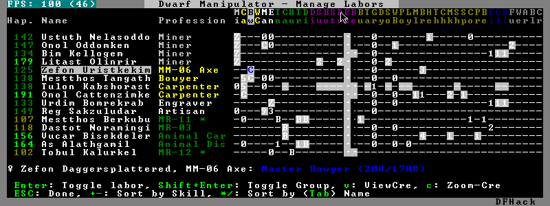
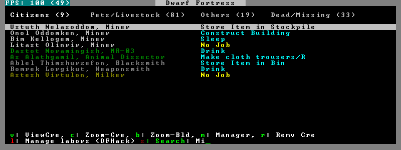
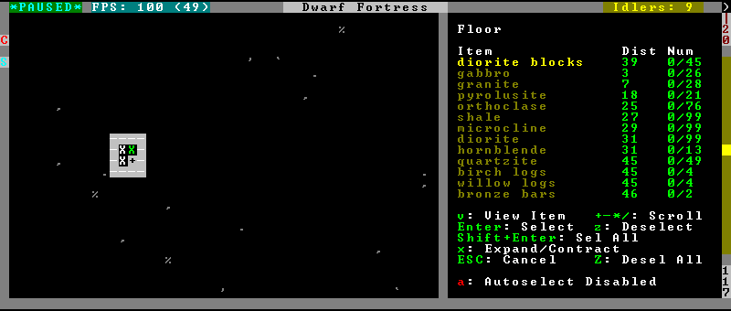
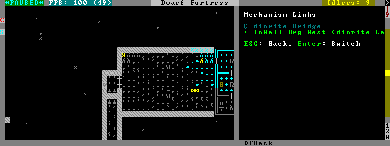
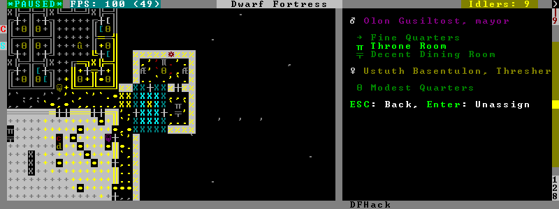
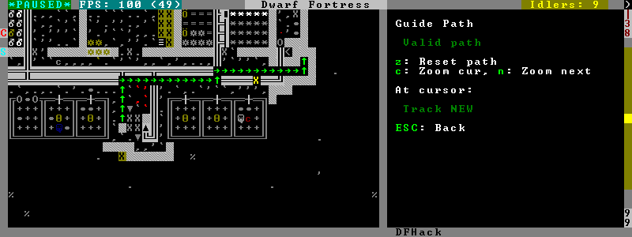
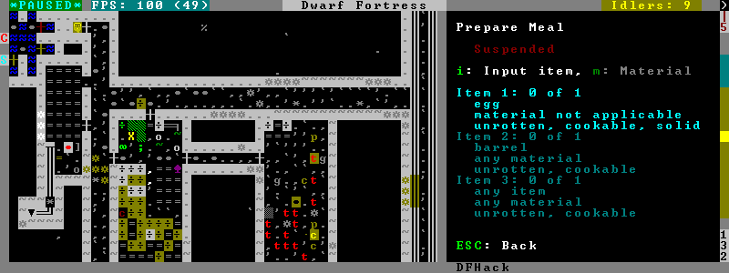
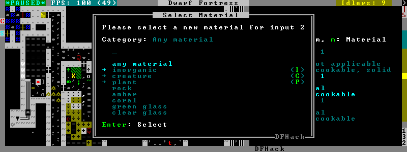

#############
DFHack Readme
#############

============
Introduction
============

DFHack is a Dwarf Fortress memory access library and a set of basic
tools that use it. Tools come in the form of plugins or (not yet)
external tools. It is an attempt to unite the various ways tools
access DF memory and allow for easier development of new tools.

.. contents::

==============
Getting DFHack
==============
The project is currently hosted on github_, for both source and
binaries at  http://github.com/peterix/dfhack

.. _github: http://www.github.com/

Releases can be downloaded from here: https://github.com/peterix/dfhack/downloads

All new releases are announced in the bay12 thread: http://tinyurl.com/dfhack-ng

=============
Compatibility
=============
DFHack works on Windows XP, Vista, 7 or any modern Linux distribution.
OSX is not supported due to lack of developers with a Mac.

Currently, version 0.34.11 is supported (and tested). If you need DFHack
for older versions, look for older releases.

On Windows, you have to use the SDL version of DF.

It is possible to use the Windows DFHack under wine/OSX.

====================
Installation/Removal
====================
Installing DFhack involves copying files into your DF folder.
Copy the files from a release archive so that:

 * On Windows, SDL.dll is replaced
 * On Linux, the 'dfhack' script is placed in the same folder as the 'df' script

Uninstalling is basically the same, in reverse:

 * On Windows, first delete SDL.dll and rename SDLreal.dll to SDL.dll. Then
   remove the other DFHack files
 * On Linux, Remove the DFHack files.

The stonesense plugin might require some additional libraries on Linux.

If any of the plugins or dfhack itself refuses to load, check the stderr.log
file created in your DF folder.

Getting started
===============

If DFHack is installed correctly, it will automatically pop up a console
window once DF is started as usual on windows. Linux and Mac OS X require
running the dfhack script from the terminal, and will use that terminal for
the console.

**NOTE**: The dfhack-run executable is there for calling DFHack commands in
an already running DF+DFHack instance from external OS scripts and programs,
and is *not* the way how you use DFHack normally.

DFHack has a lot of features, which can be accessed by typing commands in the
console, or by mapping them to keyboard shortcuts. Most of the newer and more
user-friendly tools are designed to be at least partially used via the latter
way.

In order to set keybindings, you have to create a text configuration file
called ``dfhack.init``; the installation comes with an example version called
``dfhack.init-example``, which is fully functional, covers all of the recent
features and can be simply renamed to ``dfhack.init``. You are encouraged to look
through it to learn which features it makes available under which key combinations.

For more information, refer to the rest of this document.

============
Using DFHack
============

DFHack basically extends what DF can do with something similar to the drop-down
console found in Quake engine games. On Windows, this is a separate command line
window. On linux, the terminal used to launch the dfhack script is taken over
(so, make sure you start from a terminal). Basic interaction with dfhack
involves entering commands into the console. For some basic instroduction,
use the 'help' command. To list all possible commands, use the 'ls' command.
Many commands have their own help or detailed description. You can use
'command help' or 'command ?' to show that.

The command line has some nice line editing capabilities, including history
that's preserved between different runs of DF (use up/down keys to go through
the history).

The second way to interact with DFHack is to bind the available commands
to in-game hotkeys. The old way to do this is via the hotkey/zoom menu (normally
opened with the 'h' key). Binding the commands is done by assigning a command as
a hotkey name (with 'n').

A new and more flexible way is the keybinding command in the dfhack console.
However, bindings created this way are not automatically remembered between runs
of the game, so it becomes necessary to use the dfhack.init file to ensure that
they are re-created every time it is loaded.

Interactive commands like 'liquids' cannot be used as hotkeys.

Most of the commands come from plugins. Those reside in 'hack/plugins/'.

Patched binaries
================

On linux and OSX, users of patched binaries may have to find the relevant
section in symbols.xml, and add a new line with the checksum of their
executable::

    <md5-hash value='????????????????????????????????'/>

In order to find the correct value of the hash, look into stderr.log;
DFHack prints an error there if it does not recognize the hash.

DFHack includes a small stand-alone utility for applying and removing
binary patches from the game executable. Use it from the regular operating
system console:

 * ``binpatch check "Dwarf Fortress.exe" patch.dif``

   Checks and prints if the patch is currently applied.

 * ``binpatch apply "Dwarf Fortress.exe" patch.dif``

   Applies the patch, unless it is already applied or in conflict.

 * ``binpatch remove "Dwarf Fortress.exe" patch.dif``

   Removes the patch, unless it is already removed.

The patches are expected to be encoded in text format used by IDA.

Live patching
-------------

As an alternative, you can use the ``binpatch`` dfhack command to apply/remove
patches live in memory during a DF session.

In this case, updating symbols.xml is not necessary.

=============================
Something doesn't work, help!
=============================
First, don't panic :) Second, dfhack keeps a few log files in DF's folder
- stderr.log and stdout.log. You can look at those and possibly find out what's
happening.
If you found a bug, you can either report it in the bay12 DFHack thread,
the issues tracker on github, contact me (peterix@gmail.com) or visit the
#dfhack IRC channel on freenode.

=============
The init file
=============
If your DF folder contains a file named ``dfhack.init``, its contents will be run
every time you start DF. This allows setting up keybindings. An example file
is provided as ``dfhack.init-example`` - you can tweak it and rename to dfhack.init
if you want to use this functionality.

Setting keybindings
===================

To set keybindings, use the built-in ``keybinding`` command. Like any other
command it can be used at any time from the console, but it is also meaningful
in the DFHack init file.

Currently it supports any combination of Ctrl/Alt/Shift with F1-F9, or A-Z.

Possible ways to call the command:

:keybinding list <key>: List bindings active for the key combination.
:keybinding clear <key> <key>...: Remove bindings for the specified keys.
:keybinding add <key> "cmdline" "cmdline"...: Add bindings for the specified
                                              key.
:keybinding set <key> "cmdline" "cmdline"...: Clear, and then add bindings for
                                              the specified key.

The *<key>* parameter above has the following *case-sensitive* syntax::

    [Ctrl-][Alt-][Shift-]KEY[@context]

where the *KEY* part can be F1-F9 or A-Z, and [] denote optional parts.

When multiple commands are bound to the same key combination, DFHack selects
the first applicable one. Later 'add' commands, and earlier entries within one
'add' command have priority. Commands that are not specifically intended for use
as a hotkey are always considered applicable.

The *context* part in the key specifier above can be used to explicitly restrict
the UI state where the binding would be applicable. If called without parameters,
the ``keybinding`` command among other things prints the current context string.
Only bindings with a *context* tag that either matches the current context fully,
or is a prefix ending at a '/' boundary would be considered for execution, i.e.
for context ``foo/bar/baz``, possible matches are any of ``@foo/bar/baz``, ``@foo/bar``,
``@foo`` or none.

========
Commands
========

DFHack command syntax consists of a command name, followed by arguments separated
by whitespace. To include whitespace in an argument, quote it in double quotes.
To include a double quote character, use ``\"`` inside double quotes.

If the first non-whitespace character of a line is ``#``, the line is treated
as a comment, i.e. a silent no-op command.

If the first non-whitespace character is ``:``, the command is parsed in a special
alternative mode: first, non-whitespace characters immediately following the ``:``
are used as the command name; the remaining part of the line, starting with the first
non-whitespace character *after* the command name, is used verbatim as the first argument.
The following two command lines are exactly equivalent:

 * ``:foo a b "c d" e f``
 * ``foo "a b \"c d\" e f"``

This is intended for commands like ``rb_eval`` that evaluate script language statements.

Almost all the commands support using the 'help <command-name>' built-in command
to retrieve further help without having to look at this document. Alternatively,
some accept a 'help'/'?' option on their command line.

Game progress
=============

die
---
Instantly kills DF without saving.

forcepause
----------
Forces DF to pause. This is useful when your FPS drops below 1 and you lose
control of the game.

 * Activate with 'forcepause 1'
 * Deactivate with 'forcepause 0'

nopause
-------
Disables pausing (both manual and automatic) with the exception of pause forced
by 'reveal hell'. This is nice for digging under rivers.

fastdwarf
---------
Controls speedydwarf and teledwarf. Speedydwarf makes dwarves move quickly and perform tasks quickly. Teledwarf makes dwarves move instantaneously, but do jobs at the same speed.

 * 'fastdwarf 0 0' disables both
 * 'fastdwarf 0 1' disables speedydwarf and enables teledwarf
 * 'fastdwarf 1 0' enables speedydwarf and disables teledwarf
 * 'fastdwarf 1 1' enables both
 * 'fastdwarf 0' disables both
 * 'fastdwarf 1' enables speedydwarf and disables teledwarf
 * 'fastdwarf 2 ...' sets a native debug flag in the game memory
   that implements an even more aggressive version of speedydwarf.

Game interface
==============

follow
------
Makes the game view follow the currently highlighted unit after you exit from
current menu/cursor mode. Handy for watching dwarves running around. Deactivated
by moving the view manually.

tidlers
-------
Toggle between all possible positions where the idlers count can be placed.

twaterlvl
---------
Toggle between displaying/not displaying liquid depth as numbers.

copystock
----------
Copies the parameters of the currently highlighted stockpile to the custom
stockpile settings and switches to custom stockpile placement mode, effectively
allowing you to copy/paste stockpiles easily.

rename
------
Allows renaming various things.

Options:

 :rename squad <index> "name": Rename squad by index to 'name'.
 :rename hotkey <index> \"name\": Rename hotkey by index. This allows assigning
                                  longer commands to the DF hotkeys.
 :rename unit "nickname": Rename a unit/creature highlighted in the DF user
                          interface.
 :rename unit-profession "custom profession": Change proffession name of the
                                              highlighted unit/creature.
 :rename building "name": Set a custom name for the selected building.
                          The building must be one of stockpile, workshop, furnace, trap,
                          siege engine or an activity zone.

Adventure mode
==============

adv-bodyswap
------------
This allows taking control over your followers and other creatures in adventure
mode. For example, you can make them pick up new arms and armor and equip them
properly.

Usage:

 * When viewing unit details, body-swaps into that unit.
 * In the main adventure mode screen, reverts transient swap.

advtools
--------
A package of different adventure mode tools (currently just one)

Usage:

 :list-equipped [all]: List armor and weapons equipped by your companions.
                       If all is specified, also lists non-metal clothing.
 :metal-detector [all-types] [non-trader]: Reveal metal armor and weapons in
                                           shops. The options disable the checks
                                           on item type and being in shop.

Map modification
================

changelayer
-----------
Changes material of the geology layer under cursor to the specified inorganic
RAW material. Can have impact on all surrounding regions, not only your embark!
By default changing stone to soil and vice versa is not allowed. By default
changes only the layer at the cursor position. Note that one layer can stretch
across lots of z levels. By default changes only the geology which is linked
to the biome under the cursor. That geology might be linked to other biomes
as well, though. Mineral veins and gem clusters will stay on the map. Use
'changevein' for them.

tl;dr: You will end up with changing quite big areas in one go, especially if
you use it in lower z levels. Use with care.

Options:

 :all_biomes:       Change selected layer for all biomes on your map.
                    Result may be undesirable since the same layer can AND WILL
                    be on different z-levels for different biomes. Use the tool
                    'probe' to get an idea how layers and biomes are distributed
                    on your map.
 :all_layers:       Change all layers on your map (only for the selected biome
                    unless 'all_biomes' is added). 
                    Candy mountain, anyone? Will make your map quite boring,
                    but tidy. 
 :force:            Allow changing stone to soil and vice versa. !!THIS CAN HAVE
                    WEIRD EFFECTS, USE WITH CARE!!
                    Note that soil will not be magically replaced with stone.
                    You will, however, get a stone floor after digging so it
                    will allow the floor to be engraved.
                    Note that stone will not be magically replaced with soil.
                    You will, however, get a soil floor after digging so it
                    could be helpful for creating farm plots on maps with no
                    soil.
 :verbose:          Give some details about what is being changed.
 :trouble:          Give some advice about known problems.

Examples:

 ``changelayer GRANITE``
   Convert layer at cursor position into granite.
 ``changelayer SILTY_CLAY force``
   Convert layer at cursor position into clay even if it's stone.
 ``changelayer MARBLE all_biomes all_layers``
   Convert all layers of all biomes which are not soil into marble.

.. note::

    * If you use changelayer and nothing happens, try to pause/unpause the game
      for a while and try to move the cursor to another tile. Then try again.
      If that doesn't help try temporarily changing some other layer, undo your
      changes and try again for the layer you want to change. Saving
      and reloading your map might also help.
    * You should be fine if you only change single layers without the use
      of 'force'. Still it's advisable to save your game before messing with
      the map.
    * When you force changelayer to convert soil to stone you might experience
      weird stuff (flashing tiles, tiles changed all over place etc).
      Try reverting the changes manually or even better use an older savegame.
      You did save your game, right?

changevein
----------
Changes material of the vein under cursor to the specified inorganic RAW
material. Only affects tiles within the current 16x16 block - for veins and
large clusters, you will need to use this command multiple times.

Example:

 ``changevein NATIVE_PLATINUM``
   Convert vein at cursor position into platinum ore.

changeitem
----------
Allows changing item material and base quality. By default the item currently
selected in the UI will be changed (you can select items in the 'k' list
or inside containers/inventory). By default change is only allowed if materials
is of the same subtype (for example wood<->wood, stone<->stone etc). But since
some transformations work pretty well and may be desired you can override this
with 'force'. Note that some attributes will not be touched, possibly resulting
in weirdness. To get an idea how the RAW id should look like, check some items
with 'info'. Using 'force' might create items which are not touched by
crafters/haulers.

Options:

 :info:         Don't change anything, print some info instead.
 :here:         Change all items at the cursor position. Requires in-game cursor.
 :material, m:  Change material. Must be followed by valid material RAW id.
 :quality, q:   Change base quality. Must be followed by number (0-5).
 :force:        Ignore subtypes, force change to new material.

Examples:

 ``changeitem m INORGANIC:GRANITE here``
   Change material of all items under the cursor to granite.
 ``changeitem q 5``
   Change currently selected item to masterpiece quality.

colonies
--------
Allows listing all the vermin colonies on the map and optionally turning them into honey bee colonies.

Options:

 :bees: turn colonies into honey bee colonies

deramp (by zilpin)
------------------
Removes all ramps designated for removal from the map. This is useful for replicating the old channel digging designation.
It also removes any and all 'down ramps' that can remain after a cave-in (you don't have to designate anything for that to happen).

feature
-------
Enables management of map features.

* Discovering a magma feature (magma pool, volcano, magma sea, or curious
  underground structure) permits magma workshops and furnaces to be built.
* Discovering a cavern layer causes plants (trees, shrubs, and grass) from
  that cavern to grow within your fortress.

Options:

 :list:         Lists all map features in your current embark by index.
 :show X:       Marks the selected map feature as discovered.
 :hide X:       Marks the selected map feature as undiscovered.

liquids
-------
Allows adding magma, water and obsidian to the game. It replaces the normal
dfhack command line and can't be used from a hotkey. Settings will be remembered
as long as dfhack runs. Intended for use in combination with the command
liquids-here (which can be bound to a hotkey).

For more information, refer to the command's internal help. 

.. note::

    Spawning and deleting liquids can F up pathing data and
    temperatures (creating heat traps). You've been warned.

liquids-here
------------
Run the liquid spawner with the current/last settings made in liquids (if no
settings in liquids were made it paints a point of 7/7 magma by default).

Intended to be used as keybinding. Requires an active in-game cursor.

tiletypes
---------
Can be used for painting map tiles and is an interactive command, much like
liquids.

The tool works with two set of options and a brush. The brush determines which
tiles will be processed. First set of options is the filter, which can exclude
some of the tiles from the brush by looking at the tile properties. The second
set of options is the paint - this determines how the selected tiles are
changed.

Both paint and filter can have many different properties including things like
general shape (WALL, FLOOR, etc.), general material (SOIL, STONE, MINERAL,
etc.), state of 'designated', 'hidden' and 'light' flags.

The properties of filter and paint can be partially defined. This means that
you can for example do something like this:

::  

        filter material STONE
        filter shape FORTIFICATION
        paint shape FLOOR

This will turn all stone fortifications into floors, preserving the material.

Or this:
::  

        filter shape FLOOR
        filter material MINERAL
        paint shape WALL

Turning mineral vein floors back into walls.

The tool also allows tweaking some tile flags:

Or this:

::  

        paint hidden 1
        paint hidden 0

This will hide previously revealed tiles (or show hidden with the 0 option).

Any paint or filter option (or the entire paint or filter) can be disabled entirely by using the ANY keyword:

::  

        paint hidden ANY
        paint shape ANY
        filter material any
        filter shape any
        filter any

You can use several different brushes for painting tiles:
 * Point. (point)
 * Rectangular range. (range)
 * A column ranging from current cursor to the first solid tile above. (column)
 * DF map block - 16x16 tiles, in a regular grid. (block)

Example:

::  

        range 10 10 1

This will change the brush to a rectangle spanning 10x10 tiles on one z-level.
The range starts at the position of the cursor and goes to the east, south and
up.

For more details, see the 'help' command while using this.

tiletypes-commands
------------------
Runs tiletypes commands, separated by ;. This makes it possible to change
tiletypes modes from a hotkey.

tiletypes-here
--------------
Apply the current tiletypes options at the in-game cursor position, including
the brush. Can be used from a hotkey.

tiletypes-here-point
--------------------
Apply the current tiletypes options at the in-game cursor position to a single
tile. Can be used from a hotkey.

tubefill
--------
Fills all the adamantine veins again. Veins that were empty will be filled in
too, but might still trigger a demon invasion (this is a known bug).

extirpate
---------
A tool for getting rid of trees and shrubs. By default, it only kills
a tree/shrub under the cursor. The plants are turned into ashes instantly.

Options:

 :shrubs:            affect all shrubs on the map
 :trees:             affect all trees on the map
 :all:               affect every plant!

grow
----
Makes all saplings present on the map grow into trees (almost) instantly.

immolate
--------
Very similar to extirpate, but additionally sets the plants on fire. The fires
can and *will* spread ;)

regrass
-------
Regrows grass. Not much to it ;)

weather
-------
Prints the current weather map by default.

Also lets you change the current weather to 'clear sky', 'rainy' or 'snowing'.

Options:

 :snow:   make it snow everywhere.
 :rain:   make it rain.
 :clear:  clear the sky.

Map inspection
==============

cursecheck
----------
Checks a single map tile or the whole map/world for cursed creatures (ghosts,
vampires, necromancers, werebeasts, zombies).

With an active in-game cursor only the selected tile will be observed.
Without a cursor the whole map will be checked.

By default cursed creatures will be only counted in case you just want to find
out if you have any of them running around in your fort. Dead and passive
creatures (ghosts who were put to rest, killed vampires, ...) are ignored.
Undead skeletons, corpses, bodyparts and the like are all thrown into the curse
category "zombie". Anonymous zombies and resurrected body parts will show
as "unnamed creature". 

Options:

 :detail:      Print full name, date of birth, date of curse and some status
               info (some vampires might use fake identities in-game, though).
 :nick:        Set the type of curse as nickname (does not always show up
               in-game, some vamps don't like nicknames).
 :all:         Include dead and passive cursed creatures (can result in a quite
               long list after having FUN with necromancers).
 :verbose:     Print all curse tags (if you really want to know it all).

Examples:

 ``cursecheck detail all``
   Give detailed info about all cursed creatures including deceased ones (no
   in-game cursor).
 ``cursecheck nick``
   Give a nickname all living/active cursed creatures on the map(no in-game
   cursor).

.. note::

    * If you do a full search (with the option "all") former ghosts will show up
      with the cursetype "unknown" because their ghostly flag is not set
      anymore. But if you happen to find a living/active creature with cursetype
      "unknown" please report that in the dfhack thread on the modding forum or
      per irc. This is likely to happen with mods which introduce new types
      of curses, for example.

flows
-----
A tool for checking how many tiles contain flowing liquids. If you suspect that
your magma sea leaks into HFS, you can use this tool to be sure without
revealing the map.

probe
-----
Can be used to determine tile properties like temperature.

prospect
--------
Prints a big list of all the present minerals and plants. By default, only
the visible part of the map is scanned.

Options:

 :all:   Scan the whole map, as if it was revealed.
 :value: Show material value in the output. Most useful for gems.
 :hell:  Show the Z range of HFS tubes. Implies 'all'.

Pre-embark estimate
...................

If prospect is called during the embark selection screen, it displays an estimate of
layer stone availability.

.. note::

    The results of pre-embark prospect are an *estimate*, and can at best be expected
    to be somewhere within +/- 30% of the true amount; sometimes it does a lot worse.
    Especially, it is not clear how to precisely compute how many soil layers there
    will be in a given embark tile, so it can report a whole extra layer, or omit one
    that is actually present.

Options:

 :all:    Also estimate vein mineral amounts.

reveal
------
This reveals the map. By default, HFS will remain hidden so that the demons
don't spawn. You can use 'reveal hell' to reveal everything. With hell revealed,
you won't be able to unpause until you hide the map again. If you really want
to unpause with hell revealed, use 'reveal demons'.

Reveal also works in adventure mode, but any of its effects are negated once
you move. When you use it this way, you don't need to run 'unreveal'.

unreveal
--------
Reverts the effects of 'reveal'.

revtoggle
---------
Switches between 'reveal' and 'unreveal'.

revflood
--------
This command will hide the whole map and then reveal all the tiles that have
a path to the in-game cursor.

revforget
---------
When you use reveal, it saves information about what was/wasn't visible before
revealing everything. Unreveal uses this information to hide things again.
This command throws away the information. For example, use in cases where
you abandoned with the fort revealed and no longer want the data.

showmood
--------
Shows all items needed for the currently active strange mood.

Designations
============

burrow
------
Miscellaneous burrow control. Allows manipulating burrows and automated burrow
expansion while digging.

Options:

 **enable feature ...**
    Enable features of the plugin.
 **disable feature ...**
    Disable features of the plugin.
 **clear-unit burrow burrow ...**
    Remove all units from the burrows.
 **clear-tiles burrow burrow ...**
    Remove all tiles from the burrows.
 **set-units target-burrow src-burrow ...**
    Clear target, and adds units from source burrows.
 **add-units target-burrow src-burrow ...**
    Add units from the source burrows to the target.
 **remove-units target-burrow src-burrow ...**
    Remove units in source burrows from the target.
 **set-tiles target-burrow src-burrow ...**
    Clear target and adds tiles from the source burrows.
 **add-tiles target-burrow src-burrow ...**
    Add tiles from the source burrows to the target.
 **remove-tiles target-burrow src-burrow ...**
    Remove tiles in source burrows from the target.

    For these three options, in place of a source burrow it is
    possible to use one of the following keywords: ABOVE_GROUND,
    SUBTERRANEAN, INSIDE, OUTSIDE, LIGHT, DARK, HIDDEN, REVEALED

Features:

 :auto-grow: When a wall inside a burrow with a name ending in '+' is dug
             out, the burrow is extended to newly-revealed adjacent walls.
             This final '+' may be omitted in burrow name args of commands above.
             Digging 1-wide corridors with the miner inside the burrow is SLOW.

digv
----
Designates a whole vein for digging. Requires an active in-game cursor placed
over a vein tile. With the 'x' option, it will traverse z-levels (putting stairs
between the same-material tiles).

digvx
-----
A permanent alias for 'digv x'.

digl
----
Designates layer stone for digging. Requires an active in-game cursor placed
over a layer stone tile. With the 'x' option, it will traverse z-levels
(putting stairs between the same-material tiles). With the 'undo' option it
will remove the dig designation instead (if you realize that digging out a 50
z-level deep layer was not such a good idea after all).

diglx
-----
A permanent alias for 'digl x'.

digexp
------
This command can be used for exploratory mining.

See: http://df.magmawiki.com/index.php/DF2010:Exploratory_mining

There are two variables that can be set: pattern and filter.

Patterns:

 :diag5:            diagonals separated by 5 tiles
 :diag5r:           diag5 rotated 90 degrees
 :ladder:           A 'ladder' pattern
 :ladderr:          ladder rotated 90 degrees
 :clear:            Just remove all dig designations
 :cross:            A cross, exactly in the middle of the map.

Filters:

 :all:              designate whole z-level
 :hidden:           designate only hidden tiles of z-level (default)
 :designated:       Take current designation and apply pattern to it.

After you have a pattern set, you can use 'expdig' to apply it again.

Examples:

 designate the diagonal 5 patter over all hidden tiles:
  * expdig diag5 hidden
 apply last used pattern and filter:
  * expdig
 Take current designations and replace them with the ladder pattern:
  * expdig ladder designated

digcircle
---------
A command for easy designation of filled and hollow circles.
It has several types of options.

Shape:

 :hollow:   Set the circle to hollow (default)
 :filled:   Set the circle to filled
 :#:        Diameter in tiles (default = 0, does nothing)

Action:

 :set:      Set designation (default)
 :unset:    Unset current designation
 :invert:   Invert designations already present

Designation types:

 :dig:      Normal digging designation (default)
 :ramp:     Ramp digging
 :ustair:   Staircase up
 :dstair:   Staircase down
 :xstair:   Staircase up/down
 :chan:     Dig channel

After you have set the options, the command called with no options
repeats with the last selected parameters.

Examples:

* 'digcircle filled 3' = Dig a filled circle with radius = 3.
* 'digcircle' = Do it again.

digtype
-------
For every tile on the map of the same vein type as the selected tile, this command designates it to have the same designation as the selected tile. If the selected tile has no designation, they will be dig designated.
If an argument is given, the designation of the selected tile is ignored, and all appropriate tiles are set to the specified designation.

Options:

 :dig:
 :channel:
 :ramp:
 :updown: up/down stairs
 :up:     up stairs
 :down:   down stairs
 :clear:  clear designation

filltraffic
-----------
Set traffic designations using flood-fill starting at the cursor.

Traffic Type Codes:

 :H:     High Traffic
 :N:     Normal Traffic
 :L:     Low Traffic
 :R:     Restricted Traffic

Other Options:

 :X: Fill accross z-levels.
 :B: Include buildings and stockpiles.
 :P: Include empty space.

Example:

 'filltraffic H' - When used in a room with doors, it will set traffic to HIGH in just that room.

alltraffic
----------
Set traffic designations for every single tile of the map (useful for resetting traffic designations).

Traffic Type Codes:

 :H:     High Traffic
 :N:     Normal Traffic
 :L:     Low Traffic
 :R:     Restricted Traffic

Example:

 'alltraffic N' - Set traffic to 'normal' for all tiles.

getplants
---------
This tool allows plant gathering and tree cutting by RAW ID. Specify the types
of trees to cut down and/or shrubs to gather by their plant names, separated
by spaces.

Options:

 :-t: Select trees only (exclude shrubs)
 :-s: Select shrubs only (exclude trees)
 :-c: Clear designations instead of setting them
 :-x: Apply selected action to all plants except those specified (invert
      selection)

Specifying both -t and -s will have no effect. If no plant IDs are specified,
all valid plant IDs will be listed.

Cleanup and garbage disposal
============================

clean
-----
Cleans all the splatter that get scattered all over the map, items and
creatures. In an old fortress, this can significantly reduce FPS lag. It can
also spoil your !!FUN!!, so think before you use it.

Options:

 :map:          Clean the map tiles. By default, it leaves mud and snow alone.
 :units:        Clean the creatures. Will also clean hostiles.
 :items:        Clean all the items. Even a poisoned blade.

Extra options for 'map':

 :mud:          Remove mud in addition to the normal stuff.
 :snow:         Also remove snow coverings.

spotclean
---------
Works like 'clean map snow mud', but only for the tile under the cursor. Ideal
if you want to keep that bloody entrance 'clean map' would clean up.

autodump
--------
This utility lets you quickly move all items designated to be dumped.
Items are instantly moved to the cursor position, the dump flag is unset,
and the forbid flag is set, as if it had been dumped normally.
Be aware that any active dump item tasks still point at the item.

Cursor must be placed on a floor tile so the items can be dumped there.

Options:

 :destroy:            Destroy instead of dumping. Doesn't require a cursor.
 :destroy-here:       Destroy items only under the cursor.
 :visible:            Only process items that are not hidden.
 :hidden:             Only process hidden items.
 :forbidden:          Only process forbidden items (default: only unforbidden).

autodump-destroy-here
---------------------
Destroy items marked for dumping under cursor. Identical to autodump
destroy-here, but intended for use as keybinding.

autodump-destroy-item
---------------------
Destroy the selected item. The item may be selected in the 'k' list, or inside
a container. If called again before the game is resumed, cancels destroy.

cleanowned
----------
Confiscates items owned by dwarfs. By default, owned food on the floor
and rotten items are confistacted and dumped.

Options:

 :all:          confiscate all owned items
 :scattered:    confiscated and dump all items scattered on the floor
 :x:            confiscate/dump items with wear level 'x' and more
 :X:            confiscate/dump items with wear level 'X' and more
 :dryrun:       a dry run. combine with other options to see what will happen
               without it actually happening.

Example:

 ``cleanowned scattered X``
    This will confiscate rotten and dropped food, garbage on the floors and any
    worn items with 'X' damage and above.

Bugfixes
========

drybuckets
----------
This utility removes water from all buckets in your fortress, allowing them to be safely used for making lye.

fixdiplomats
------------
Up to version 0.31.12, Elves only sent Diplomats to your fortress to propose
tree cutting quotas due to a bug; once that bug was fixed, Elves stopped caring
about excess tree cutting. This command adds a Diplomat position to all Elven
civilizations, allowing them to negotiate tree cutting quotas (and allowing you
to violate them and potentially start wars) in case you haven't already modified
your raws accordingly.

fixmerchants
------------
This command adds the Guild Representative position to all Human civilizations,
allowing them to make trade agreements (just as they did back in 0.28.181.40d
and earlier) in case you haven't already modified your raws accordingly.

fixveins
--------
Removes invalid references to mineral inclusions and restores missing ones.
Use this if you broke your embark with tools like tiletypes, or if you
accidentally placed a construction on top of a valuable mineral floor.

tweak
-----
Contains various tweaks for minor bugs.

One-shot subcommands:

:clear-missing:  Remove the missing status from the selected unit.
                 This allows engraving slabs for ghostly, but not yet
                 found, creatures.
:clear-ghostly:  Remove the ghostly status from the selected unit and mark
                 it as dead. This allows getting rid of bugged ghosts
                 which do not show up in the engraving slab menu at all,
                 even after using clear-missing. It works, but is
                 potentially very dangerous - so use with care. Probably
                 (almost certainly) it does not have the same effects like
                 a proper burial. You've been warned.
:fixmigrant:     Remove the resident/merchant flag from the selected unit.
                 Intended to fix bugged migrants/traders who stay at the
                 map edge and don't enter your fort. Only works for
                 dwarves (or generally the player's race in modded games).
                 Do NOT abuse this for 'real' caravan merchants (if you
                 really want to kidnap them, use 'tweak makeown' instead,
                 otherwise they will have their clothes set to forbidden etc).
:makeown:        Force selected unit to become a member of your fort.
                 Can be abused to grab caravan merchants and escorts, even if
                 they don't belong to the player's race. Foreign sentients
                 (humans, elves) can be put to work, but you can't assign rooms
                 to them and they don't show up in DwarfTherapist because the
                 game treats them like pets. Grabbing draft animals from
                 a caravan can result in weirdness (animals go insane or berserk
                 and are not flagged as tame), but you are allowed to mark them
                 for slaughter. Grabbing wagons results in some funny spam, then
                 they are scuttled.

Subcommands that persist until disabled or DF quit:

:stable-cursor:  Saves the exact cursor position between t/q/k/d/etc menus of dwarfmode.
:patrol-duty:    Makes Train orders not count as patrol duty to stop unhappy thoughts.
                 Does NOT fix the problem when soldiers go off-duty (i.e. civilian).
:readable-build-plate: Fixes rendering of creature weight limits in pressure plate build menu.

                       .. image:: images/tweak-plate.png

:stable-temp:    Fixes performance bug 6012 by squashing jitter in temperature updates.
                 In very item-heavy forts with big stockpiles this can improve FPS by 50-100%
:fast-heat:      Further improves temperature update performance by ensuring that 1 degree
                 of item temperature is crossed in no more than specified number of frames
                 when updating from the environment temperature. This reduces the time it
                 takes for stable-temp to stop updates again when equilibrium is disturbed.
:fix-dimensions: Fixes subtracting small amount of thread/cloth/liquid from a stack
                 by splitting the stack and subtracting from the remaining single item.
                 This is a necessary addition to the binary patch in bug 808.
:advmode-contained: Works around bug 6202, i.e. custom reactions with container inputs
                    in advmode. The issue is that the screen tries to force you to select
                    the contents separately from the container. This forcefully skips child
                    reagents.
:fast-trade:     Makes Shift-Enter in the Move Goods to Depot and Trade screens select
                 the current item (fully, in case of a stack), and scroll down one line.
:military-stable-assign: Preserve list order and cursor position when assigning to squad,
                         i.e. stop the rightmost list of the Positions page of the military
                         screen from constantly resetting to the top.
:military-color-assigned: Color squad candidates already assigned to other squads in yellow/green
                          to make them stand out more in the list.

                          .. image:: images/tweak-mil-color.png

:military-training: Speeds up melee squad training by removing an almost certainly
                    unintended inverse dependency of training speed on unit count
                    (i.e. the more units you have, the slower it becomes), and making
                    the units spar more.

fix-armory
----------

Enables a fix for storage of squad equipment in barracks.

Specifically, it prevents your haulers from moving squad equipment
to stockpiles, and instead queues jobs to store it on weapon racks,
armor stands, and in containers.

.. note::

  In order to actually be used, weapon racks have to be patched and
  manually assigned to a squad. See documentation for ``gui/assign-rack``
  below.

  Also, the default capacity of armor stands is way too low, so you
  may want to also apply the ``armorstand-capacity`` patch. Check out
  http://www.bay12games.com/dwarves/mantisbt/view.php?id=1445
  for more information about the bugs.

Note that the buildings in the armory are used as follows:

* Weapon racks (when patched) are used to store any assigned weapons.
  Each rack belongs to a specific squad, and can store up to 5 weapons.

* Armor stands belong to specific squad members and are used for
  armor and shields. By default one stand can store one item of each
  type (hence one boot or gauntlet); if patched, the limit is raised to 2,
  which should be sufficient.

* Cabinets are used to store assigned clothing for a specific squad member.
  They are **never** used to store owned clothing.

* Chests (boxes, etc) are used for a flask, backpack or quiver assigned
  to the squad member. Due to a probable bug, food is dropped out of the
  backpack when it is stored.

.. warning::

  Although armor stands, cabinets and chests properly belong only to one
  squad member, the owner of the building used to create the barracks will
  randomly use any containers inside the room. Thus, it is recommended to
  always create the armory from a weapon rack.

Contrary to the common misconception, all these uses are controlled by the
*Individual Equipment* usage flag. The *Squad Equipment* flag is actually
intended for ammo, but the game does even less in that area than for armor
and weapons. This plugin implements the following rules almost from scratch:

* Combat ammo is stored in chests inside rooms with Squad Equipment enabled.

* If a chest is assigned to a squad member due to Individual Equipment also
  being set, it is only used for that squad's ammo; otherwise, any squads
  with Squad Equipment on the room will use all of the chests at random.

* Training ammo is stored in chests inside archery ranges designated from
  archery targets, and controlled by the same Train flag as archery training
  itself. This is inspired by some defunct code for weapon racks.

There are some minor traces in the game code to suggest that the first of
these rules is intended by Toady; the rest are invented by this plugin.

Mode switch and reclaim
=======================

lair
----
This command allows you to mark the map as 'monster lair', preventing item
scatter on abandon. When invoked as 'lair reset', it does the opposite.

Unlike reveal, this command doesn't save the information about tiles - you
won't be able to restore state of real monster lairs using 'lair reset'.

Options:

 :lair: Mark the map as monster lair
 :lair reset: Mark the map as ordinary (not lair)

mode
----
This command lets you see and change the game mode directly.
Not all combinations are good for every situation and most of them will
produce undesirable results. There are a few good ones though.

.. admonition:: Example

     You are in fort game mode, managing your fortress and paused.
     You switch to the arena game mode, *assume control of a creature* and then
     switch to adventure game mode(1). 
     You just lost a fortress and gained an adventurer.
     You could also do this.
     You are in fort game mode, managing your fortress and paused at the esc menu.
     You switch to the adventure game mode, then use Dfusion to *assume control of a creature* and then
     save or retire. 
     You just created a returnable mountain home and gained an adventurer.

I take no responsibility of anything that happens as a result of using this tool

Visualizer and data export
==========================

ssense / stonesense
-------------------
An isometric visualizer that runs in a second window. This requires working
graphics acceleration and at least a dual core CPU (otherwise it will slow
down DF).

All the data resides in the 'stonesense' directory. For detailed instructions,
see stonesense/README.txt

Compatible with Windows > XP SP3 and most modern Linux distributions.

Older versions, support and extra graphics can be found in the bay12 forum
thread: http://www.bay12forums.com/smf/index.php?topic=43260.0

Some additional resources:
http://df.magmawiki.com/index.php/Utility:Stonesense/Content_repository

mapexport
---------
Export the current loaded map as a file. This will be eventually usable
with visualizers.

dwarfexport
-----------
Export dwarves to RuneSmith-compatible XML.

Job management
==============

job
---
Command for general job query and manipulation.

Options:
 *no extra options*
    Print details of the current job. The job can be selected
    in a workshop, or the unit/jobs screen.
 **list**
    Print details of all jobs in the selected workshop.
 **item-material <item-idx> <material[:subtoken]>**
    Replace the exact material id in the job item.
 **item-type <item-idx> <type[:subtype]>**
    Replace the exact item type id in the job item.

job-material
------------
Alter the material of the selected job.

Invoked as::

    job-material <inorganic-token>

Intended to be used as a keybinding:

 * In 'q' mode, when a job is highlighted within a workshop or furnace,
   changes the material of the job. Only inorganic materials can be used
   in this mode.
 * In 'b' mode, during selection of building components positions the cursor
   over the first available choice with the matching material.

job-duplicate
-------------
Duplicate the selected job in a workshop:
 * In 'q' mode, when a job is highlighted within a workshop or furnace building,
   instantly duplicates the job.

workflow
--------
Manage control of repeat jobs.

Usage:

 ``workflow enable [option...], workflow disable [option...]``
   If no options are specified, enables or disables the plugin.
   Otherwise, enables or disables any of the following options:

   - drybuckets: Automatically empty abandoned water buckets.
   - auto-melt: Resume melt jobs when there are objects to melt.
 ``workflow jobs``
   List workflow-controlled jobs (if in a workshop, filtered by it).
 ``workflow list``
   List active constraints, and their job counts.
 ``workflow list-commands``
   List active constraints as workflow commands that re-create them;
   this list can be copied to a file, and then reloaded using the
   ``script`` built-in command.
 ``workflow count <constraint-spec> <cnt-limit> [cnt-gap]``
   Set a constraint, counting every stack as 1 item.
 ``workflow amount <constraint-spec> <cnt-limit> [cnt-gap]``
   Set a constraint, counting all items within stacks.
 ``workflow unlimit <constraint-spec>``
   Delete a constraint.
 ``workflow unlimit-all``
   Delete all constraints.

Function
........

When the plugin is enabled, it protects all repeat jobs from removal.
If they do disappear due to any cause, they are immediately re-added to their
workshop and suspended.

In addition, when any constraints on item amounts are set, repeat jobs that
produce that kind of item are automatically suspended and resumed as the item
amount goes above or below the limit. The gap specifies how much below the limit
the amount has to drop before jobs are resumed; this is intended to reduce
the frequency of jobs being toggled.

Check out the ``gui/workflow`` script below for a simple front-end integrated
in the game UI.

Constraint format
.................

The contstraint spec consists of 4 parts, separated with '/' characters::

    ITEM[:SUBTYPE]/[GENERIC_MAT,...]/[SPECIFIC_MAT:...]/[LOCAL,<quality>]

The first part is mandatory and specifies the item type and subtype,
using the raw tokens for items, in the same syntax you would e.g. use
for a custom reaction input. See this list for more info: http://dwarffortresswiki.org/index.php/Item_token

The subsequent parts are optional:

- A generic material spec constrains the item material to one of
  the hard-coded generic classes, which currently include::

    PLANT WOOD CLOTH SILK LEATHER BONE SHELL SOAP TOOTH HORN PEARL YARN
    METAL STONE SAND GLASS CLAY MILK

- A specific material spec chooses the material exactly, using the
  raw syntax for reaction input materials, e.g. INORGANIC:IRON,
  although for convenience it also allows just IRON, or ACACIA:WOOD etc.
  See this page for more details on the unabbreviated raw syntax:

  http://dwarffortresswiki.org/index.php/Material_token

- A comma-separated list of miscellaneous flags, which currently can
  be used to ignore imported items or items below a certain quality.

Constraint examples
...................

Keep metal bolts within 900-1000, and wood/bone within 150-200.
::
    
    workflow amount AMMO:ITEM_AMMO_BOLTS/METAL 1000 100
    workflow amount AMMO:ITEM_AMMO_BOLTS/WOOD,BONE 200 50

Keep the number of prepared food & drink stacks between 90 and 120
::
    
    workflow count FOOD 120 30
    workflow count DRINK 120 30

Make sure there are always 25-30 empty bins/barrels/bags.
::
    
    workflow count BIN 30
    workflow count BARREL 30
    workflow count BOX/CLOTH,SILK,YARN 30

Make sure there are always 15-20 coal and 25-30 copper bars.
::

    workflow count BAR//COAL 20
    workflow count BAR//COPPER 30

Produce 15-20 gold crafts.
::

    workflow count CRAFTS//GOLD 20

Collect 15-20 sand bags and clay boulders.
::
    
    workflow count POWDER_MISC/SAND 20
    workflow count BOULDER/CLAY 20

Make sure there are always 80-100 units of dimple dye.
::
    
    workflow amount POWDER_MISC//MUSHROOM_CUP_DIMPLE:MILL 100 20

.. note::

  In order for this to work, you have to set the material of the PLANT input
  on the Mill Plants job to MUSHROOM_CUP_DIMPLE using the 'job item-material'
  command. Otherwise the plugin won't be able to deduce the output material.

Maintain 10-100 locally-made crafts of exceptional quality.
::

    workflow count CRAFTS///LOCAL,EXCEPTIONAL 100 90

Fortress activity management
============================

seedwatch
---------
Tool for turning cooking of seeds and plants on/off depending on how much you
have of them.

See 'seedwatch help' for detailed description.

zone
----
Helps a bit with managing activity zones (pens, pastures and pits) and cages.

Options:

 :set:         Set zone or cage under cursor as default for future assigns.
 :assign:      Assign unit(s) to the pen or pit marked with the 'set' command.
               If no filters are set a unit must be selected in the in-game ui.
               Can also be followed by a valid zone id which will be set
               instead.
 :unassign:    Unassign selected creature from it's zone.
 :nick:        Mass-assign nicknames, must be followed by the name you want
               to set.
 :remnick:     Mass-remove nicknames.
 :tocages:     Assign unit(s) to cages inside a pasture.
 :uinfo:       Print info about unit(s). If no filters are set a unit must
               be selected in the in-game ui.
 :zinfo:       Print info about zone(s). If no filters are set zones under
               the cursor are listed.
 :verbose:     Print some more info.
 :filters:     Print list of valid filter options.
 :examples:    Print some usage examples.
 :not:         Negates the next filter keyword.

Filters:

 :all:           Process all units (to be used with additional filters).
 :count:         Must be followed by a number. Process only n units (to be used
                 with additional filters). 
 :unassigned:    Not assigned to zone, chain or built cage.
 :minage:        Minimum age. Must be followed by number.
 :maxage:        Maximum age. Must be followed by number.
 :race:          Must be followed by a race RAW ID (e.g. BIRD_TURKEY, ALPACA,
                 etc). Negatable.
 :caged:         In a built cage. Negatable.
 :own:           From own civilization. Negatable.
 :merchant:      Is a merchant / belongs to a merchant. Should only be used for
                 pitting, not for stealing animals (slaughter should work).
 :war:           Trained war creature. Negatable.
 :hunting:       Trained hunting creature. Negatable.
 :tamed:         Creature is tame. Negatable.
 :trained:       Creature is trained. Finds war/hunting creatures as well as
                 creatures who have a training level greater than 'domesticated'.
                 If you want to specifically search for war/hunting creatures use
                 'war' or 'hunting' Negatable.
 :trainablewar:  Creature can be trained for war (and is not already trained for
                 war/hunt). Negatable.
 :trainablehunt: Creature can be trained for hunting (and is not already trained
                 for war/hunt). Negatable.
 :male:          Creature is male. Negatable.
 :female:        Creature is female. Negatable.
 :egglayer:      Race lays eggs. Negatable.
 :grazer:        Race is a grazer. Negatable.
 :milkable:      Race is milkable. Negatable.

Usage with single units
.......................

One convenient way to use the zone tool is to bind the command 'zone assign' to
a hotkey, maybe also the command 'zone set'. Place the in-game cursor over
a pen/pasture or pit, use 'zone set' to mark it. Then you can select units
on the map (in 'v' or 'k' mode), in the unit list or from inside cages
and use 'zone assign' to assign them to their new home. Allows pitting your
own dwarves, by the way.

Usage with filters
..................

All filters can be used together with the 'assign' command.

Restrictions: It's not possible to assign units who are inside built cages
or chained because in most cases that won't be desirable anyways.
It's not possible to cage owned pets because in that case the owner
uncages them after a while which results in infinite hauling back and forth.

Usually you should always use the filter 'own' (which implies tame) unless you
want to use the zone tool for pitting hostiles. 'own' ignores own dwarves unless
you specify 'race DWARF' (so it's safe to use 'assign all own' to one big
pasture if you want to have all your animals at the same place). 'egglayer' and
'milkable' should be used together with 'female' unless you have a mod with
egg-laying male elves who give milk or whatever. Merchants and their animals are
ignored unless you specify 'merchant' (pitting them should be no problem,
but stealing and pasturing their animals is not a good idea since currently they
are not properly added to your own stocks; slaughtering them should work).

Most filters can be negated (e.g. 'not grazer' -> race is not a grazer).

Mass-renaming
.............

Using the 'nick' command you can set the same nickname for multiple units.
If used without 'assign', 'all' or 'count' it will rename all units in the
current default target zone. Combined with 'assign', 'all' or 'count' (and
further optional filters) it will rename units matching the filter conditions. 

Cage zones
..........

Using the 'tocages' command you can assign units to a set of cages, for example
a room next to your butcher shop(s). They will be spread evenly among available
cages to optimize hauling to and butchering from them. For this to work you need
to build cages and then place one pen/pasture activity zone above them, covering
all cages you want to use. Then use 'zone set' (like with 'assign') and use
'zone tocages filter1 filter2 ...'. 'tocages' overwrites 'assign' because it
would make no sense, but can be used together with 'nick' or 'remnick' and all
the usual filters.

Examples
........

``zone assign all own ALPACA minage 3 maxage 10``
   Assign all own alpacas who are between 3 and 10 years old to the selected
   pasture.
``zone assign all own caged grazer nick ineedgrass``
   Assign all own grazers who are sitting in cages on stockpiles (e.g. after
   buying them from merchants) to the selected pasture and give them
   the nickname 'ineedgrass'.
``zone assign all own not grazer not race CAT``
   Assign all own animals who are not grazers, excluding cats.
``zone assign count 5 own female milkable``
   Assign up to 5 own female milkable creatures to the selected pasture.
``zone assign all own race DWARF maxage 2``
   Throw all useless kids into a pit :)
``zone nick donttouchme``
   Nicknames all units in the current default zone or cage to 'donttouchme'.
   Mostly intended to be used for special pastures or cages which are not marked
   as rooms you want to protect from autobutcher.
``zone tocages count 50 own tame male not grazer``
   Stuff up to 50 owned tame male animals who are not grazers into cages built
   on the current default zone.
   
autonestbox
-----------
Assigns unpastured female egg-layers to nestbox zones. Requires that you create
pen/pasture zones above nestboxes. If the pen is bigger than 1x1 the nestbox
must be in the top left corner. Only 1 unit will be assigned per pen, regardless
of the size. The age of the units is currently not checked, most birds grow up
quite fast. Egglayers who are also grazers will be ignored, since confining them
to a 1x1 pasture is not a good idea. Only tame and domesticated own units are
processed since pasturing half-trained wild egglayers could destroy your neat
nestbox zones when they revert to wild. When called without options autonestbox
will instantly run once.

Options:

 :start:        Start running every X frames (df simulation ticks).
                Default: X=6000, which would be every 60 seconds at 100fps.
 :stop:         Stop running automatically.
 :sleep:        Must be followed by number X. Changes the timer to sleep X
                frames between runs.

autobutcher
-----------
Assigns lifestock for slaughter once it reaches a specific count. Requires that
you add the target race(s) to a watch list. Only tame units will be processed.

Named units will be completely ignored (to protect specific animals from
autobutcher you can give them nicknames with the tool 'rename unit' for single
units or with 'zone nick' to mass-rename units in pastures and cages).

Creatures trained for war or hunting will be ignored as well.

Creatures assigned to cages will be ignored if the cage is defined as a room
(to avoid butchering unnamed zoo animals).

Once you have too much adults, the oldest will be butchered first.
Once you have too much kids, the youngest will be butchered first.
If you don't set any target count the following default will be used:
1 male kid, 5 female kids, 1 male adult, 5 female adults.

Options:

 :start:        Start running every X frames (df simulation ticks).
                Default: X=6000, which would be every 60 seconds at 100fps.
 :stop:         Stop running automatically.
 :sleep:        Must be followed by number X. Changes the timer to sleep
                X frames between runs.
 :watch R:      Start watching a race. R can be a valid race RAW id (ALPACA,
                BIRD_TURKEY, etc) or a list of ids seperated by spaces or
                the keyword 'all' which affects all races on your current
                watchlist.
 :unwatch R:    Stop watching race(s). The current target settings will be
                remembered. R can be a list of ids or the keyword 'all'.
 :forget R:     Stop watching race(s) and forget it's/their target settings.
                R can be a list of ids or the keyword 'all'.
 :autowatch:    Automatically adds all new races (animals you buy from merchants,
                tame yourself or get from migrants) to the watch list using
                default target count. 
 :noautowatch:  Stop auto-adding new races to the watchlist.
 :list:         Print the current status and watchlist.
 :list_export:  Print status and watchlist in a format which can be used
                to import them to another savegame (see notes).
 :target fk mk fa ma R: Set target count for specified race(s).
                  fk = number of female kids,
                  mk = number of male kids,
                  fa = number of female adults,
                  ma = number of female adults.
                  R can be a list of ids or the keyword 'all' or 'new'.
                  R = 'all': change target count for all races on watchlist
                  and set the new default for the future. R = 'new': don't touch
                  current settings on the watchlist, only set the new default
                  for future entries.
 :example:      Print some usage examples.

Examples:

You want to keep max 7 kids (4 female, 3 male) and max 3 adults (2 female,
1 male) of the race alpaca. Once the kids grow up the oldest adults will get
slaughtered. Excess kids will get slaughtered starting with the youngest
to allow that the older ones grow into adults. Any unnamed cats will
be slaughtered as soon as possible.
::  

     autobutcher target 4 3 2 1 ALPACA BIRD_TURKEY
     autobutcher target 0 0 0 0 CAT
     autobutcher watch ALPACA BIRD_TURKEY CAT
     autobutcher start
    
Automatically put all new races onto the watchlist and mark unnamed tame units
for slaughter as soon as they arrive in your fort. Settings already made
for specific races will be left untouched.
::  

     autobutcher target 0 0 0 0 new
     autobutcher autowatch
     autobutcher start

Stop watching the races alpaca and cat, but remember the target count
settings so that you can use 'unwatch' without the need to enter the
values again. Note: 'autobutcher unwatch all' works, but only makes sense
if you want to keep the plugin running with the 'autowatch' feature or manually
add some new races with 'watch'. If you simply want to stop it completely use
'autobutcher stop' instead.
::  

     autobutcher unwatch ALPACA CAT
    
**Note:**

Settings and watchlist are stored in the savegame, so that you can have
different settings for each world. If you want to copy your watchlist to
another savegame you can use the command list_export:
::  

     Load savegame where you made the settings.
     Start a CMD shell and navigate to the df directory. Type the following into the shell:
     dfhack-run autobutcher list_export > autobutcher.bat
     Load the savegame where you want to copy the settings to, run the batch file (from the shell):
     autobutcher.bat

autolabor
---------
Automatically manage dwarf labors.

When enabled, autolabor periodically checks your dwarves and enables or
disables labors. It tries to keep as many dwarves as possible busy but
also tries to have dwarves specialize in specific skills.

.. note::

    Warning: autolabor will override any manual changes you make to labors
    while it is enabled.

For detailed usage information, see 'help autolabor'.

Other
=====

catsplosion
-----------
Makes cats just *multiply*. It is not a good idea to run this more than once or
twice.

dfusion
-------
This is the DFusion lua plugin system by Warmist, running as a DFHack plugin. There are two parts to this plugin: an interactive script that shows a text based menu and lua modules. Some of the functionality of is intentionaly left out of the menu:
 :Friendship: a binary plugin that allows multi race forts (to use make a script that imports plugins.dfusion.friendship and use Friendship:install{table} table should contain list of race names.)
 :Embark: a binary plugin that allows multi race embark (to use make a script that imports plugins.dfusion.embark and use Embark:install{table} table should contain list of race names or list of pairs (race-name, caste_id)).

See the bay12 thread for details: http://www.bay12forums.com/smf/index.php?topic=93317.0

.. note::

    * Some of the DFusion plugins aren't completely ported yet. This can lead to crashes.
    * The game will be suspended while you're using dfusion. Don't panic when it doesn't respond.

misery
------
When enabled, every new negative dwarven thought will be multiplied by a factor (2 by default).

Usage:

:misery enable n:  enable misery with optional magnitude n. If specified, n must be positive.
:misery n:         same as "misery enable n"
:misery enable:    same as "misery enable 2"
:misery disable:   stop adding new negative thoughts. This will not remove existing duplicated thoughts. Equivalent to "misery 1"
:misery clear:     remove fake thoughts added in this session of DF. Saving makes them permanent! Does not change factor.

=======
Scripts
=======

Lua or ruby scripts placed in the hack/scripts/ directory are considered for
execution as if they were native DFHack commands. They are listed at the end
of the 'ls' command output.

Note: scripts in subdirectories of hack/scripts/ can still be called, but will
only be listed by ls if called as 'ls -a'. This is intended as a way to hide
scripts that are obscure, developer-oriented, or should be used as keybindings.

Some notable scripts:

fix/*
=====

Scripts in this subdirectory fix various bugs and issues, some of them obscure.

* fix/dead-units

  Removes uninteresting dead units from the unit list. Doesn't seem to give any
  noticeable performance gain, but migrants normally stop if the unit list grows
  to around 3000 units, and this script reduces it back.

* fix/population-cap

  Run this after every migrant wave to ensure your population cap is not exceeded.
  The issue with the cap is that it is compared to the population number reported
  by the last caravan, so once it drops below the cap, migrants continue to come
  until that number is updated again.

* fix/stable-temp

  Instantly sets the temperature of all free-lying items to be in equilibrium with
  the environment and stops temperature updates. In order to maintain this efficient
  state however, use ``tweak stable-temp`` and ``tweak fast-heat``.

* fix/item-occupancy

  Diagnoses and fixes issues with nonexistant 'items occupying site', usually
  caused by autodump bugs or other hacking mishaps.

gui/*
=====

Scripts that implement dialogs inserted into the main game window are put in this
directory.

binpatch
========

Checks, applies or removes binary patches directly in memory at runtime::

  binpatch check/apply/remove <patchname>

If the name of the patch has no extension or directory separators, the
script uses ``hack/patches/<df-version>/<name>.dif``, thus auto-selecting
the version appropriate for the currently loaded executable.

quicksave
=========

If called in dwarf mode, makes DF immediately auto-save the game by setting a flag
normally used in seasonal auto-save.

setfps
======

Run ``setfps <number>`` to set the FPS cap at runtime, in case you want to watch
combat in slow motion or something :)

siren
=====

Wakes up sleeping units, cancels breaks and stops parties either everywhere,
or in the burrows given as arguments. In return, adds bad thoughts about
noise, tiredness and lack of protection. Also, the units with interrupted
breaks will go on break again a lot sooner. The script is intended for
emergencies, e.g. when a siege appears, and all your military is partying.

growcrops
=========
Instantly grow seeds inside farming plots.

With no argument, this command list the various seed types currently in
use in your farming plots.
With a seed type, the script will grow 100 of these seeds, ready to be
harvested. You can change the number with a 2nd argument.

For exemple, to grow 40 plump helmet spawn:
:: 

    growcrops plump 40

removebadthoughts
=================
This script remove negative thoughts from your dwarves. Very useful against
tantrum spirals.

The script can target a single creature, when used with the ``him`` argument,
or the whole fort population, with ``all``.

To show every bad thought present without actually removing them, run the
script with the ``-n`` or ``--dry-run`` argument. This can give a quick
hint on what bothers your dwarves the most.

Individual dwarf happiness may not increase right after this command is run,
but in the short term your dwarves will get much more joyful.

Internals: the thoughts are set to be very old, so that the game remove them
quickly after you unpause.

slayrace
========
Kills any unit of a given race.

With no argument, lists the available races and count eligible targets.

With the special argument ``him``, targets only the selected creature.

With the special argument ``undead``, targets all undeads on the map,
regardless of their race.

Any non-dead non-caged unit of the specified race gets its ``blood_count``
set to 0, which means immediate death at the next game tick. For creatures
such as vampires, it also sets animal.vanish_countdown to 2.

An alternate mode is selected by adding a 2nd argument to the command,
``magma``. In this case, a column of 7/7 magma is generated on top of the
targets until they die (Warning: do not call on magma-safe creatures. Also,
using this mode for birds is not recommanded.)

Will target any unit on a revealed tile of the map, including ambushers.

Ex::

    slayrace gob

To kill a single creature, select the unit with the 'v' cursor and::

    slayrace him

To purify all elves on the map with fire (may have side-effects)::

    slayrace elve magma

magmasource
===========
Create an infinite magma source on a tile.

This script registers a map tile as a magma source, and every 12 game ticks
that tile receives 1 new unit of flowing magma.

Place the game cursor where you want to create the source (must be a
flow-passable tile, and not too high in the sky) and call::

    magmasource here

To add more than 1 unit everytime, call the command again.

To delete one source, place the cursor over its tile and use ``delete-here``.
To remove all placed sources, call ``magmasource stop``.

With no argument, this command shows an help message and list existing sources.

digfort
=======
A script to designate an area for digging according to a plan in csv format.

This script, inspired from quickfort, can designate an area for digging.
Your plan should be stored in a .csv file like this::

    # this is a comment 
    d;d;u;d;d;skip this tile;d
    d;d;d;i

Available tile shapes are named after the 'dig' menu shortcuts:
``d`` for dig, ``u`` for upstairs, ``d`` downstairs, ``i`` updown,
``h`` channel, ``r`` upward ramp, ``x`` remove designation.
Unrecognized characters are ignored (eg the 'skip this tile' in the sample).

Empty lines and data after a ``#`` are ignored as comments.
To skip a row in your design, use a single ``;``.

The script takes the plan filename, starting from the root df folder.

superdwarf
==========
Similar to fastdwarf, per-creature.

To make any creature superfast, target it ingame using 'v' and::

    superdwarf add

Other options available: ``del``, ``clear``, ``list``.

This plugin also shortens the 'sleeping' and 'on break' periods of targets.

drainaquifer
============
Remove all 'aquifer' tag from the map blocks. Irreversible.

deathcause
==========
Focus a body part ingame, and this script will display the cause of death of
the creature.
Also works when selecting units from the 'u'nitlist viewscreen.

lua
===

There are the following ways to invoke this command:

1. ``lua`` (without any parameters)

   This starts an interactive lua interpreter.

2. ``lua -f "filename"`` or ``lua --file "filename"``

   This loads and runs the file indicated by filename.

3. ``lua -s ["filename"]`` or ``lua --save ["filename"]``

   This loads and runs the file indicated by filename from the save
   directory. If the filename is not supplied, it loads "dfhack.lua".

4. ``:lua`` *lua statement...*

   Parses and executes the lua statement like the interactive interpreter would.

embark
======
Allows to embark anywhere. Currently windows only.

lever
=====
Allow manipulation of in-game levers from the dfhack console.

Can list levers, including state and links, with::

    lever list

To queue a job so that a dwarf will pull the lever 42, use ``lever pull 42``.
This is the same as 'q'uerying the building and queue a 'P'ull request.

To magically toggle the lever immediately, use::

    lever pull 42 --now

stripcaged
==========
For dumping items inside cages. Will mark selected items for dumping, then
a dwarf may come and actually dump it. See also ``autodump``.

With the ``items`` argument, only dumps items laying in the cage, excluding
stuff worn by caged creatures. ``weapons`` will dump worn weapons, ``armor``
will dump everything worn by caged creatures (including armor and clothing),
and ``all`` will dump everything, on a creature or not.

``stripcaged list`` will display on the dfhack console the list of all cages
and their item content.

Without further arguments, all commands work on all cages and animal traps on
the map. With the ``here`` argument, considers only the in-game selected cage
(or the cage under the game cursor). To target only specific cages, you can
alternatively pass cage IDs as arguments::

  stripcaged weapons 25321 34228

create-items
============
Spawn arbitrary items under the cursor.

The first argument gives the item category, the second gives the material,
and the optionnal third gives the number of items to create (defaults to 20).

Currently supported item categories: ``boulder``, ``bar``, ``plant``, ``log``,
``web``.

Instead of material, using ``list`` makes the script list eligible materials.

The ``web`` item category will create an uncollected cobweb on the floor.

Note that the script does not enforce anything, and will let you create
boulders of toad blood and stuff like that.
However the ``list`` mode will only show 'normal' materials.

Exemples::

    create-items boulders COAL_BITUMINOUS 12
    create-items plant tail_pig
    create-items log list
    create-items web CREATURE:SPIDER_CAVE_GIANT:SILK
    create-items bar CREATURE:CAT:SOAP
    create-items bar adamantine

=======================
In-game interface tools
=======================

These tools work by displaying dialogs or overlays in the game window, and
are mostly implemented by lua scripts.

.. note::

    In order to avoid user confusion, as a matter of policy all these tools
    display the word "DFHack" on the screen somewhere while active.

    When that is not appropriate because they merely add keybinding hints to
    existing DF screens, they deliberately use red instead of green for the key.

    As an exception, the tweak plugin described above does not follow this
    guideline because it arguably just fixes small usability bugs in the game UI.

Dwarf Manipulator
=================

Implemented by the manipulator plugin. To activate, open the unit screen and
press 'l'.

This tool implements a Dwarf Therapist-like interface within the game UI. The
far left column displays the unit's Happiness (color-coded based on its
value), and the right half of the screen displays each dwarf's labor settings
and skill levels (0-9 for Dabbling thru Professional, A-E for Great thru Grand
Master, and U-Z for Legendary thru Legendary+5).

Cells with teal backgrounds denote skills not controlled by labors, e.g.
military and social skills.

.. image:: images/manipulator2.png

Use the arrow keys or number pad to move the cursor around, holding Shift to
move 10 tiles at a time.

Press the Z-Up (<) and Z-Down (>) keys to move quickly between labor/skill
categories. The numpad Z-Up and Z-Down keys seek to the first or last unit
in the list. Backspace seeks to the top left corner.

Press Enter to toggle the selected labor for the selected unit, or Shift+Enter
to toggle all labors within the selected category.

Press the ``+-`` keys to sort the unit list according to the currently selected
skill/labor, and press the ``*/`` keys to sort the unit list by Name, Profession,
Happiness, or Arrival order (using Tab to select which sort method to use here).

With a unit selected, you can press the "v" key to view its properties (and
possibly set a custom nickname or profession) or the "c" key to exit
Manipulator and zoom to its position within your fortress.

The following mouse shortcuts are also available:

* Click on a column header to sort the unit list. Left-click to sort it in one
  direction (descending for happiness or labors/skills, ascending for name or
  profession) and right-click to sort it in the opposite direction.
* Left-click on a labor cell to toggle that labor. Right-click to move the
  cursor onto that cell instead of toggling it.
* Left-click on a unit's name or profession to view its properties.
* Right-click on a unit's name or profession to zoom to it.

Pressing ESC normally returns to the unit screen, but Shift-ESC would exit
directly to the main dwarf mode screen.

Search
======

The search plugin adds search to the Stocks, Trading, Stockpile and Unit List screens.

Searching works the same way as the search option in "Move to Depot" does.
You will see the Search option displayed on screen with a hotkey (usually 's').
Pressing it lets you start typing a query and the relevant list will start
filtering automatically.

Pressing ENTER, ESC or the arrow keys will return you to browsing the now
filtered list, which still functions as normal. You can clear the filter
by either going back into search mode and backspacing to delete it, or
pressing the "shifted" version of the search hotkey while browsing the
list (e.g. if the hotkey is 's', then hitting 'shift-s' will clear any
filter).

Leaving any screen automatically clears the filter.

In the Trade screen, the actual trade will always only act on items that
are actually visible in the list; the same effect applies to the Trade
Value numbers displayed by the screen. Because of this, pressing the 't'
key while search is active clears the search instead of executing the trade.

In the stockpile screen the option only appears if the cursor is in the
rightmost list:

.. image:: images/search-stockpile.png

Note that the 'Permit XXX'/'Forbid XXX' keys conveniently operate only
on items actually shown in the rightmost list, so it is possible to select
only fat or tallow by forbidding fats, then searching for fat/tallow, and
using Permit Fats again while the list is filtered.

AutoMaterial
============

The automaterial plugin makes building constructions (walls, floors, fortifications,
etc) a little bit easier by saving you from having to trawl through long lists of
materials each time you place one.

Firstly, it moves the last used material for a given construction type to the top of
the list, if there are any left. So if you build a wall with chalk blocks, the next
time you place a wall the chalk blocks will be at the top of the list, regardless of
distance (it only does this in "grouped" mode, as individual item lists could be huge).
This should mean you can place most constructions without having to search for your
preferred material type.

Pressing 'a' while highlighting any material will enable that material for "auto select"
for this construction type. You can enable multiple materials as autoselect. Now the next
time you place this type of construction, the plugin will automatically choose materials
for you from the kinds you enabled. If there is enough to satisfy the whole placement,
you won't be prompted with the material screen - the construction will be placed and you
will be back in the construction menu as if you did it manually.

When choosing the construction placement, you will see a couple of options:

.. image:: images/automaterial-pos.png

Use 'a' here to temporarily disable the material autoselection, e.g. if you need
to go to the material selection screen so you can toggle some materials on or off.

The other option (auto type selection, off by default) can be toggled on with 't'. If you
toggle this option on, instead of returning you to the main construction menu after selecting
materials, it returns you back to this screen. If you use this along with several autoselect
enabled materials, you should be able to place complex constructions more conveniently.

gui/liquids
===========

To use, bind to a key (the example config uses Alt-L) and activate in the 'k' mode.

.. image:: images/liquids.png

While active, use the suggested keys to switch the usual liquids parameters, and Enter
to select the target area and apply changes.

gui/mechanisms
==============

To use, bind to a key (the example config uses Ctrl-M) and activate in the 'q' mode.

Lists mechanisms connected to the building, and their links. Navigating the list centers
the view on the relevant linked buildings.

To exit, press ESC or Enter; ESC recenters on the original building, while Enter leaves
focus on the current one. Shift-Enter has an effect equivalent to pressing Enter, and then
re-entering the mechanisms ui.

gui/rename
==========

Backed by the rename plugin, this script allows entering the desired name
via a simple dialog in the game ui.

* ``gui/rename [building]`` in 'q' mode changes the name of a building.

  .. image:: images/rename-bld.png

  The selected building must be one of stockpile, workshop, furnace, trap, or siege engine.
  It is also possible to rename zones from the 'i' menu.

* ``gui/rename [unit]`` with a unit selected changes the nickname.

  Unlike the built-in interface, this works even on enemies and animals.

* ``gui/rename unit-profession`` changes the selected unit's custom profession name.

  .. image:: images/rename-prof.png

  Likewise, this can be applied to any unit, and when used on animals it overrides
  their species string.

The ``building`` or ``unit`` options are automatically assumed when in relevant ui state.

The example config binds building/unit rename to Ctrl-Shift-N, and
unit profession change to Ctrl-Shift-T.

gui/room-list
=============

To use, bind to a key (the example config uses Alt-R) and activate in the 'q' mode,
either immediately or after opening the assign owner page.

The script lists other rooms owned by the same owner, or by the unit selected in the assign
list, and allows unassigning them.

gui/choose-weapons
==================

Bind to a key (the example config uses Ctrl-W), and activate in the Equip->View/Customize
page of the military screen.

Depending on the cursor location, it rewrites all 'individual choice weapon' entries
in the selected squad or position to use a specific weapon type matching the assigned
unit's top skill. If the cursor is in the rightmost list over a weapon entry, it rewrites
only that entry, and does it even if it is not 'individual choice'.

Rationale: individual choice seems to be unreliable when there is a weapon shortage,
and may lead to inappropriate weapons being selected.

gui/guide-path
==============

Bind to a key (the example config uses Alt-P), and activate in the Hauling menu with
the cursor over a Guide order.

The script displays the cached path that will be used by the order; the game
computes it when the order is executed for the first time.

gui/workshop-job
================

Bind to a key (the example config uses Alt-A), and activate with a job selected in
a workshop in the 'q' mode.

The script shows a list of the input reagents of the selected job, and allows changing
them like the ``job item-type`` and ``job item-material`` commands.

Specifically, pressing the 'i' key pops up a dialog that lets you select an item
type from a list.

.. image:: images/workshop-job-item.png

Pressing 'm', unless the item type does not allow a material,
lets you choose a material.

Since there are a lot more materials than item types, this dialog is more complex
and uses a hierarchy of sub-menus. List choices that open a sub-menu are marked
with an arrow on the left.

.. warning::

  Due to the way input reagent matching works in DF, you must select an item type
  if you select a material, or the material will be matched incorrectly in some cases.
  If you press 'm' without choosing an item type, the script will auto-choose it
  if there is only one valid choice, or pop up an error message box instead of the
  material selection dialog.

Note that both materials and item types presented in the dialogs are filtered
by the job input flags, and even the selected item type for material selection,
or material for item type selection. Many jobs would let you select only one
input item type.

For example, if you choose a *plant* input item type for your prepare meal job,
it will only let you select cookable materials.

If you choose a *barrel* item instead (meaning things stored in barrels, like
drink or milk), it will let you select any material, since in this case the
material is matched against the barrel itself. Then, if you select, say, iron,
and then try to change the input item type, now it won't let you select *plant*;
you have to unset the material first.

gui/workflow
============

Bind to a key (the example config uses Alt-W), and activate with a job selected
in a workshop in the 'q' mode.

.. image:: images/workflow.png

This script provides a simple interface to constraints managed by the workflow
plugin. When active, it displays a list of all constraints applicable to the
current job, and their current status.

A constraint specifies a certain range to be compared against either individual
*item* or whole *stack* count, an item type and optionally a material. When the
current count is below the lower bound of the range, the job is resumed; if it
is above or equal to the top bound, it will be suspended. Within the range, the
specific constraint has no effect on the job; others may still affect it.

Pressing 'I' switches the current constraint between counting stacks or items.
Pressing 'R' lets you input the range directly; 'e', 'r', 'd', 'f' adjust the
bounds by 5, 10, or 20 depending on the direction and the 'I' setting (counting
items and expanding the range each gives a 2x bonus).

Pressing 'A' produces a list of possible outputs of this job as guessed by
workflow, and lets you create a new constraint by choosing one as template. If you
don't see the choice you want in the list, it likely means you have to adjust
the job material first using ``job item-material`` or ``gui/workshop-job``,
as described in ``workflow`` documentation above. In this manner, this feature
can be used for troubleshooting jobs that don't match the right constraints.

.. image:: images/workflow-new1.png

If you select one of the outputs with Enter, the matching constraint is simply
added to the list. If you use Shift-Enter, the interface proceeds to the
next dialog, which allows you to edit the suggested constraint parameters to
suit your need, and set the item count range.

.. image:: images/workflow-new2.png

Pressing 'S' (or, with the example config, Alt-W in the 'z' stocks screen)
opens the overall status screen, which was copied from the C++ implementation
by falconne for better integration with the rest of the lua script:

.. image:: images/workflow-status.png

This screen shows all currently existing workflow constraints, and allows
monitoring and/or changing them from one screen. The constraint list can
be filtered by typing text in the field below.

The color of the stock level number indicates how "healthy" the stock level
is, based on current count and trend. Bright green is very good, green is good,
red is bad, bright red is very bad.

The limit number is also color-coded. Red means that there are currently no
workshops producing that item (i.e. no jobs). If it's yellow, that means the
production has been delayed, possibly due to lack of input materials.

The chart on the right is a plot of the last 14 days (28 half day plots) worth
of stock history for the selected item, with the rightmost point representing
the current stock value. The bright green dashed line is the target
limit (maximum) and the dark green line is that minus the gap (minimum).

gui/assign-rack
===============

Bind to a key (the example config uses P), and activate when viewing a weapon
rack in the 'q' mode.

.. image:: images/assign-rack.png

This script is part of a group of related fixes to make the armory storage
work again. The existing issues are:

* Weapon racks have to each be assigned to a specific squad, like with
  beds/boxes/armor stands and individual squad members, but nothing in
  the game does this. This issue is what this script addresses.

* Even if assigned by the script, **the game will unassign the racks again without a binary patch**.
  This patch is called ``weaponrack-unassign``, and can be applied via
  the binpatch program, or the matching script. See this for more info
  about the bug:
  http://www.bay12games.com/dwarves/mantisbt/view.php?id=1445

* Haulers still take equpment stored in the armory away to the stockpiles,
  unless the ``fix-armory`` plugin above is used.

The script interface simply lets you designate one of the squads that
are assigned to the barracks/armory containing the selected stand as
the intended user. In order to aid in the choice, it shows the number
of currently assigned racks for every valid squad.

=============
Behavior Mods
=============

These plugins, when activated via configuration UI or by detecting certain
structures in RAWs, modify the game engine behavior concerning the target
objects to add features not otherwise present.

.. admonition:: DISCLAIMER

    The plugins in this section have mostly been created for fun as an interesting
    technical challenge, and do not represent any long-term plans to produce more
    similar modifications of the game.

Siege Engine
============

The siege-engine plugin enables siege engines to be linked to stockpiles, and
aimed at an arbitrary rectangular area across Z levels, instead of the original
four directions. Also, catapults can be ordered to load arbitrary objects, not
just stones.

Rationale
---------

Siege engines are a very interesting feature, but sadly almost useless in the current state
because they haven't been updated since 2D and can only aim in four directions. This is an
attempt to bring them more up to date until Toady has time to work on it. Actual improvements,
e.g. like making siegers bring their own, are something only Toady can do.

Configuration UI
----------------

The configuration front-end to the plugin is implemented by the gui/siege-engine
script. Bind it to a key (the example config uses Alt-A) and activate after selecting
a siege engine in 'q' mode.

.. image:: images/siege-engine.png

The main mode displays the current target, selected ammo item type, linked stockpiles and
the allowed operator skill range. The map tile color is changed to signify if it can be
hit by the selected engine: green for fully reachable, blue for out of range, red for blocked,
yellow for partially blocked.

Pressing 'r' changes into the target selection mode, which works by highlighting two points
with Enter like all designations. When a target area is set, the engine projectiles are
aimed at that area, or units within it (this doesn't actually change the original aiming
code, instead the projectile trajectory parameters are rewritten as soon as it appears).

After setting the target in this way for one engine, you can 'paste' the same area into others
just by pressing 'p' in the main page of this script. The area to paste is kept until you quit
DF, or select another area manually.

Pressing 't' switches to a mode for selecting a stockpile to take ammo from.

Exiting from the siege engine script via ESC reverts the view to the state prior to starting
the script. Shift-ESC retains the current viewport, and also exits from the 'q' mode to main
menu.

Power Meter
===========

The power-meter plugin implements a modified pressure plate that detects power being
supplied to gear boxes built in the four adjacent N/S/W/E tiles.

The configuration front-end is implemented by the gui/power-meter script. Bind it to a
key (the example config uses Ctrl-Shift-M) and activate after selecting Pressure Plate
in the build menu.

.. image:: images/power-meter.png

The script follows the general look and feel of the regular pressure plate build
configuration page, but configures parameters relevant to the modded power meter building.

Steam Engine
============

The steam-engine plugin detects custom workshops with STEAM_ENGINE in
their token, and turns them into real steam engines.

Rationale
---------

The vanilla game contains only water wheels and windmills as sources of
power, but windmills give relatively little power, and water wheels require
flowing water, which must either be a real river and thus immovable and
limited in supply, or actually flowing and thus laggy.

Steam engines are an alternative to water reactors that actually makes
sense, and hopefully doesn't lag. Also, unlike e.g. animal treadmills,
it can be done just by combining existing features of the game engine
in a new way with some glue code and a bit of custom logic.

Construction
------------

The workshop needs water as its input, which it takes via a
passable floor tile below it, like usual magma workshops do.
The magma version also needs magma.

.. admonition:: ISSUE

    Since this building is a machine, and machine collapse
    code cannot be hooked, it would collapse over true open space.
    As a loophole, down stair provides support to machines, while
    being passable, so use them.

After constructing the building itself, machines can be connected
to the edge tiles that look like gear boxes. Their exact position
is extracted from the workshop raws.

.. admonition:: ISSUE

    Like with collapse above, part of the code involved in
    machine connection cannot be hooked. As a result, the workshop
    can only immediately connect to machine components built AFTER it.
    This also means that engines cannot be chained without intermediate
    short axles that can be built later than both of the engines.

Operation
---------

In order to operate the engine, queue the Stoke Boiler job (optionally
on repeat). A furnace operator will come, possibly bringing a bar of fuel,
and perform it. As a result, a "boiling water" item will appear
in the 't' view of the workshop.

.. note::

    The completion of the job will actually consume one unit
    of the appropriate liquids from below the workshop. This means
    that you cannot just raise 7 units of magma with a piston and
    have infinite power. However, liquid consumption should be slow
    enough that water can be supplied by a pond zone bucket chain.

Every such item gives 100 power, up to a limit of 300 for coal,
and 500 for a magma engine. The building can host twice that
amount of items to provide longer autonomous running. When the
boiler gets filled to capacity, all queued jobs are suspended;
once it drops back to 3+1 or 5+1 items, they are re-enabled.

While the engine is providing power, steam is being consumed.
The consumption speed includes a fixed 10% waste rate, and
the remaining 90% are applied proportionally to the actual
load in the machine. With the engine at nominal 300 power with
150 load in the system, it will consume steam for actual
300*(10% + 90%*150/300) = 165 power.

Masterpiece mechanism and chain will decrease the mechanical
power drawn by the engine itself from 10 to 5. Masterpiece
barrel decreases waste rate by 4%. Masterpiece piston and pipe
decrease it by further 4%, and also decrease the whole steam
use rate by 10%.

Explosions
----------

The engine must be constructed using barrel, pipe and piston
from fire-safe, or in the magma version magma-safe metals.

During operation weak parts get gradually worn out, and
eventually the engine explodes. It should also explode if
toppled during operation by a building destroyer, or a
tantruming dwarf.

Save files
----------

It should be safe to load and view engine-using fortresses
from a DF version without DFHack installed, except that in such
case the engines won't work. However actually making modifications
to them, or machines they connect to (including by pulling levers),
can easily result in inconsistent state once this plugin is
available again. The effects may be as weird as negative power
being generated.

Add Spatter
===========

This plugin makes reactions with names starting with ``SPATTER_ADD_``
produce contaminants on the items instead of improvements. The produced
contaminants are immune to being washed away by water or destroyed by
the ``clean items`` command.

The plugin is intended to give some use to all those poisons that can
be bought from caravans. :)

To be really useful this needs patches from bug 808, ``tweak fix-dimensions``
and ``tweak advmode-contained``.
