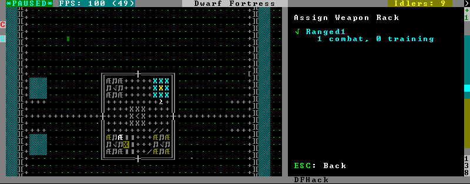

.. _binpatches:

######################
Patching the DF binary
######################

Writing scripts and plugins for DFHack is not the only way to modify Dwarf
Fortress.  Before DFHack, it was common for tools to manually patch the
binary to change behaviour, and DFHack still contains tools to do this via
the `binpatch` command.

.. warning::

    We recommend using a script or plugin instead of a raw patch if
    at all possible - that way your work will work for many versions
    across multiple operating systems.

.. contents:: Contents
  :local:

Getting a patch
===============
There are no binary patches available for Dwarf Fortress versions after 0.34.11.

This system is kept for the chance that someone will find it useful, so some
hints on how to write your own follow.  This will require disassembly and
decent skill in `memory research <memory-research>`.

* The patches are expected to be encoded in text format used by IDA.

* See `the patches folder in commit b0e1b51 <https://github.com/DFHack/dfhack/tree/b0e1b51d2ac08dd8c914f6ec299c5b355525a9aa/patches/>`_ for examples.

* :issue:`546` is about the future of the binpatches, and may be useful reading.

If you want to write a patch, the armory patches discussed here and documented
below would probably be the best place to start.

Using a patch
=============
There are two methods to apply a patch.

Patching at runtime
-------------------
The `binpatch` script checks, applies or removes binary patches
directly in memory at runtime::

    binpatch [check|apply|remove] <patchname>

If the name of the patch has no extension or directory separators, the
script uses :file:`hack/patches/<df-version>/<name>.dif`, thus auto-selecting
the version appropriate for the currently loaded executable.

This is the preferred method; it's easier to debug, does not cause persistent
problems, and leaves file checksums alone.  As with many other commands, users
can simply add it to `dfhack.init` to reapply the patch every time DF is run.

Patching on disk
----------------

.. warning::

    This method of patching is deprecated, and may be removed without notice.
    You should use the runtime patching option above.

DFHack includes a small stand-alone utility for applying and removing
binary patches from the game executable. Use it from the regular operating
system console:

``binpatch check "Dwarf Fortress.exe" patch.dif``
        Checks and prints if the patch is currently applied.

``binpatch apply "Dwarf Fortress.exe" patch.dif``
        Applies the patch, unless it is already applied or in conflict.

``binpatch remove "Dwarf Fortress.exe" patch.dif``
        Removes the patch, unless it is already removed.

If you use a permanent patch under OSX or Linux, you must update
``symbols.xml`` with the new checksum of the executable.  Find the relevant
section, and add a new line:

.. code-block:: xml

    <md5-hash value='????????????????????????????????'/>

In order to find the correct value of the hash, look into stderr.log;
DFHack prints an error there if it does not recognize the hash.

.. _binpatches/needs-patch:

Tools reliant on binpatches
===========================
Some DFHack tools require the game to be patched to work.  As no patches
are currently available, the full description of each is included here.

fix-armory
----------
Enables a fix for storage of squad equipment in barracks.

Specifically, it prevents your haulers from moving squad equipment
to stockpiles, and instead queues jobs to store it on weapon racks,
armor stands, and in containers.

.. note::

  In order to actually be used, weapon racks have to be patched and
  manually assigned to a squad. See `gui/assign-rack`.

Note that the buildings in the armory are used as follows:

* Weapon racks (when patched) are used to store any assigned weapons.
  Each rack belongs to a specific squad, and can store up to 5 weapons.

* Armor stands belong to specific squad members and are used for
  armor and shields.

* Cabinets are used to store assigned clothing for a specific squad member.
  They are **never** used to store owned clothing.

* Chests (boxes, etc) are used for a flask, backpack or quiver assigned
  to the squad member. Due to a probable bug, food is dropped out of the
  backpack when it is stored.

.. warning::

  Although armor stands, cabinets and chests properly belong only to one
  squad member, the owner of the building used to create the barracks will
  randomly use any containers inside the room. Thus, it is recommended to
  always create the armory from a weapon rack.

Contrary to the common misconception, all these uses are controlled by the
*Individual Equipment* usage flag. The *Squad Equipment* flag is actually
intended for ammo, but the game does even less in that area than for armor
and weapons. This plugin implements the following rules almost from scratch:

* Combat ammo is stored in chests inside rooms with Squad Equipment enabled.

* If a chest is assigned to a squad member due to Individual Equipment also
  being set, it is only used for that squad's ammo; otherwise, any squads
  with Squad Equipment on the room will use all of the chests at random.

* Training ammo is stored in chests inside archery ranges designated from
  archery targets, and controlled by the same Train flag as archery training
  itself. This is inspired by some defunct code for weapon racks.

There are some minor traces in the game code to suggest that the first of
these rules is intended by Toady; the rest are invented by this plugin.

gui/assign-rack
---------------
Bind to a key (the example config uses :kbd:`P`), and activate when viewing a weapon
rack in the :kbd:`q` mode.

This script is part of a group of related fixes to make the armory storage
work again. The existing issues are:

* Weapon racks have to each be assigned to a specific squad, like with
  beds/boxes/armor stands and individual squad members, but nothing in
  the game does this. This issue is what this script addresses.

* Even if assigned by the script, **the game will unassign the racks again
  without a binary patch**.  This patch is called ``weaponrack-unassign``,
  and has not been updated since 0.34.11. See :bug:`1445` for more info.

* Haulers still take equipment stored in the armory away to the stockpiles,
  unless `fix-armory` is used.

The script interface simply lets you designate one of the squads that
are assigned to the barracks/armory containing the selected stand as
the intended user. In order to aid in the choice, it shows the number
of currently assigned racks for every valid squad.
