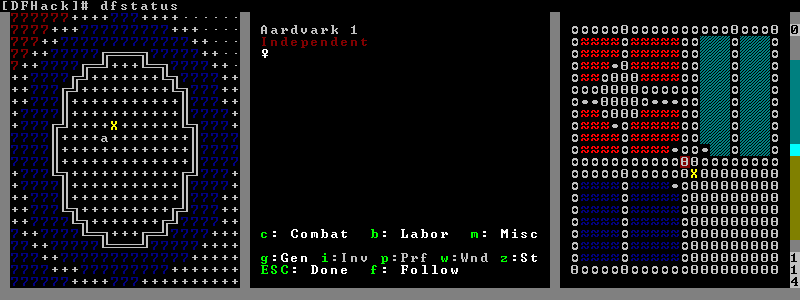
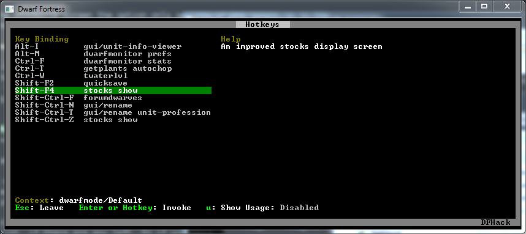
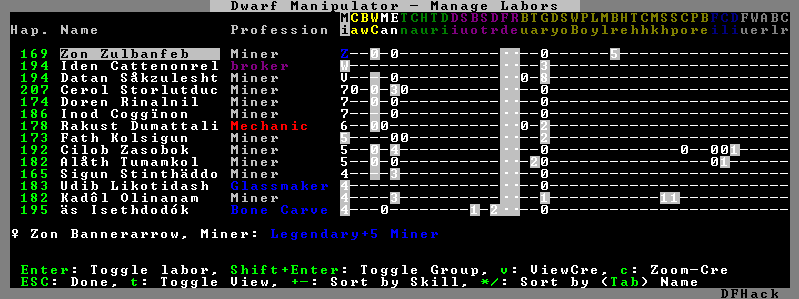
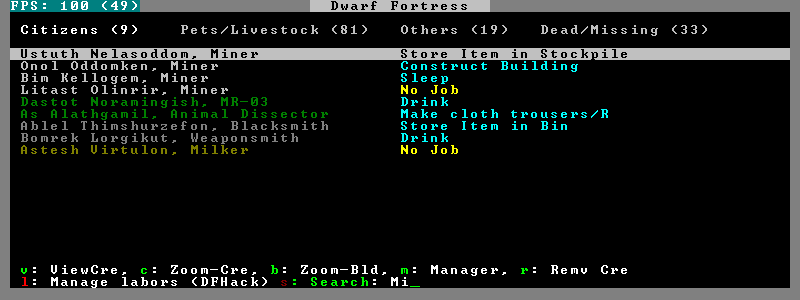
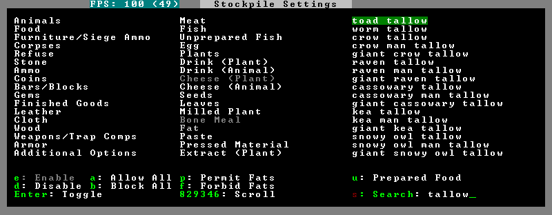
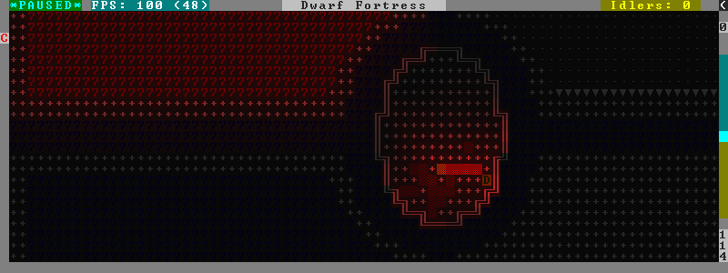

##############
DFHack Plugins
##############

DFHack plugins are the commands, that are compiled with a specific version.
They can provide anything from a small keybinding, to a complete overhaul of
game subsystems or the entire renderer.

Most commands offered by plugins are listed here,
hopefully organised in a way you will find useful.

.. contents::
   :depth: 3

===============================
Data inspection and visualizers
===============================

.. _stonesense:

stonesense
==========
An isometric visualizer that runs in a second window. This requires working
graphics acceleration and at least a dual core CPU (otherwise it will slow
down DF). Usage:

:stonesense:        Open the visualiser in a new window.  Alias ``ssense``.
:ssense overlay:    Overlay DF window, replacing the map area.
                    ``PRINT_MODE:2D`` strongly recommended for stability.

Stonesense can be configured by editing the :file:`stonesense/init.txt`
and :file:`stonesense/keybinds.txt` files. Additional content, such as sprites
for modded creatures, is available from the content repository on the wiki.

For detailed information, see the `stonesense readme`_, the :wiki:`wiki page
<Utility:Stonesense>`, or the :forums:`Bay12 forums thread <106497>`.

.. _`stonesense readme`: https://github.com/DFHack/stonesense/blob/master/README.md

.. _blueprint:

blueprint
=========
Exports a portion of your fortress into QuickFort style blueprint files.::

    blueprint <x> <y> <z> <name> [dig] [build] [place] [query]

Options (If only region and name are given, export all):

:x,y,z:     Size of map area to export
:name:      Name of export files
:dig:       Export dig commands to "<name>-dig.csv"
:build:     Export build commands to "<name>-build.csv"
:place:     Export stockpile commands to "<name>-place.csv"
:query:     Export query commands to "<name>-query.csv"

Goes very well with `fortplan`, for re-importing.

.. _remotefortressreader:

remotefortressreader
====================
An in-development plugin for realtime fortress visualisation.
See :forums:`Armok Vision <146473>`.

cursecheck
==========
Checks a single map tile or the whole map/world for cursed creatures (ghosts,
vampires, necromancers, werebeasts, zombies).

With an active in-game cursor only the selected tile will be observed.
Without a cursor the whole map will be checked.

By default cursed creatures will be only counted in case you just want to find
out if you have any of them running around in your fort. Dead and passive
creatures (ghosts who were put to rest, killed vampires, ...) are ignored.
Undead skeletons, corpses, bodyparts and the like are all thrown into the curse
category "zombie". Anonymous zombies and resurrected body parts will show
as "unnamed creature".

Options:

:detail:      Print full name, date of birth, date of curse and some status
              info (some vampires might use fake identities in-game, though).
:nick:        Set the type of curse as nickname (does not always show up
              in-game, some vamps don't like nicknames).
:all:         Include dead and passive cursed creatures (can result in a quite
              long list after having FUN with necromancers).
:verbose:     Print all curse tags (if you really want to know it all).

Examples:

``cursecheck detail all``
   Give detailed info about all cursed creatures including deceased ones (no
   in-game cursor).
``cursecheck nick``
   Give a nickname all living/active cursed creatures on the map(no in-game
   cursor).

.. note::

    If you do a full search (with the option "all") former ghosts will show up
    with the cursetype "unknown" because their ghostly flag is not set.

    Please report any living/active creatures with cursetype "unknown" -
    this is most likely with mods which introduce new types of curses.

flows
=====
A tool for checking how many tiles contain flowing liquids. If you suspect that
your magma sea leaks into HFS, you can use this tool to be sure without
revealing the map.

probe
=====
Can be used to determine tile properties like temperature.

.. _prospect:

prospect
========
Prints a big list of all the present minerals and plants. By default, only
the visible part of the map is scanned.

Options:

:all:   Scan the whole map, as if it was revealed.
:value: Show material value in the output. Most useful for gems.
:hell:  Show the Z range of HFS tubes. Implies 'all'.

If prospect is called during the embark selection screen, it displays an estimate of
layer stone availability.

.. note::

    The results of pre-embark prospect are an *estimate*, and can at best be expected
    to be somewhere within +/- 30% of the true amount; sometimes it does a lot worse.
    Especially, it is not clear how to precisely compute how many soil layers there
    will be in a given embark tile, so it can report a whole extra layer, or omit one
    that is actually present.

Options:

:all:    Also estimate vein mineral amounts.

.. _reveal:
.. _unreveal:
.. _revtoggle:
.. _revflood:
.. _revforget:

reveal
======
This reveals the map. By default, HFS will remain hidden so that the demons
don't spawn. You can use ``reveal hell`` to reveal everything. With hell revealed,
you won't be able to unpause until you hide the map again. If you really want
to unpause with hell revealed, use ``reveal demons``.

Reveal also works in adventure mode, but any of its effects are negated once
you move. When you use it this way, you don't need to run ``unreveal``.

Usage and related commands:

:reveal:        Reveal the whole map, except for HFS to avoid demons spawning
:reveal hell:   Also show hell, but requires ``unreveal`` before unpausing
:reveal demons: Reveals everything and allows unpausing - good luck!
:unreveal:      Reverts the effects of ``reveal``
:revtoggle:     Switches between ``reveal`` and ``unreveal``
:revflood:      Hide everything, then reveal tiles with a path to the cursor
                (useful to make walled-off rooms vanish)
:revforget:     Discard info about what was visible before revealing the map.
                Only useful where (eg) you abandoned with the fort revealed
                and no longer want the data.

showmood
========
Shows all items needed for the currently active strange mood.

========
Bugfixes
========

fixdiplomats
============
Adds a Diplomat position to all Elven civilizations, allowing them to negotiate
tree cutting quotas - and you to violate them and start wars.
This was vanilla behaviour until ``0.31.12``, in which the "bug" was "fixed".

fixmerchants
============
Adds the Guild Representative position to all Human civilizations,
allowing them to make trade agreements.  This was the default behaviour in
``0.28.181.40d`` and earlier.

.. _fix-unit-occupancy:

fix-unit-occupancy
==================
This plugin fixes issues with unit occupancy, notably phantom
"unit blocking tile" messages (:bug:`3499`). It can be run manually, or
periodically when enabled with the built-in enable/disable commands:

:(no argument):         Run the plugin once immediately, for the whole map.
:-h, here, cursor:      Run immediately, only operate on the tile at the cursor
:-n, dry, dry-run:      Run immediately, do not write changes to map
:interval <X>:          Run the plugin every ``X`` ticks (when enabled).
                        The default is 1200 ticks, or 1 day.
                        Ticks are only counted when the game is unpaused.

.. _fixveins:

fixveins
========
Removes invalid references to mineral inclusions and restores missing ones.
Use this if you broke your embark with tools like `tiletypes`, or if you
accidentally placed a construction on top of a valuable mineral floor.

petcapRemover
=============
Allows you to remove or raise the pet population cap. In vanilla
DF, pets will not reproduce unless the population is below 50 and the number of
children of that species is below a certain percentage. This plugin allows
removing the second restriction and removing or raising the first. Pets still
require PET or PET_EXOTIC tags in order to reproduce. Type ``help petcapRemover``
for exact usage. In order to make population more stable and avoid sudden
population booms as you go below the raised population cap, this plugin counts
pregnancies toward the new population cap. It can still go over, but only in the
case of multiple births.

Usage:

:petcapRemover:             cause pregnancies now and schedule the next check
:petcapRemover every n:     set how often in ticks the plugin checks for possible pregnancies
:petcapRemover cap n:       set the new cap to n. if n = 0, no cap
:petcapRemover pregtime n:  sets the pregnancy duration to n ticks. natural pregnancies are
                            300000 ticks for the current race and 200000 for everyone else

.. _tweak:

tweak
=====
Contains various tweaks for minor bugs.

One-shot subcommands:

:clear-missing:  Remove the missing status from the selected unit.
                 This allows engraving slabs for ghostly, but not yet
                 found, creatures.
:clear-ghostly:  Remove the ghostly status from the selected unit and mark
                 it as dead. This allows getting rid of bugged ghosts
                 which do not show up in the engraving slab menu at all,
                 even after using clear-missing. It works, but is
                 potentially very dangerous - so use with care. Probably
                 (almost certainly) it does not have the same effects like
                 a proper burial. You've been warned.
:fixmigrant:     Remove the resident/merchant flag from the selected unit.
                 Intended to fix bugged migrants/traders who stay at the
                 map edge and don't enter your fort. Only works for
                 dwarves (or generally the player's race in modded games).
                 Do NOT abuse this for 'real' caravan merchants (if you
                 really want to kidnap them, use 'tweak makeown' instead,
                 otherwise they will have their clothes set to forbidden etc).
:makeown:        Force selected unit to become a member of your fort.
                 Can be abused to grab caravan merchants and escorts, even if
                 they don't belong to the player's race. Foreign sentients
                 (humans, elves) can be put to work, but you can't assign rooms
                 to them and they don't show up in DwarfTherapist because the
                 game treats them like pets. Grabbing draft animals from
                 a caravan can result in weirdness (animals go insane or berserk
                 and are not flagged as tame), but you are allowed to mark them
                 for slaughter. Grabbing wagons results in some funny spam, then
                 they are scuttled.

Subcommands that persist until disabled or DF quits:

:adamantine-cloth-wear: Prevents adamantine clothing from wearing out while being worn (bug 6481).
:advmode-contained:     Works around :bug:`6202`, custom reactions with container inputs
                        in advmode. The issue is that the screen tries to force you to select
                        the contents separately from the container. This forcefully skips child
                        reagents.
:civ-view-agreement:    Fixes overlapping text on the "view agreement" screen
:craft-age-wear:        Fixes the behavior of crafted items wearing out over time (:bug:`6003`).
                        With this tweak, items made from cloth and leather will gain a level of
                        wear  every 20 years.
:embark-profile-name:   Allows the use of lowercase letters when saving embark profiles
:eggs-fertile:          Displays a fertility indicator on nestboxes
:farm-plot-select:      Adds "Select all" and "Deselect all" options to farm plot menus
:fast-heat:             Further improves temperature update performance by ensuring that 1 degree
                        of item temperature is crossed in no more than specified number of frames
                        when updating from the environment temperature. This reduces the time it
                        takes for stable-temp to stop updates again when equilibrium is disturbed.
:fast-trade:            Makes Shift-Down in the Move Goods to Depot and Trade screens select
                        the current item (fully, in case of a stack), and scroll down one line.
:fps-min:               Fixes the in-game minimum FPS setting
:import-priority-category:
                        Allows changing the priority of all goods in a
                        category when discussing an import agreement with the liaison
:kitchen-keys:          Fixes DF kitchen meal keybindings (:bug:`614`)
:kitchen-prefs-color:   Changes color of enabled items to green in kitchen preferences
:kitchen-prefs-empty:   Fixes a layout issue with empty kitchen tabs (:bug:`9000`)
:manager-quantity:      Removes the limit of 30 jobs per manager order
:max-wheelbarrow:       Allows assigning more than 3 wheelbarrows to a stockpile
:military-color-assigned:
                        Color squad candidates already assigned to other squads in yellow/green
                        to make them stand out more in the list.

                        .. image:: images/tweak-mil-color.png

:military-stable-assign:
                        Preserve list order and cursor position when assigning to squad,
                        i.e. stop the rightmost list of the Positions page of the military
                        screen from constantly resetting to the top.
:nestbox-color:         Fixes the color of built nestboxes
:shift-8-scroll:        Gives Shift-8 (or :kbd:`*`) priority when scrolling menus, instead of scrolling the map
:stable-cursor:         Saves the exact cursor position between t/q/k/d/b/etc menus of fortress mode.
:tradereq-pet-gender:   Displays pet genders on the trade request screen

.. _fix-armory:

fix-armory
==========
`This plugin requires a binpatch <binpatches/needs-patch>`, which has not
been available since DF 0.34.11

===========
UI Upgrades
===========

.. note::

    In order to avoid user confusion, as a matter of policy all GUI tools
    display the word :guilabel:`DFHack` on the screen somewhere while active.

    When that is not appropriate because they merely add keybinding hints to
    existing DF screens, they deliberately use red instead of green for the key.

.. _automelt:

automelt
========
When automelt is enabled for a stockpile, any meltable items placed
in it will be designated to be melted.
This plugin adds an option to the :kbd:`q` menu when `enabled <enable>`.

.. _autotrade:

autotrade
=========
When autotrade is enabled for a stockpile, any items placed in it will be
designated to be taken to the Trade Depot whenever merchants are on the map.
This plugin adds an option to the :kbd:`q` menu when `enabled <enable>`.

.. _command-prompt:

command-prompt
==============
An in-game DFHack terminal, where you can enter other commands.
Best used from a keybinding; by default :kbd:`Ctrl`:kbd:`Shift`:kbd:`P`.

Usage: ``command-prompt [entry]``

If called with an entry, it starts with that text filled in.
Most useful for developers, who can set a keybinding to open
a laungage interpreter for lua or Ruby by starting with the
`:lua <lua>` or `:rb <rb>` commands.

Otherwise somewhat similar to `gui/quickcmd`.

.. _hotkeys:

hotkeys
=======
Opens an in-game screen showing which DFHack keybindings are
active in the current context.

Type ``hotkeys`` into the DFHack console to open the screen,
or bind the command to a globally active hotkey.  The default
keybinding is :kbd:`Ctrl`:kbd:`F1`.  See also `hotkey-notes`.

.. _rb:

rb
==
Ruby language plugin, which evaluates the following arguments as a ruby string.
Best used as ``:rb [string]``, for the special parsing mode.  Alias ``rb_eval``.

.. _manipulator:

manipulator
===========
An in-game equivalent to the popular program Dwarf Therapist.

To activate, open the unit screen and press :kbd:`l`.

The far left column displays the unit's Happiness (color-coded based on its
value), Name, Profession/Squad, and the right half of the screen displays each
dwarf's labor settings and skill levels (0-9 for Dabbling through Professional,
A-E for Great through Grand Master, and U-Z for Legendary through Legendary+5).

Cells with teal backgrounds denote skills not controlled by labors, e.g.
military and social skills.

.. image:: images/manipulator2.png

Press :kbd:`t` to toggle between Profession and Squad view.

.. image:: images/manipulator3.png

Use the arrow keys or number pad to move the cursor around, holding :kbd:`Shift` to
move 10 tiles at a time.

Press the Z-Up (:kbd:`<`) and Z-Down (:kbd:`>`) keys to move quickly between labor/skill
categories. The numpad Z-Up and Z-Down keys seek to the first or last unit
in the list. :kbd:`Backspace` seeks to the top left corner.

Press Enter to toggle the selected labor for the selected unit, or Shift+Enter
to toggle all labors within the selected category.

Press the :kbd:`+`:kbd:`-` keys to sort the unit list according to the currently selected
skill/labor, and press the :kbd:`*`:kbd:`/` keys to sort the unit list by Name, Profession/Squad,
Happiness, or Arrival order (using :kbd:`Tab` to select which sort method to use here).

With a unit selected, you can press the :kbd:`v` key to view its properties (and
possibly set a custom nickname or profession) or the :kbd:`c` key to exit
Manipulator and zoom to its position within your fortress.

The following mouse shortcuts are also available:

* Click on a column header to sort the unit list. Left-click to sort it in one
  direction (descending for happiness or labors/skills, ascending for name,
  profession or squad) and right-click to sort it in the opposite direction.
* Left-click on a labor cell to toggle that labor. Right-click to move the
  cursor onto that cell instead of toggling it.
* Left-click on a unit's name, profession or squad to view its properties.
* Right-click on a unit's name, profession or squad to zoom to it.

Pressing :kbd:`Esc` normally returns to the unit screen, but :kbd:`Shift`:kbd:`Esc` would exit
directly to the main dwarf mode screen.

.. comment - the link target "search" is reserved for the Sphinx search page
.. _search-plugin:

search
======
The search plugin adds search to the Stocks, Animals, Trading, Stockpile,
Noble (assignment candidates), Military (position candidates), Burrows
(unit list), Rooms, Announcements, Job List and Unit List screens.

Searching works the same way as the search option in :guilabel:`Move to Depot`.
You will see the Search option displayed on screen with a hotkey (usually :kbd:`s`).
Pressing it lets you start typing a query and the relevant list will start
filtering automatically.

Pressing :kbd:`Enter`, :kbd:`Esc` or the arrow keys will return you to browsing the now
filtered list, which still functions as normal. You can clear the filter
by either going back into search mode and backspacing to delete it, or
pressing the "shifted" version of the search hotkey while browsing the
list (e.g. if the hotkey is :kbd:`s`, then hitting :kbd:`Shift`:kbd:`s` will clear any
filter).

Leaving any screen automatically clears the filter.

In the Trade screen, the actual trade will always only act on items that
are actually visible in the list; the same effect applies to the Trade
Value numbers displayed by the screen. Because of this, the :kbd:`t` key is
blocked while search is active, so you have to reset the filters first.
Pressing :kbd:`Alt`:kbd:`C` will clear both search strings.

In the stockpile screen the option only appears if the cursor is in the
rightmost list:

Note that the 'Permit XXX'/'Forbid XXX' keys conveniently operate only
on items actually shown in the rightmost list, so it is possible to select
only fat or tallow by forbidding fats, then searching for fat/tallow, and
using Permit Fats again while the list is filtered.

.. _nopause:

nopause
=======
Disables pausing (both manual and automatic) with the exception of pause forced
by `reveal` ``hell``. This is nice for digging under rivers.

.. _embark-tools:

embark-tools
============
A collection of embark-related tools. Usage and available tools::

    embark-tools enable/disable tool [tool]...

:anywhere:      Allows embarking anywhere (including sites, mountain-only biomes,
                and oceans). Use with caution.
:mouse:         Implements mouse controls (currently in the local embark region only)
:sand:          Displays an indicator when sand is present in the currently-selected
                area, similar to the default clay/stone indicators.
:sticky:        Maintains the selected local area while navigating the world map

.. _automaterial:

automaterial
============
This makes building constructions (walls, floors, fortifications, etc) a little bit
easier by saving you from having to trawl through long lists of materials each time
you place one.

Firstly, it moves the last used material for a given construction type to the top of
the list, if there are any left. So if you build a wall with chalk blocks, the next
time you place a wall the chalk blocks will be at the top of the list, regardless of
distance (it only does this in "grouped" mode, as individual item lists could be huge).
This should mean you can place most constructions without having to search for your
preferred material type.

.. image:: images/automaterial-mat.png

Pressing :kbd:`a` while highlighting any material will enable that material for "auto select"
for this construction type. You can enable multiple materials as autoselect. Now the next
time you place this type of construction, the plugin will automatically choose materials
for you from the kinds you enabled. If there is enough to satisfy the whole placement,
you won't be prompted with the material screen - the construction will be placed and you
will be back in the construction menu as if you did it manually.

When choosing the construction placement, you will see a couple of options:

.. image:: images/automaterial-pos.png

Use :kbd:`a` here to temporarily disable the material autoselection, e.g. if you need
to go to the material selection screen so you can toggle some materials on or off.

The other option (auto type selection, off by default) can be toggled on with :kbd:`t`. If you
toggle this option on, instead of returning you to the main construction menu after selecting
materials, it returns you back to this screen. If you use this along with several autoselect
enabled materials, you should be able to place complex constructions more conveniently.

.. _buildingplan:

buildingplan
============
When active (via ``enable buildingplan``), this plugin adds a planning mode for
furniture placement.  You can then place furniture and other buildings before
the required materials are available, and the job will be unsuspended when
the item is created.

Very useful when combined with `workflow` - you can set a constraint
to always have one or two doors/beds/tables/chairs/etc available, and place
as many as you like.  The plugins then take over and fulfill the orders,
with minimal space dedicated to stockpiles.

.. _confirm:

confirm
=======
Implements several confirmation dialogs for potentially destructive actions
(for example, seizing goods from traders or deleting hauling routes).

Usage:

:enable confirm:    Enable all confirmations; alias ``confirm enable all``.
                    Replace with ``disable`` to disable.
:confirm help:      List available confirmation dialogues.
:confirm enable option1 [option2...]:
                    Enable (or disable) specific confirmation dialogues.

follow
======
Makes the game view follow the currently highlighted unit after you exit from the
current menu or cursor mode. Handy for watching dwarves running around. Deactivated
by moving the view manually.

.. _mousequery:

mousequery
==========
Adds mouse controls to the DF interface, eg click-and-drag designations.

Options:

:plugin:    enable/disable the entire plugin
:rbutton:   enable/disable right mouse button
:track:     enable/disable moving cursor in build and designation mode
:edge:      enable/disable active edge scrolling (when on, will also enable tracking)
:live:      enable/disable query view when unpaused
:delay:     Set delay when edge scrolling in tracking mode. Omit amount to display current setting.

Usage::

    mousequery [plugin] [rbutton] [track] [edge] [live] [enable|disable]

.. _resume:

resume
======
Allows automatic resumption of suspended constructions, along with colored
UI hints for construction status.

.. _trackstop:

trackstop
=========
Adds a :kbd:`q` menu for track stops, which is completely blank by default.
This allows you to view and/or change the track stop's friction and dump
direction settings, using the keybindings from the track stop building interface.

.. _sort-items:

sort-items
==========
Sort the visible item list::

    sort-items order [order...]

Sort the item list using the given sequence of comparisons.
The ``<`` prefix for an order makes undefined values sort first.
The ``>`` prefix reverses the sort order for defined values.

Item order examples::

    description material wear type quality

The orderings are defined in ``hack/lua/plugins/sort/*.lua``

.. _sort-units:

sort-units
==========
Sort the visible unit list::

    sort-units order [order...]

Sort the unit list using the given sequence of comparisons.
The ``<`` prefix for an order makes undefined values sort first.
The ``>`` prefix reverses the sort order for defined values.

Unit order examples::

    name age arrival squad squad_position profession

The orderings are defined in ``hack/lua/plugins/sort/*.lua``

.. _stocks:

stocks
======
Replaces the DF stocks screen with an improved version.

.. _stocksettings:
.. _stockpiles:

stocksettings
=============
Offers the following commands to save and load stockpile settings.
See `gui/stockpiles` for an in-game interface.

:copystock:     Copies the parameters of the currently highlighted stockpile to the custom
                stockpile settings and switches to custom stockpile placement mode, effectively
                allowing you to copy/paste stockpiles easily.

:savestock:     Saves the currently highlighted stockpile's settings to a file in your Dwarf
                Fortress folder. This file can be used to copy settings between game saves or
                players.  eg:  ``savestock food_settings.dfstock``

:loadstock:     Loads a saved stockpile settings file and applies it to the currently selected
                stockpile.  eg:  ``loadstock food_settings.dfstock``

To use savestock and loadstock, use the :kbd:`q` command to highlight a stockpile.
Then run savestock giving it a descriptive filename. Then, in a different (or
the same!) gameworld, you can highlight any stockpile with :kbd:`q` then execute the
``loadstock`` command passing it the name of that file. The settings will be
applied to that stockpile.

Note that files are relative to the DF folder, so put your files there or in a
subfolder for easy access. Filenames should not have spaces.  Generated materials,
divine metals, etc are not saved as they are different in every world.

.. _rename:

rename
======
Allows renaming various things.  Use `gui/rename` for an in-game interface.

Options:

``rename squad <index> "name"``
  Rename squad by index to 'name'.
``rename hotkey <index> \"name\"``
  Rename hotkey by index. This allows assigning
  longer commands to the DF hotkeys.
``rename unit "nickname"``
  Rename a unit/creature highlighted in the DF user interface.
``rename unit-profession "custom profession"``
  Change proffession name of the highlighted unit/creature.
``rename building "name"``
  Set a custom name for the selected building.
  The building must be one of stockpile, workshop, furnace, trap,
  siege engine or an activity zone.

.. _rendermax:

rendermax
=========
A collection of renderer replacing/enhancing filters. For better effect try changing the
black color in palette to non totally black. See :forums:`128487` for more info.

Options:

:trippy:                        Randomizes the color of each tiles. Used for fun, or testing.
:light:                         Enable lighting engine.
:light reload:                  Reload the settings file.
:light sun <x>|cycle:           Set time to <x> (in hours) or set it to df time cycle.
:occlusionON, occlusionOFF:     Show debug occlusion info.
:disable:                       Disable any filter that is enabled.

An image showing lava and dragon breath. Not pictured here: sunlight, shining items/plants,
materials that color the light etc...

===========================
Job and Fortress management
===========================

.. _autolabor:

autolabor
=========
Automatically manage dwarf labors to efficiently complete jobs.
Autolabor tries to keep as many dwarves as possible busy but
also tries to have dwarves specialize in specific skills.

The key is that, for almost all labors, once a dwarf begins a job it will finish that
job even if the associated labor is removed. Autolabor therefore frequently checks
which dwarf or dwarves should take new jobs for that labor, and sets labors accordingly.
Labors with equiptment (mining, hunting, and woodcutting), which are abandoned
if labors change mid-job, are handled slightly differently to minimise churn.

.. warning::

    *autolabor will override any manual changes you make to labors while
    it is enabled, including through other tools such as Dwarf Therapist*

Simple usage:

:enable autolabor:      Enables the plugin with default settings.  (Persistent per fortress)
:disable autolabor:     Disables the plugin.

Anything beyond this is optional - autolabor works well on the default settings.

By default, each labor is assigned to between 1 and 200 dwarves (2-200 for mining).
By default 33% of the workforce become haulers, who handle all hauling jobs as well
as cleaning, pulling levers, recovering wounded, removing constructions, and filling ponds.
Other jobs are automatically assigned as described above.  Each of these settings can be adjusted.

Jobs are rarely assigned to nobles with responsibilities for meeting diplomats or merchants,
never to the chief medical dwarf, and less often to the bookeeper and manager.

Hunting is never assigned without a butchery, and fishing is never assigned without a fishery.

For each labor a preference order is calculated based on skill, biased against masters of other
trades and excluding those who can't do the job.  The labor is then added to the best <minimum>
dwarves for that labor.  We assign at least the minimum number of dwarfs, in order of preference,
and then assign additional dwarfs that meet any of these conditions:

* The dwarf is idle and there are no idle dwarves assigned to this labor
* The dwarf has non-zero skill associated with the labor
* The labor is mining, hunting, or woodcutting and the dwarf currently has it enabled.

We stop assigning dwarfs when we reach the maximum allowed.

Advanced usage:

:autolabor <labor> <minimum> [<maximum>]:
                                Set number of dwarves assigned to a labor.
:autolabor <labor> haulers:     Set a labor to be handled by hauler dwarves.
:autolabor <labor> disable:     Turn off autolabor for a specific labor.
:autolabor <labor> reset:       Return a labor to the default handling.
:autolabor reset-all:           Return all labors to the default handling.
:autolabor list:                List current status of all labors.
:autolabor status:              Show basic status information.

See `autolabor-artisans` for a differently-tuned setup.

Examples:

``autolabor MINE``
        Keep at least 5 dwarves with mining enabled.
``autolabor CUT_GEM 1 1``
        Keep exactly 1 dwarf with gemcutting enabled.
``autolabor COOK 1 1 3``
        Keep 1 dwarf with cooking enabled, selected only from the top 3.
``autolabor FEED_WATER_CIVILIANS haulers``
        Have haulers feed and water wounded dwarves.
``autolabor CUTWOOD disable``
        Turn off autolabor for wood cutting.

.. _autohauler:

autohauler
==========
Autohauler is an autolabor fork.

Rather than the all-of-the-above means of autolabor, autohauler will instead
only manage hauling labors and leave skilled labors entirely to the user, who
will probably use Dwarf Therapist to do so.

Idle dwarves will be assigned the hauling labors; everyone else (including
those currently hauling) will have the hauling labors removed. This is to
encourage every dwarf to do their assigned skilled labors whenever possible,
but resort to hauling when those jobs are not available. This also implies
that the user will have a very tight skill assignment, with most skilled
labors only being assigned to just one dwarf, no dwarf having more than two
active skilled labors, and almost every non-military dwarf having at least
one skilled labor assigned.

Autohauler allows skills to be flagged as to prevent hauling labors from
being assigned when the skill is present. By default this is the unused
ALCHEMIST labor but can be changed by the user.

.. _job:

job
===
Command for general job query and manipulation.

Options:

*no extra options*
    Print details of the current job. The job can be selected
    in a workshop, or the unit/jobs screen.
**list**
    Print details of all jobs in the selected workshop.
**item-material <item-idx> <material[:subtoken]>**
    Replace the exact material id in the job item.
**item-type <item-idx> <type[:subtype]>**
    Replace the exact item type id in the job item.

job-material
============
Alter the material of the selected job.  Similar to ``job item-material ...``

Invoked as::

    job-material <inorganic-token>

Intended to be used as a keybinding:

* In :kbd:`q` mode, when a job is highlighted within a workshop or furnace,
  changes the material of the job. Only inorganic materials can be used
  in this mode.
* In :kbd:`b` mode, during selection of building components positions the cursor
  over the first available choice with the matching material.

job-duplicate
=============
In :kbd:`q` mode, when a job is highlighted within a workshop or furnace
building, calling ``job-duplicate`` instantly duplicates the job.

.. _stockflow:

stockflow
=========
Allows the fortress bookkeeper to queue jobs through the manager,
based on space or items available in stockpiles.

Inspired by `workflow`.

Usage:

``stockflow enable``
    Enable the plugin.
``stockflow disable``
    Disable the plugin.
``stockflow fast``
    Enable the plugin in fast mode.
``stockflow list``
    List any work order settings for your stockpiles.
``stockflow status``
    Display whether the plugin is enabled.

While enabled, the :kbd:`q` menu of each stockpile will have two new options:

* :kbd:`j`:  Select a job to order, from an interface like the manager's screen.
* :kbd:`J`:  Cycle between several options for how many such jobs to order.

Whenever the bookkeeper updates stockpile records, new work orders will
be placed on the manager's queue for each such selection, reduced by the
number of identical orders already in the queue.

In fast mode, new work orders will be enqueued once per day, instead of
waiting for the bookkeeper.

.. _workflow:

workflow
========
Manage control of repeat jobs.  `gui/workflow` provides a simple
front-end integrated in the game UI.

Usage:

``workflow enable [option...], workflow disable [option...]``
   If no options are specified, enables or disables the plugin.
   Otherwise, enables or disables any of the following options:

   - drybuckets: Automatically empty abandoned water buckets.
   - auto-melt: Resume melt jobs when there are objects to melt.
``workflow jobs``
   List workflow-controlled jobs (if in a workshop, filtered by it).
``workflow list``
   List active constraints, and their job counts.
``workflow list-commands``
   List active constraints as workflow commands that re-create them;
   this list can be copied to a file, and then reloaded using the
   ``script`` built-in command.
``workflow count <constraint-spec> <cnt-limit> [cnt-gap]``
   Set a constraint, counting every stack as 1 item.
``workflow amount <constraint-spec> <cnt-limit> [cnt-gap]``
   Set a constraint, counting all items within stacks.
``workflow unlimit <constraint-spec>``
   Delete a constraint.
``workflow unlimit-all``
   Delete all constraints.

Function
--------
When the plugin is enabled, it protects all repeat jobs from removal.
If they do disappear due to any cause, they are immediately re-added to their
workshop and suspended.

In addition, when any constraints on item amounts are set, repeat jobs that
produce that kind of item are automatically suspended and resumed as the item
amount goes above or below the limit. The gap specifies how much below the limit
the amount has to drop before jobs are resumed; this is intended to reduce
the frequency of jobs being toggled.

Constraint format
-----------------
The constraint spec consists of 4 parts, separated with ``/`` characters::

    ITEM[:SUBTYPE]/[GENERIC_MAT,...]/[SPECIFIC_MAT:...]/[LOCAL,<quality>]

The first part is mandatory and specifies the item type and subtype,
using the raw tokens for items (the same syntax used custom reaction inputs).
For more information, see :wiki:`this wiki page <Material_token>`.

The subsequent parts are optional:

- A generic material spec constrains the item material to one of
  the hard-coded generic classes, which currently include::

    PLANT WOOD CLOTH SILK LEATHER BONE SHELL SOAP TOOTH HORN PEARL YARN
    METAL STONE SAND GLASS CLAY MILK

- A specific material spec chooses the material exactly, using the
  raw syntax for reaction input materials, e.g. ``INORGANIC:IRON``,
  although for convenience it also allows just ``IRON``, or ``ACACIA:WOOD`` etc.
  See the link above for more details on the unabbreviated raw syntax.

- A comma-separated list of miscellaneous flags, which currently can
  be used to ignore imported items or items below a certain quality.

Constraint examples
-------------------
Keep metal bolts within 900-1000, and wood/bone within 150-200::

    workflow amount AMMO:ITEM_AMMO_BOLTS/METAL 1000 100
    workflow amount AMMO:ITEM_AMMO_BOLTS/WOOD,BONE 200 50

Keep the number of prepared food & drink stacks between 90 and 120::

    workflow count FOOD 120 30
    workflow count DRINK 120 30

Make sure there are always 25-30 empty bins/barrels/bags::

    workflow count BIN 30
    workflow count BARREL 30
    workflow count BOX/CLOTH,SILK,YARN 30

Make sure there are always 15-20 coal and 25-30 copper bars::

    workflow count BAR//COAL 20
    workflow count BAR//COPPER 30

Produce 15-20 gold crafts::

    workflow count CRAFTS//GOLD 20

Collect 15-20 sand bags and clay boulders::

    workflow count POWDER_MISC/SAND 20
    workflow count BOULDER/CLAY 20

Make sure there are always 80-100 units of dimple dye::

    workflow amount POWDER_MISC//MUSHROOM_CUP_DIMPLE:MILL 100 20

.. note::

  In order for this to work, you have to set the material of the PLANT input
  on the Mill Plants job to MUSHROOM_CUP_DIMPLE using the `job item-material <job>`
  command. Otherwise the plugin won't be able to deduce the output material.

Maintain 10-100 locally-made crafts of exceptional quality::

    workflow count CRAFTS///LOCAL,EXCEPTIONAL 100 90

.. _fix-job-postings:

fix-job-postings
----------------
This command fixes crashes caused by previous versions of workflow, mostly in
DFHack 0.40.24-r4, and should be run automatically when loading a world (but can
also be run manually if desired).

.. _clean:

clean
=====
Cleans all the splatter that get scattered all over the map, items and
creatures. In an old fortress, this can significantly reduce FPS lag. It can
also spoil your !!FUN!!, so think before you use it.

Options:

:map:          Clean the map tiles. By default, it leaves mud and snow alone.
:units:        Clean the creatures. Will also clean hostiles.
:items:        Clean all the items. Even a poisoned blade.

Extra options for ``map``:

:mud:          Remove mud in addition to the normal stuff.
:snow:         Also remove snow coverings.

spotclean
=========
Works like ``clean map snow mud``, but only for the tile under the cursor. Ideal
if you want to keep that bloody entrance ``clean map`` would clean up.

.. _autodump:

autodump
========
This plugin adds an option to the :kbd:`q` menu for stckpiles when `enabled <enable>`.
When autodump is enabled for a stockpile, any items placed in the stockpile will
automatically be designated to be dumped.

ALternatively, you can use it to quickly move all items designated to be dumped.
Items are instantly moved to the cursor position, the dump flag is unset,
and the forbid flag is set, as if it had been dumped normally.
Be aware that any active dump item tasks still point at the item.

Cursor must be placed on a floor tile so the items can be dumped there.

Options:

:destroy:            Destroy instead of dumping. Doesn't require a cursor.
                     If called again before the game is resumed, cancels destroy.
:destroy-here:       As ``destroy``, but only the selected item in the :kbd:`k` list,
                     or inside a container.
                     Alias ``autodump-destroy-here``, for keybindings.
:visible:            Only process items that are not hidden.
:hidden:             Only process hidden items.
:forbidden:          Only process forbidden items (default: only unforbidden).

cleanowned
==========
Confiscates items owned by dwarfs. By default, owned food on the floor
and rotten items are confistacted and dumped.

Options:

:all:          confiscate all owned items
:scattered:    confiscated and dump all items scattered on the floor
:x:            confiscate/dump items with wear level 'x' and more
:X:            confiscate/dump items with wear level 'X' and more
:dryrun:       a dry run. combine with other options to see what will happen
               without it actually happening.

Example:

``cleanowned scattered X``
    This will confiscate rotten and dropped food, garbage on the floors and any
    worn items with 'X' damage and above.

.. _dwarfmonitor:

dwarfmonitor
============
Records dwarf activity to measure fort efficiency.

Options:

:enable <mode>:     Start monitoring ``mode``. ``mode`` can be "work", "misery",
                    "weather", or "all".  This will enable all corresponding widgets,
                    if applicable.
:disable <mode>:    Stop monitoring ``mode``, and disable corresponding widgets, if applicable.
:stats:             Show statistics summary
:prefs:             Show dwarf preferences summary
:reload:            Reload configuration file (``dfhack-config/dwarfmonitor.json``)

Widget configuration:

The following types of widgets (defined in :file:`hack/lua/plugins/dwarfmonitor.lua`)
can be displayed on the main fortress mode screen:

:date:      Show the in-game date
:misery:    Show overall happiness levels of all dwarves
:weather:   Show current weather (rain/snow)
:cursor:    Show the current mouse cursor position

The file :file:`dfhack-config/dwarfmonitor.json` can be edited to control the
positions and settings of all widgets displayed. This file should contain a
JSON object with the key ``widgets`` containing an array of objects - see the
included file in the ``dfhack-config`` folder for an example::

    {
        "widgets": [
            {
                "type": "widget type (weather, misery, etc.)",
                "x": X coordinate,
                "y": Y coordinate
                <...additional options...>
            }
        ]
    }

X and Y coordinates begin at zero (in the upper left corner of the screen).
Negative coordinates will be treated as distances from the lower right corner,
beginning at 1 - e.g. an x coordinate of 0 is the leftmost column, while an x
coordinate of 1 is the rightmost column.

By default, the x and y coordinates given correspond to the leftmost tile of
the widget. Including an ``anchor`` option set to ``right`` will cause the
rightmost tile of the widget to be located at this position instead.

Some widgets support additional options:

* ``date`` widget:

  * ``format``: specifies the format of the date. The following characters
    are replaced (all others, such as punctuation, are not modified)

    * ``Y`` or ``y``: The current year
    * ``M``: The current month, zero-padded if necessary
    * ``m``: The current month, *not* zero-padded
    * ``D``: The current day, zero-padded if necessary
    * ``d``: The current day, *not* zero-padded

    The default date format is ``Y-M-D``, per the ISO8601 standard.

* ``cursor`` widget:

  * ``format``: Specifies the format. ``X``, ``x``, ``Y``, and ``y`` are
    replaced with the corresponding cursor cordinates, while all other
    characters are unmodified.
  * ``show_invalid``: If set to ``true``, the mouse coordinates will both be
    displayed as ``-1`` when the cursor is outside of the DF window; otherwise,
    nothing will be displayed.

workNow
=======
Force all dwarves to look for a job immediately, or as soon as the game is unpaused.

.. _seedwatch:

seedwatch
=========
Watches the numbers of seeds available and enables/disables seed and plant cooking.

Each plant type can be assigned a limit. If their number falls below that limit,
the plants and seeds of that type will be excluded from cookery.
If the number rises above the limit + 20, then cooking will be allowed.

The plugin needs a fortress to be loaded and will deactivate automatically otherwise.
You have to reactivate with 'seedwatch start' after you load the game.

Options:

:all:       Adds all plants from the abbreviation list to the watch list.
:start:     Start watching.
:stop:      Stop watching.
:info:      Display whether seedwatch is watching, and the watch list.
:clear:     Clears the watch list.

Examples:

``seedwatch MUSHROOM_HELMET_PLUMP 30``
    add ``MUSHROOM_HELMET_PLUMP`` to the watch list, limit = 30
``seedwatch MUSHROOM_HELMET_PLUMP``
    removes ``MUSHROOM_HELMET_PLUMP`` from the watch list.
``seedwatch all 30``
    adds all plants from the abbreviation list to the watch list, the limit being 30.

.. _zone:

zone
====
Helps a bit with managing activity zones (pens, pastures and pits) and cages.

Options:

:set:         Set zone or cage under cursor as default for future assigns.
:assign:      Assign unit(s) to the pen or pit marked with the 'set' command.
              If no filters are set a unit must be selected in the in-game ui.
              Can also be followed by a valid zone id which will be set
              instead.
:unassign:    Unassign selected creature from it's zone.
:nick:        Mass-assign nicknames, must be followed by the name you want
              to set.
:remnick:     Mass-remove nicknames.
:tocages:     Assign unit(s) to cages inside a pasture.
:uinfo:       Print info about unit(s). If no filters are set a unit must
              be selected in the in-game ui.
:zinfo:       Print info about zone(s). If no filters are set zones under
              the cursor are listed.
:verbose:     Print some more info.
:filters:     Print list of valid filter options.
:examples:    Print some usage examples.
:not:         Negates the next filter keyword.

Filters:

:all:           Process all units (to be used with additional filters).
:count:         Must be followed by a number. Process only n units (to be used
                with additional filters).
:unassigned:    Not assigned to zone, chain or built cage.
:minage:        Minimum age. Must be followed by number.
:maxage:        Maximum age. Must be followed by number.
:race:          Must be followed by a race RAW ID (e.g. BIRD_TURKEY, ALPACA,
                etc). Negatable.
:caged:         In a built cage. Negatable.
:own:           From own civilization. Negatable.
:merchant:      Is a merchant / belongs to a merchant. Should only be used for
                pitting, not for stealing animals (slaughter should work).
:war:           Trained war creature. Negatable.
:hunting:       Trained hunting creature. Negatable.
:tamed:         Creature is tame. Negatable.
:trained:       Creature is trained. Finds war/hunting creatures as well as
                creatures who have a training level greater than 'domesticated'.
                If you want to specifically search for war/hunting creatures use
                'war' or 'hunting' Negatable.
:trainablewar:  Creature can be trained for war (and is not already trained for
                war/hunt). Negatable.
:trainablehunt: Creature can be trained for hunting (and is not already trained
                for war/hunt). Negatable.
:male:          Creature is male. Negatable.
:female:        Creature is female. Negatable.
:egglayer:      Race lays eggs. Negatable.
:grazer:        Race is a grazer. Negatable.
:milkable:      Race is milkable. Negatable.

Usage with single units
-----------------------
One convenient way to use the zone tool is to bind the command 'zone assign' to
a hotkey, maybe also the command 'zone set'. Place the in-game cursor over
a pen/pasture or pit, use 'zone set' to mark it. Then you can select units
on the map (in 'v' or 'k' mode), in the unit list or from inside cages
and use 'zone assign' to assign them to their new home. Allows pitting your
own dwarves, by the way.

Usage with filters
------------------
All filters can be used together with the 'assign' command.

Restrictions: It's not possible to assign units who are inside built cages
or chained because in most cases that won't be desirable anyways.
It's not possible to cage owned pets because in that case the owner
uncages them after a while which results in infinite hauling back and forth.

Usually you should always use the filter 'own' (which implies tame) unless you
want to use the zone tool for pitting hostiles. 'own' ignores own dwarves unless
you specify 'race DWARF' (so it's safe to use 'assign all own' to one big
pasture if you want to have all your animals at the same place). 'egglayer' and
'milkable' should be used together with 'female' unless you have a mod with
egg-laying male elves who give milk or whatever. Merchants and their animals are
ignored unless you specify 'merchant' (pitting them should be no problem,
but stealing and pasturing their animals is not a good idea since currently they
are not properly added to your own stocks; slaughtering them should work).

Most filters can be negated (e.g. 'not grazer' -> race is not a grazer).

Mass-renaming
-------------
Using the 'nick' command you can set the same nickname for multiple units.
If used without 'assign', 'all' or 'count' it will rename all units in the
current default target zone. Combined with 'assign', 'all' or 'count' (and
further optional filters) it will rename units matching the filter conditions.

Cage zones
----------
Using the 'tocages' command you can assign units to a set of cages, for example
a room next to your butcher shop(s). They will be spread evenly among available
cages to optimize hauling to and butchering from them. For this to work you need
to build cages and then place one pen/pasture activity zone above them, covering
all cages you want to use. Then use 'zone set' (like with 'assign') and use
'zone tocages filter1 filter2 ...'. 'tocages' overwrites 'assign' because it
would make no sense, but can be used together with 'nick' or 'remnick' and all
the usual filters.

Examples
--------
``zone assign all own ALPACA minage 3 maxage 10``
   Assign all own alpacas who are between 3 and 10 years old to the selected
   pasture.
``zone assign all own caged grazer nick ineedgrass``
   Assign all own grazers who are sitting in cages on stockpiles (e.g. after
   buying them from merchants) to the selected pasture and give them
   the nickname 'ineedgrass'.
``zone assign all own not grazer not race CAT``
   Assign all own animals who are not grazers, excluding cats.
``zone assign count 5 own female milkable``
   Assign up to 5 own female milkable creatures to the selected pasture.
``zone assign all own race DWARF maxage 2``
   Throw all useless kids into a pit :)
``zone nick donttouchme``
   Nicknames all units in the current default zone or cage to 'donttouchme'.
   Mostly intended to be used for special pastures or cages which are not marked
   as rooms you want to protect from autobutcher.
``zone tocages count 50 own tame male not grazer``
   Stuff up to 50 owned tame male animals who are not grazers into cages built
   on the current default zone.

autonestbox
===========
Assigns unpastured female egg-layers to nestbox zones. Requires that you create
pen/pasture zones above nestboxes. If the pen is bigger than 1x1 the nestbox
must be in the top left corner. Only 1 unit will be assigned per pen, regardless
of the size. The age of the units is currently not checked, most birds grow up
quite fast. Egglayers who are also grazers will be ignored, since confining them
to a 1x1 pasture is not a good idea. Only tame and domesticated own units are
processed since pasturing half-trained wild egglayers could destroy your neat
nestbox zones when they revert to wild. When called without options autonestbox
will instantly run once.

Options:

:start:        Start running every X frames (df simulation ticks).
               Default: X=6000, which would be every 60 seconds at 100fps.
:stop:         Stop running automatically.
:sleep:        Must be followed by number X. Changes the timer to sleep X
               frames between runs.

.. _autobutcher:

autobutcher
===========
Assigns lifestock for slaughter once it reaches a specific count. Requires that
you add the target race(s) to a watch list. Only tame units will be processed.

Units will be ignored if they are:

* Nicknamed (for custom protection; you can use the `rename` ``unit`` tool
  individually, or `zone` ``nick`` for groups)
* Caged, if and only if the cage is defined as a room (to protect zoos)
* Trained for war or hunting

Creatures who will not reproduce (because they're not interested in the
opposite sex or have been gelded) will be butchered before those who will.
Older adults and younger children will be butchered first if the population
is above the target (default 1 male, 5 female kids and adults).  Note that
you may need to set a target above 1 to have a reliable breeding population
due to asexuality etc.  See `fix-ster` if this is a problem.

Options:

:example:      Print some usage examples.
:start:        Start running every X frames (df simulation ticks).
               Default: X=6000, which would be every 60 seconds at 100fps.
:stop:         Stop running automatically.
:sleep <x>:    Changes the timer to sleep X frames between runs.
:watch R:      Start watching a race. R can be a valid race RAW id (ALPACA,
               BIRD_TURKEY, etc) or a list of ids seperated by spaces or
               the keyword 'all' which affects all races on your current
               watchlist.
:unwatch R:    Stop watching race(s). The current target settings will be
               remembered. R can be a list of ids or the keyword 'all'.
:forget R:     Stop watching race(s) and forget it's/their target settings.
               R can be a list of ids or the keyword 'all'.
:autowatch:    Automatically adds all new races (animals you buy from merchants,
               tame yourself or get from migrants) to the watch list using
               default target count.
:noautowatch:  Stop auto-adding new races to the watchlist.
:list:         Print the current status and watchlist.
:list_export:  Print the commands needed to set up status and watchlist,
               which can be used to import them to another save (see notes).
:target <fk> <mk> <fa> <ma> <R>:
               Set target count for specified race(s).  The first four arguments
               are the number of female and male kids, and female and male adults.
               R can be a list of spceies ids, or the keyword ``all`` or ``new``.
               ``R = 'all'``: change target count for all races on watchlist
               and set the new default for the future. ``R = 'new'``: don't touch
               current settings on the watchlist, only set the new default
               for future entries.
:list_export:  Print the commands required to rebuild your current settings.

.. note::

    Settings and watchlist are stored in the savegame, so that you can have
    different settings for each save. If you want to copy your watchlist to
    another savegame you must export the commands required to recreate your settings.

    To export, open an external terminal in the DF directory, and run
    ``dfhack-run autobutcher list_export > filename.txt``.  To import, load your
    new save and run ``script filename.txt`` in the DFHack terminal.

Examples:

You want to keep max 7 kids (4 female, 3 male) and max 3 adults (2 female,
1 male) of the race alpaca. Once the kids grow up the oldest adults will get
slaughtered. Excess kids will get slaughtered starting with the youngest
to allow that the older ones grow into adults. Any unnamed cats will
be slaughtered as soon as possible. ::

     autobutcher target 4 3 2 1 ALPACA BIRD_TURKEY
     autobutcher target 0 0 0 0 CAT
     autobutcher watch ALPACA BIRD_TURKEY CAT
     autobutcher start

Automatically put all new races onto the watchlist and mark unnamed tame units
for slaughter as soon as they arrive in your fort. Settings already made
for specific races will be left untouched. ::

     autobutcher target 0 0 0 0 new
     autobutcher autowatch
     autobutcher start

Stop watching the races alpaca and cat, but remember the target count
settings so that you can use 'unwatch' without the need to enter the
values again. Note: 'autobutcher unwatch all' works, but only makes sense
if you want to keep the plugin running with the 'autowatch' feature or manually
add some new races with 'watch'. If you simply want to stop it completely use
'autobutcher stop' instead. ::

    autobutcher unwatch ALPACA CAT

autochop
========
Automatically manage tree cutting designation to keep available logs withing given
quotas.

Open the dashboard by running::

    getplants autochop

The plugin must be activated (with ``c``) before it can be used. You can then set logging quotas
and restrict designations to specific burrows (with 'Enter') if desired. The plugin's activity
cycle runs once every in game day.

If you add ``enable getplants`` to your dfhack.init there will be a hotkey to
open the dashboard from the chop designation menu.

================
Map modification
================

.. _3dveins:

3dveins
=======
Removes all existing veins from the map and generates new ones using
3D Perlin noise, in order to produce a layout that smoothly flows between
Z levels. The vein distribution is based on the world seed, so running
the command for the second time should produce no change. It is best to
run it just once immediately after embark.

This command is intended as only a cosmetic change, so it takes
care to exactly preserve the mineral counts reported by `prospect` ``all``.
The amounts of different layer stones may slightly change in some cases
if vein mass shifts between Z layers.

The only undo option is to restore your save from backup.

.. _alltraffic:

alltraffic
==========
Set traffic designations for every single tile of the map - useful for resetting
traffic designations.  See also `filltraffic`, `restrictice`, and `restrictliquids`.

Options:

:H:     High Traffic
:N:     Normal Traffic
:L:     Low Traffic
:R:     Restricted Traffic

.. _burrow:

burrow
======
Miscellaneous burrow control. Allows manipulating burrows and automated burrow
expansion while digging.

Options:

:enable feature ...:
    Enable features of the plugin.
:disable feature ...:
    Disable features of the plugin.
:clear-unit burrow burrow ...:
    Remove all units from the burrows.
:clear-tiles burrow burrow ...:
    Remove all tiles from the burrows.
:set-units target-burrow src-burrow ...:
    Clear target, and adds units from source burrows.
:add-units target-burrow src-burrow ...:
    Add units from the source burrows to the target.
:remove-units target-burrow src-burrow ...:
    Remove units in source burrows from the target.
:set-tiles target-burrow src-burrow ...:
    Clear target and adds tiles from the source burrows.
:add-tiles target-burrow src-burrow ...:
    Add tiles from the source burrows to the target.
:remove-tiles target-burrow src-burrow ...:
    Remove tiles in source burrows from the target.

    For these three options, in place of a source burrow it is
    possible to use one of the following keywords: ABOVE_GROUND,
    SUBTERRANEAN, INSIDE, OUTSIDE, LIGHT, DARK, HIDDEN, REVEALED

Features:

:auto-grow: When a wall inside a burrow with a name ending in '+' is dug
            out, the burrow is extended to newly-revealed adjacent walls.
            This final '+' may be omitted in burrow name args of commands above.
            Digging 1-wide corridors with the miner inside the burrow is SLOW.

changelayer
===========
Changes material of the geology layer under cursor to the specified inorganic
RAW material. Can have impact on all surrounding regions, not only your embark!
By default changing stone to soil and vice versa is not allowed. By default
changes only the layer at the cursor position. Note that one layer can stretch
across lots of z levels. By default changes only the geology which is linked
to the biome under the cursor. That geology might be linked to other biomes
as well, though. Mineral veins and gem clusters will stay on the map. Use
`changevein` for them.

tl;dr: You will end up with changing quite big areas in one go, especially if
you use it in lower z levels. Use with care.

Options:

:all_biomes:       Change selected layer for all biomes on your map.
                   Result may be undesirable since the same layer can AND WILL
                   be on different z-levels for different biomes. Use the tool
                   'probe' to get an idea how layers and biomes are distributed
                   on your map.
:all_layers:       Change all layers on your map (only for the selected biome
                   unless 'all_biomes' is added).
                   Candy mountain, anyone? Will make your map quite boring,
                   but tidy.
:force:            Allow changing stone to soil and vice versa. !!THIS CAN HAVE
                   WEIRD EFFECTS, USE WITH CARE!!
                   Note that soil will not be magically replaced with stone.
                   You will, however, get a stone floor after digging so it
                   will allow the floor to be engraved.
                   Note that stone will not be magically replaced with soil.
                   You will, however, get a soil floor after digging so it
                   could be helpful for creating farm plots on maps with no
                   soil.
:verbose:          Give some details about what is being changed.
:trouble:          Give some advice about known problems.

Examples:

``changelayer GRANITE``
   Convert layer at cursor position into granite.
``changelayer SILTY_CLAY force``
   Convert layer at cursor position into clay even if it's stone.
``changelayer MARBLE all_biomes all_layers``
   Convert all layers of all biomes which are not soil into marble.

.. note::

    * If you use changelayer and nothing happens, try to pause/unpause the game
      for a while and try to move the cursor to another tile. Then try again.
      If that doesn't help try temporarily changing some other layer, undo your
      changes and try again for the layer you want to change. Saving
      and reloading your map might also help.
    * You should be fine if you only change single layers without the use
      of 'force'. Still it's advisable to save your game before messing with
      the map.
    * When you force changelayer to convert soil to stone you might experience
      weird stuff (flashing tiles, tiles changed all over place etc).
      Try reverting the changes manually or even better use an older savegame.
      You did save your game, right?

.. _changevein:

changevein
==========
Changes material of the vein under cursor to the specified inorganic RAW
material. Only affects tiles within the current 16x16 block - for veins and
large clusters, you will need to use this command multiple times.

Example:

``changevein NATIVE_PLATINUM``
   Convert vein at cursor position into platinum ore.

changeitem
==========
Allows changing item material and base quality. By default the item currently
selected in the UI will be changed (you can select items in the 'k' list
or inside containers/inventory). By default change is only allowed if materials
is of the same subtype (for example wood<->wood, stone<->stone etc). But since
some transformations work pretty well and may be desired you can override this
with 'force'. Note that some attributes will not be touched, possibly resulting
in weirdness. To get an idea how the RAW id should look like, check some items
with 'info'. Using 'force' might create items which are not touched by
crafters/haulers.

Options:

:info:         Don't change anything, print some info instead.
:here:         Change all items at the cursor position. Requires in-game cursor.
:material, m:  Change material. Must be followed by valid material RAW id.
:quality, q:   Change base quality. Must be followed by number (0-5).
:force:        Ignore subtypes, force change to new material.

Examples:

``changeitem m INORGANIC:GRANITE here``
   Change material of all items under the cursor to granite.
``changeitem q 5``
   Change currently selected item to masterpiece quality.

cleanconst
==========
Cleans up construction materials.

This utility alters all constructions on the map so that they spawn their
building component when they are disassembled, allowing their actual
build items to be safely deleted.  This can improve FPS in extreme situations.

colonies
========
Allows listing all the vermin colonies on the map and optionally turning
them into honey bee colonies.

Options:

:bees: turn colonies into honey bee colonies

deramp
======
Removes all ramps designated for removal from the map. This is useful for
replicating the old channel digging designation.  It also removes any and
all 'down ramps' that can remain after a cave-in (you don't have to designate
anything for that to happen).

.. _dig:

dig
===
This plugin makes many automated or complicated dig patterns easy.

Basic commands:

:digv:      Designate all of the selected vein for digging.
:digvx:     Also cross z-levels, digging stairs as needed.  Alias for ``digv x``.
:digl:      Like ``digv``, for layer stone.  Also supports an ``undo`` option
            to remove designations, for if you accidentally set 50 levels at once.
:diglx:     Also cross z-levels, digging stairs as needed.  Alias for ``digl x``.

digexp
======
This command is for :wiki:`exploratory mining <Exploratory_mining>`.

There are two variables that can be set: pattern and filter.

Patterns:

:diag5:            diagonals separated by 5 tiles
:diag5r:           diag5 rotated 90 degrees
:ladder:           A 'ladder' pattern
:ladderr:          ladder rotated 90 degrees
:clear:            Just remove all dig designations
:cross:            A cross, exactly in the middle of the map.

Filters:

:all:              designate whole z-level
:hidden:           designate only hidden tiles of z-level (default)
:designated:       Take current designation and apply pattern to it.

After you have a pattern set, you can use ``expdig`` to apply it again.

Examples:

``expdig diag5 hidden``
  Designate the diagonal 5 patter over all hidden tiles
``expdig``
  Apply last used pattern and filter
``expdig ladder designated``
  Take current designations and replace them with the ladder pattern

digcircle
=========
A command for easy designation of filled and hollow circles.
It has several types of options.

Shape:

:hollow:   Set the circle to hollow (default)
:filled:   Set the circle to filled
:#:        Diameter in tiles (default = 0, does nothing)

Action:

:set:      Set designation (default)
:unset:    Unset current designation
:invert:   Invert designations already present

Designation types:

:dig:      Normal digging designation (default)
:ramp:     Ramp digging
:ustair:   Staircase up
:dstair:   Staircase down
:xstair:   Staircase up/down
:chan:     Dig channel

After you have set the options, the command called with no options
repeats with the last selected parameters.

Examples:

``digcircle filled 3``
        Dig a filled circle with diameter = 3.
``digcircle``
        Do it again.

digtype
=======
For every tile on the map of the same vein type as the selected tile,
this command designates it to have the same designation as the
selected tile. If the selected tile has no designation, they will be
dig designated.
If an argument is given, the designation of the selected tile is
ignored, and all appropriate tiles are set to the specified
designation.

Options:

:dig:
:channel:
:ramp:
:updown: up/down stairs
:up:     up stairs
:down:   down stairs
:clear:  clear designation

digFlood
========
Automatically digs out specified veins as they are discovered. It runs once
every time a dwarf finishes a dig job. It will only dig out appropriate tiles
that are adjacent to the finished dig job. To add a vein type, use ``digFlood 1 [type]``.
This will also enable the plugin. To remove a vein type, use ``digFlood 0 [type] 1``
to disable, then remove, then re-enable.

Usage:

:help digflood:     detailed help message
:digFlood 0:        disable the plugin
:digFlood 1:        enable the plugin
:digFlood 0 MICROCLINE COAL_BITUMINOUS 1:
                    disable plugin, remove microcline and bituminous coal from monitoring, then re-enable the plugin
:digFlood CLEAR:    remove all inorganics from monitoring
:digFlood digAll1:  ignore the monitor list and dig any vein
:digFlood digAll0:  disable digAll mode

.. _filltraffic:

filltraffic
===========
Set traffic designations using flood-fill starting at the cursor.
See also `alltraffic`, `restrictice`, and `restrictliquids`.  Options:

:H:     High Traffic
:N:     Normal Traffic
:L:     Low Traffic
:R:     Restricted Traffic
:X:     Fill across z-levels.
:B:     Include buildings and stockpiles.
:P:     Include empty space.

Example:

``filltraffic H``
  When used in a room with doors, it will set traffic to HIGH in just that room.

.. _fortplan:

fortplan
========
Usage: ``fortplan [filename]``

Designates furniture for building according to a ``.csv`` file with
quickfort-style syntax. Companion to `digfort`.

The first line of the file must contain the following::

   #build start(X; Y; <start location description>)

...where X and Y are the offset from the top-left corner of the file's area
where the in-game cursor should be located, and ``<start location description>``
is an optional description of where that is. You may also leave a description
of the contents of the file itself following the closing parenthesis on the
same line.

The syntax of the file itself is similar to `digfort` or
`quickfort <http://www.bay12forums.com/smf/index.php?topic=35931>`_. At present,
only buildings constructed of an item with the same name as the building
are supported. All other characters are ignored. For example::

    `,`,d,`,`
    `,f,`,t,`
    `,s,b,c,`

This section of a file would designate for construction a door and some
furniture inside a bedroom: specifically, clockwise from top left, a cabinet,
a table, a chair, a bed, and a statue.

All of the building designation uses `Planning Mode <buildingplan>`, so you do not need to
have the items available to construct all the buildings when you run
fortplan with the .csv file.

getplants
=========
This tool allows plant gathering and tree cutting by RAW ID. Specify the types
of trees to cut down and/or shrubs to gather by their plant names, separated
by spaces.

Options:

:-t: Select trees only (exclude shrubs)
:-s: Select shrubs only (exclude trees)
:-c: Clear designations instead of setting them
:-x: Apply selected action to all plants except those specified (invert
     selection)
:-a: Select every type of plant (obeys ``-t``/``-s``)

Specifying both ``-t`` and ``-s`` will have no effect. If no plant IDs are specified,
all valid plant IDs will be listed.

infiniteSky
===========
Automatically allocates new z-levels of sky at the top of the map as you build up,
or on request allocates many levels all at once.

Usage:

``infiniteSky n``
  Raise the sky by n z-levels.
``infiniteSky enable/disable``
  Enables/disables monitoring of constructions. If you build anything in the second to highest z-level, it will allocate one more sky level. This is so you can continue to build stairs upward.

:issue:`Sometimes <254>` new z-levels disappear and cause cave-ins.
Saving and loading after creating new z-levels should fix the problem.

.. _liquids:

liquids
=======
Allows adding magma, water and obsidian to the game. It replaces the normal
dfhack command line and can't be used from a hotkey. Settings will be remembered
as long as dfhack runs. Intended for use in combination with the command
``liquids-here`` (which can be bound to a hotkey).  See also :issue:`80`.

.. note::

    Spawning and deleting liquids can mess up pathing data and
    temperatures (creating heat traps). You've been warned.

Settings will be remembered until you quit DF. You can call `liquids-here` to execute
the last configured action, which is useful in combination with keybindings.

Usage: point the DF cursor at a tile you want to modify and use the commands.

If you only want to add or remove water or magma from one tile,
`source` may be easier to use.

Commands
--------
Misc commands:

:q:                 quit
:help, ?:           print this list of commands
:<empty line>:      put liquid

Modes:

:m:         switch to magma
:w:         switch to water
:o:         make obsidian wall instead
:of:        make obsidian floors
:rs:        make a river source
:f:         flow bits only
:wclean:    remove salt and stagnant flags from tiles

Set-Modes and flow properties (only for magma/water):

:s+:    only add mode
:s.:    set mode
:s-:    only remove mode
:f+:    make the spawned liquid flow
:f.:    don't change flow state (read state in flow mode)
:f-:    make the spawned liquid static

Permaflow (only for water):

:pf.:           don't change permaflow state
:pf-:           make the spawned liquid static
:pf[NS][EW]:    make the spawned liquid permanently flow
:0-7:           set liquid amount

Brush size and shape:

:p, point:      Single tile
:r, range:      Block with cursor at bottom north-west (any place, any size)
:block:         DF map block with cursor in it (regular spaced 16x16x1 blocks)
:column:        Column from cursor, up through free space
:flood:         Flood-fill water tiles from cursor (only makes sense with wclean)

.. _liquids-here:

liquids-here
------------
Run the liquid spawner with the current/last settings made in liquids (if no
settings in liquids were made it paints a point of 7/7 magma by default).

Intended to be used as keybinding. Requires an active in-game cursor.

plant
=====
A tool for creating shrubs, growing, or getting rid of them.

Subcommands:

:create:      Creates a new sapling under the cursor. Takes a raw ID as argument
              (e.g. TOWER_CAP). The cursor must be located on a dirt or grass floor tile.
:grow:        Turns saplings into trees; under the cursor if a sapling is selected,
              or every sapling on the map if the cursor is hidden.
:extirpate:   Kills the tree or shrub under the cursor, instantly turning them to ashes.
:immolate:    Sets the plants on fire instead. The fires can and *will* spread ;)

For mass effects, use one of the additional options:

:shrubs:    affect all shrubs on the map
:trees:     affect all trees on the map
:all:       affect every plant!

regrass
=======
Regrows all the grass. Not much to it ;)

.. _restrictice:

restrictice
===========
Restrict traffic on all tiles on top of visible ice.
See also `alltraffic`, `filltraffic`, and `restrictliquids`.

.. _restrictliquids:

restrictliquids
===============
Restrict traffic on all visible tiles with liquid.
See also `alltraffic`, `filltraffic`, and `restrictice`.

.. _tiletypes:

tiletypes
=========
Can be used for painting map tiles and is an interactive command, much like
`liquids`.  If something goes wrong, `fixveins` may help.

The tool works with two set of options and a brush. The brush determines which
tiles will be processed. First set of options is the filter, which can exclude
some of the tiles from the brush by looking at the tile properties. The second
set of options is the paint - this determines how the selected tiles are
changed.

Both paint and filter can have many different properties including things like
general shape (WALL, FLOOR, etc.), general material (SOIL, STONE, MINERAL,
etc.), state of 'designated', 'hidden' and 'light' flags.

The properties of filter and paint can be partially defined. This means that
you can for example turn all stone fortifications into floors, preserving the
material::

        filter material STONE
        filter shape FORTIFICATION
        paint shape FLOOR

Or turn mineral vein floors back into walls::

        filter shape FLOOR
        filter material MINERAL
        paint shape WALL

The tool also allows tweaking some tile flags::

        paint hidden 1
        paint hidden 0

This will hide previously revealed tiles (or show hidden with the 0 option).

More recently, the tool supports changing the base material of the tile to
an arbitrary stone from the raws, by creating new veins as required. Note
that this mode paints under ice and constructions, instead of overwriting
them. To enable, use::

        paint stone MICROCLINE

This mode is incompatible with the regular ``material`` setting, so changing
it cancels the specific stone selection::

        paint material ANY

Since different vein types have different drop rates, it is possible to choose
which one to use in painting::

        paint veintype CLUSTER_SMALL

When the chosen type is ``CLUSTER`` (the default), the tool may automatically
choose to use layer stone or lava stone instead of veins if its material matches
the desired one.

Any paint or filter option (or the entire paint or filter) can be disabled entirely by using the ANY keyword::

        paint hidden ANY
        paint shape ANY
        filter material any
        filter shape any
        filter any

You can use several different brushes for painting tiles:

:point:     a single tile
:range:     a rectangular range
:column:    a column ranging from current cursor to the first solid tile above
:block:     a DF map block - 16x16 tiles, in a regular grid

Example::

    range 10 10 1

This will change the brush to a rectangle spanning 10x10 tiles on one z-level.
The range starts at the position of the cursor and goes to the east, south and
up.

For more details, use ``tiletypes help``.

tiletypes-command
-----------------
Runs tiletypes commands, separated by ;. This makes it possible to change
tiletypes modes from a hotkey or via dfhack-run.

tiletypes-here
--------------
Apply the current tiletypes options at the in-game cursor position, including
the brush. Can be used from a hotkey.

tiletypes-here-point
--------------------
Apply the current tiletypes options at the in-game cursor position to a single
tile. Can be used from a hotkey.

tubefill
========
Fills all the adamantine veins again. Veins that were hollow will be left
alone.

Options:

:hollow:            fill in naturally hollow veins too

Beware that filling in hollow veins will trigger a demon invasion on top of
your miner when you dig into the region that used to be hollow.

weather
=======
Prints the current weather, and lets you change the weather to 'clear', 'rain'
or 'snow', with those words as commands (eg ``weather rain``).

=================
Mods and Cheating
=================

.. _add-spatter:

add-spatter
===========
This plugin makes reactions with names starting with ``SPATTER_ADD_``
produce contaminants on the items instead of improvements.  The plugin is
intended to give some use to all those poisons that can be bought from caravans,
so they're immune to being washed away by water or destroyed by `clean`.

.. _adv-bodyswap:

adv-bodyswap
============
This allows taking control over your followers and other creatures in adventure
mode. For example, you can make them pick up new arms and armor and equip them
properly.

Usage:

* When viewing unit details, body-swaps into that unit.
* In the main adventure mode screen, reverts transient swap.

.. _catsplosion:

catsplosion
===========
Makes cats just *multiply*. It is not a good idea to run this more than once or
twice.

.. _createitem:

createitem
==========
Allows creating new items of arbitrary types and made of arbitrary materials.
By default, items created are spawned at the feet of the selected unit.

Specify the item and material information as you would indicate them in custom reaction raws, with the following differences:

* Separate the item and material with a space rather than a colon
* If the item has no subtype, omit the :NONE
* If the item is REMAINS, FISH, FISH_RAW, VERMIN, PET, or EGG,
  specify a CREATURE:CASTE pair instead of a material token.

Corpses, body parts, and prepared meals cannot be created using this tool.

Examples::

    createitem GLOVES:ITEM_GLOVES_GAUNTLETS INORGANIC:STEEL 2
            Create 2 pairs of steel gauntlets.
    createitem WOOD PLANT_MAT:TOWER_CAP:WOOD
            Create tower-cap logs.

To change where new items are placed, first run the command with a destination type while an appropriate destination is selected.

Options:

:floor:     Subsequent items will be placed on the floor beneath the selected unit's feet.
:item:      Subsequent items will be stored inside the currently selected item.
:building:  Subsequent items will become part of the currently selected building.
            Good for loading traps; do not use with workshops (or deconstruct to use the item).

.. _diggingInvaders:

diggingInvaders
===============
Makes invaders dig or destroy constructions to get to your dwarves.

To enable/disable the pluging, use: ``diggingInvaders (1|enable)|(0|disable)``

Basic usage:

:add GOBLIN:        registers the race GOBLIN as a digging invader. Case-sensitive.
:remove GOBLIN:     unregisters the race GOBLIN as a digging invader. Case-sensitive.
:now:               makes invaders try to dig now, if plugin is enabled
:clear:             clears all digging invader races
:edgesPerTick n:    makes the pathfinding algorithm work on at most n edges per tick.
                    Set to 0 or lower to make it unlimited.

You can also use ``diggingInvaders setCost (race) (action) n`` to set the
pathing cost of particular action, or ``setDelay`` to set how long it takes.
Costs and delays are per-tile, and the table shows default values.

============================== ======= ====== =================================
Action                         Cost    Delay  Notes
============================== ======= ====== =================================
``walk``                       1       0      base cost in the path algorithm
``destroyBuilding``            2       1,000  delay adds to the job_completion_timer of destroy building jobs that are assigned to invaders
``dig``                        10,000  1,000  digging soil or natural stone
``destroyRoughConstruction``   1,000   1,000  constructions made from boulders
``destroySmoothConstruction``  100     100    constructions made from blocks or bars
============================== ======= ====== =================================

.. _fastdwarf:

fastdwarf
=========
Controls speedydwarf and teledwarf. Speedydwarf makes dwarves move quickly
and perform tasks quickly. Teledwarf makes dwarves move instantaneously,
but do jobs at the same speed.

:fastdwarf 0:   disables both (also ``0 0``)
:fastdwarf 1:   enables speedydwarf and disables teledwarf (also ``1 0``)
:fastdwarf 2:   sets a native debug flag in the game memory that implements an
                even more aggressive version of speedydwarf.
:fastdwarf 0 1: disables speedydwarf and enables teledwarf
:fastdwarf 1 1: enables both

See `superdwarf` for a per-creature version.

.. _forceequip:

forceequip
==========
Forceequip moves local items into a unit's inventory.  It is typically used to
equip specific clothing/armor items onto a dwarf, but can also be used to put
armor onto a war animal or to add unusual items (such as crowns) to any unit.

For more information run ``forceequip help``.  See also `modtools/equip-item`.

lair
====
This command allows you to mark the map as a monster lair, preventing item
scatter on abandon. When invoked as ``lair reset``, it does the opposite.

Unlike `reveal`, this command doesn't save the information about tiles - you
won't be able to restore state of real monster lairs using ``lair reset``.

Options:

:lair:          Mark the map as monster lair
:lair reset:    Mark the map as ordinary (not lair)

mode
====
This command lets you see and change the game mode directly.

.. warning::

    Only use ``mode`` after making a backup of your save!

    Not all combinations are good for every situation and most of them will
    produce undesirable results. There are a few good ones though.

Examples:

  * You are in fort game mode, managing your fortress and paused.
  * You switch to the arena game mode, *assume control of a creature* and then
  * switch to adventure game mode(1).
    You just lost a fortress and gained an adventurer.  Alternatively:

  * You are in fort game mode, managing your fortress and paused at the esc menu.
  * You switch to the adventure game mode, assume control of a creature, then save or retire.
  * You just created a returnable mountain home and gained an adventurer.

.. _strangemood:

strangemood
===========
Creates a strange mood job the same way the game itself normally does it.

Options:

:-force:        Ignore normal strange mood preconditions (no recent mood, minimum
                moodable population, artifact limit not reached).
:-unit:         Make the strange mood strike the selected unit instead of picking
                one randomly. Unit eligibility is still enforced.
:-type <T>:     Force the mood to be of a particular type instead of choosing randomly based on happiness.
                Valid values for Tare "fey", "secretive", "possessed", "fell", and "macabre".
:-skill S:      Force the mood to use a specific skill instead of choosing the highest moodable skill.
                Valid values are "miner", "carpenter", "engraver", "mason", "tanner", "weaver",
                "clothier", "weaponsmith",  "armorsmith", "metalsmith", "gemcutter", "gemsetter",
                "woodcrafter", "stonecrafter", "metalcrafter", "glassmaker", "leatherworker",
                "bonecarver", "bowyer", and "mechanic".

Known limitations: if the selected unit is currently performing a job, the mood will not be started.

.. _siege-engine:

siege-engine
============
Siege engines in DF haven't been updated since the game was 2D, and can
only aim in four directions.  This plugin allows you to:

* link siege engines to stockpiles
* load any object into a catapult, not just stones
* aim at a rectangular area in any direction, and across Z-levels

The front-end is implemented by `gui/siege-engine`.

.. _power-meter:

power-meter
===========
The power-meter plugin implements a modified pressure plate that detects power being
supplied to gear boxes built in the four adjacent N/S/W/E tiles.

The configuration front-end is implemented by `gui/power-meter`.

.. _steam-engine:

steam-engine
============
The steam-engine plugin detects custom workshops with STEAM_ENGINE in
their token, and turns them into real steam engines.

The vanilla game contains only water wheels and windmills as sources of
power, but windmills give relatively little power, and water wheels require
flowing water, which must either be a real river and thus immovable and
limited in supply, or actually flowing and thus laggy.

Compared to the :wiki:`water reactor <Water_wheel#Dwarven_Water_Reactor>`
exploit, steam engines make a lot of sense!

Construction
------------
The workshop needs water as its input, which it takes via a
passable floor tile below it, like usual magma workshops do.
The magma version also needs magma.

Due to DFHack limits, the workshop will collapse over true open space.
However down stairs are passable but support machines, so you can use them.

After constructing the building itself, machines can be connected
to the edge tiles that look like gear boxes. Their exact position
is extracted from the workshop raws.

Like with collapse above, due to DFHack limits the workshop
can only immediately connect to machine components built AFTER it.
This also means that engines cannot be chained without intermediate
axles built after both engines.

Operation
---------
In order to operate the engine, queue the Stoke Boiler job (optionally
on repeat). A furnace operator will come, possibly bringing a bar of fuel,
and perform it. As a result, a "boiling water" item will appear
in the :kbd:`t` view of the workshop.

.. note::

    The completion of the job will actually consume one unit
    of the appropriate liquids from below the workshop. This means
    that you cannot just raise 7 units of magma with a piston and
    have infinite power. However, liquid consumption should be slow
    enough that water can be supplied by a pond zone bucket chain.

Every such item gives 100 power, up to a limit of 300 for coal,
and 500 for a magma engine. The building can host twice that
amount of items to provide longer autonomous running. When the
boiler gets filled to capacity, all queued jobs are suspended;
once it drops back to 3+1 or 5+1 items, they are re-enabled.

While the engine is providing power, steam is being consumed.
The consumption speed includes a fixed 10% waste rate, and
the remaining 90% are applied proportionally to the actual
load in the machine. With the engine at nominal 300 power with
150 load in the system, it will consume steam for actual
300*(10% + 90%*150/300) = 165 power.

Masterpiece mechanism and chain will decrease the mechanical
power drawn by the engine itself from 10 to 5. Masterpiece
barrel decreases waste rate by 4%. Masterpiece piston and pipe
decrease it by further 4%, and also decrease the whole steam
use rate by 10%.

Explosions
----------
The engine must be constructed using barrel, pipe and piston
from fire-safe, or in the magma version magma-safe metals.

During operation weak parts get gradually worn out, and
eventually the engine explodes. It should also explode if
toppled during operation by a building destroyer, or a
tantruming dwarf.

Save files
----------
It should be safe to load and view engine-using fortresses
from a DF version without DFHack installed, except that in such
case the engines won't work. However actually making modifications
to them, or machines they connect to (including by pulling levers),
can easily result in inconsistent state once this plugin is
available again. The effects may be as weird as negative power
being generated.

