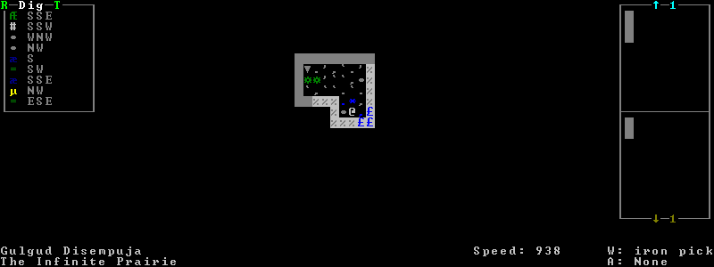
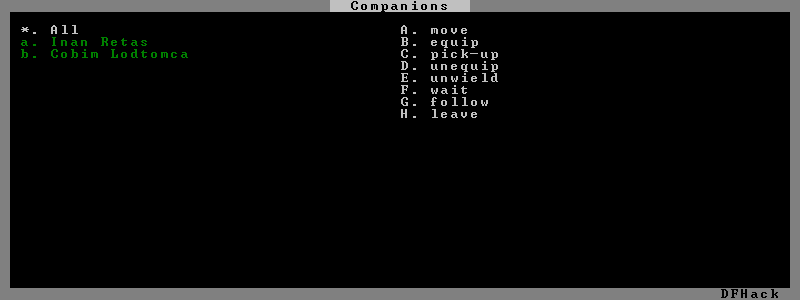
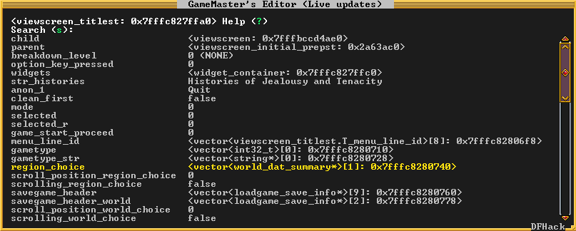
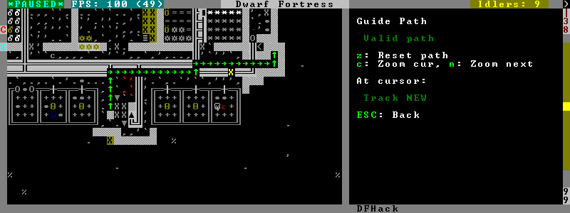
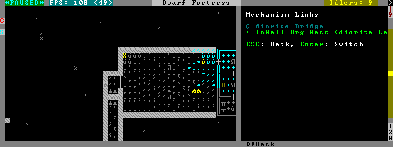
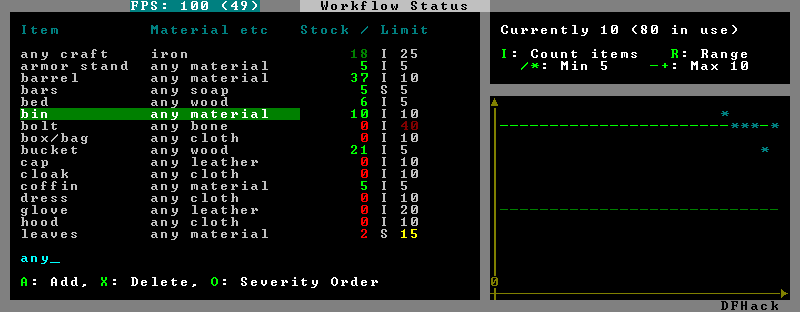
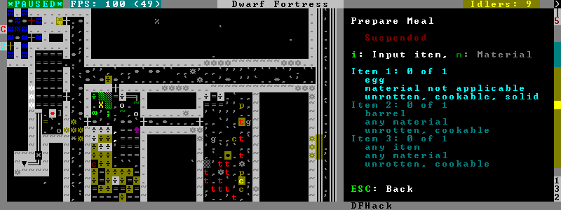
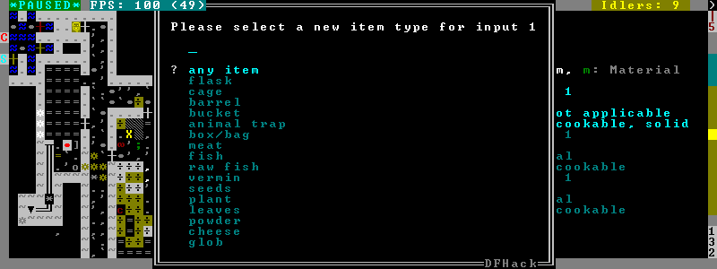

##############
DFHack Scripts
##############

Lua or ruby scripts placed in the ``hack/scripts/`` directory are considered for
execution as if they were native DFHack commands. They are listed at the end
of the ``ls`` command output.

Note: scripts in subdirectories of hack/scripts/ can still be called, but will
only be listed by ls if called as ``ls -a``. This is intended as a way to hide
scripts that are obscure, developer-oriented, or should be used as keybindings
or from the init file.

``kill-lua`` stops any currently-running Lua scripts. By default, scripts can
only be interrupted every 256 instructions. Use ``kill-lua force`` to interrupt
the next instruction.

.. contents::

=================
3rd-party scripts
=================

This listing is autogenerated from ``.rst`` files in the 3rdparty scripts directory.

.. warning::

    Because this documentation is pulled in from external sources,
    it may not match the DFHack distribution exactly.

    * Some scripts should have a prefix (eg listed as ``myscript``,
      should be ``gui/myscript``) but don't.
    * Some sections of documentation may refer to scripts which are
      not distributed with DFHack.

.. toctree::
   :glob:
   :maxdepth: 2

   /scripts/3rdparty/*/*

=======
devel/*
=======
Scripts in this subdirectory are intended for developers, or still substantially
under development.  If you don't already know what they do, best to leave them alone.

================================================
fix/* - scripts that fix bugs or common problems
================================================
Scripts in this subdirectory fix various bugs and issues, some of them obscure.

fix/blood-del
=============
Makes it so that future caravans won't bring barrels full of blood, ichor, or goo.

fix/build-location
==================
Fixes construction jobs that are stuck trying to build a wall while standing
on the same exact tile (bug 5991), designates the tile restricted traffic to
hopefully avoid jamming it again, and unsuspends them.

fix/dead-units
==============
Removes uninteresting dead units from the unit list. Doesn't seem to give any
noticeable performance gain, but migrants normally stop if the unit list grows
to around 3000 units, and this script reduces it back.

fix/fat-dwarves
===============
Avoids 5-10% FPS loss due to constant recalculation of insulation for dwarves at
maximum fatness, by reducing the cap from 1,000,000 to 999,999.

fix/feeding-timers
==================
Reset the GiveWater and GiveFood timers of all units as appropriate.

fix/growth-bug
==============
Fixes locally born units such that they will grow larger than their birth size.
Note that this bug was fixed in DF version 0.40.02.

fix/item-occupancy
==================
Diagnoses and fixes issues with nonexistant 'items occupying site', usually
caused by autodump bugs or other hacking mishaps.

fix/loyaltycascade
==================
Aborts loyalty cascades by fixing units whose own civ is the enemy.

fix/population-cap
==================
Run this after every migrant wave to ensure your population cap is not exceeded.
The issue with the cap is that it is compared to the population number reported
by the last caravan, so once it drops below the cap, migrants continue to come
until that number is updated again.

fix/stable-temp
===============
Instantly sets the temperature of all free-lying items to be in equilibrium with
the environment and stops temperature updates. In order to maintain this efficient
state however, use `plugins/tweak` ``stable-temp`` and `plugins/tweak` ``fast-heat``.

fix/stuckdoors
==============
Fix doors that are stuck open due to incorrect map occupancy flags, eg due to
incorrect use of teleport.

========================================
gui/* - scripts with an ingame interface
========================================
Scripts that implement dialogs inserted into the main game window are put in this
directory.

.. note::

    In order to avoid user confusion, as a matter of policy all these tools
    display the word "DFHack" on the screen somewhere while active.

    When that is not appropriate because they merely add keybinding hints to
    existing DF screens, they deliberately use red instead of green for the key.

gui/advfort
===========
This script allows to perform jobs in adventure mode. For more complete help
press '?' while script is running. It's most confortable to use this as a
keybinding. (e.g. keybinding set Ctrl-T gui/advfort). Possible arguments:

* -a or --nodfassign - uses different method to assign items.

* -i or --inventory - checks inventory for possible items to use in the job.

* -c or --cheat - relaxes item requirements for buildings (e.g. walls from bones).
  implies -a

* job - selects that job (e.g. Dig or FellTree)

An example of player digging in adventure mode:

.. admonition:: DISCLAIMER

    advfort changes only persist in non procedural sites. Namely: player forts, caves, camps.

gui/advfort_items
=================
Does something with items in adventure mode jobs.

.. _scripts/gui/assign-rack:

gui/assign-rack
===============
`This script requires a binpatch <binpatches/needs-patch>`, which has not
been available since DF 0.34.11

gui/autobutcher
===============
An in-game interface for `plugins/autobutcher`.

gui/choose-weapons
==================
Bind to a key (the example config uses Ctrl-W), and activate in the Equip->View/Customize
page of the military screen.

Depending on the cursor location, it rewrites all 'individual choice weapon' entries
in the selected squad or position to use a specific weapon type matching the assigned
unit's top skill. If the cursor is in the rightmost list over a weapon entry, it rewrites
only that entry, and does it even if it is not 'individual choice'.

Rationale: individual choice seems to be unreliable when there is a weapon shortage,
and may lead to inappropriate weapons being selected.

gui/clone-uniform
=================
Bind to a key (the example config uses Ctrl-C), and activate in the Uniforms
page of the military screen with the cursor in the leftmost list.

When invoked, the script duplicates the currently selected uniform template,
and selects the newly created copy.

gui/companion-order
===================
A script to issue orders for companions. Select companions with lower case chars, issue orders with upper
case. Must be in look or talk mode to issue command on tile.

* move - orders selected companions to move to location. If companions are following they will move no more than 3 tiles from you.
* equip - try to equip items on the ground.
* pick-up - try to take items into hand (also wield)
* unequip - remove and drop equipment
* unwield - drop held items
* wait - temporarily remove from party
* follow - rejoin the party after "wait"
* leave - remove from party (can be rejoined by talking)

.. _scripts/gui/create-item:

gui/create-item
===============
A graphical interface for creating items.

gui/dfstatus
============
Show a quick overview of critical stock quantities, including food, drinks, wood, and various bars.
Sections can be enabled/disabled/configured by editing ``dfhack-config/dfstatus.lua``.

gui/gm-editor
=============
There are three ways to open this editor:

* using gui/gm-editor command/keybinding - opens editor on what is selected
  or viewed (e.g. unit/item description screen)

* using gui/gm-editor <lua command> - executes lua command and opens editor on
  its results (e.g. gui/gm-editor "df.global.world.items.all" shows all items)

* using gui/gm-editor dialog - shows an in game dialog to input lua command. Works
  the same as version above.

This editor allows to change and modify almost anything in df. Press '?' for an
in-game help.

gui/gm-unit
===========
An editor for various unit attributes.

gui/guide-path
==============
Bind to a key (the example config uses Alt-P), and activate in the Hauling menu with
the cursor over a Guide order.

The script displays the cached path that will be used by the order; the game
computes it when the order is executed for the first time.

gui/hack-wish
=============
An alias for `scripts/gui/create-item`.  Deprecated.

gui/hello-world
===============
A basic example for testing, or to start your own script from.

gui/liquids
===========
To use, bind to a key (the example config uses Alt-L) and activate in the 'k' mode.

.. image:: images/liquids.png

This script is a gui front-end to `plugins/liquids` and works similarly,
allowing you to add or remove water & magma, and create obsidian walls & floors.

.. warning::

    There is **no undo support**.  Bugs in this plugin have been
    known to create pathfinding problems and heat traps.

The ``b`` key changes how the affected area is selected. The default *Rectangle*
mode works by selecting two corners like any ordinary designation. The ``p``
key chooses between adding water, magma, obsidian walls & floors, or just
tweaking flags.

When painting liquids, it is possible to select the desired level with ``+-``,
and choose between setting it exactly, only increasing or only decreasing
with ``s``.

In addition, ``f`` allows disabling or enabling the flowing water computations
for an area, and ``r`` operates on the "permanent flow" property that makes
rivers power water wheels even when full and technically not flowing.

After setting up the desired operations using the described keys, use ``Enter`` to apply them.

gui/mechanisms
==============
To use, bind to a key (the example config uses Ctrl-M) and activate in the 'q' mode.

Lists mechanisms connected to the building, and their links. Navigating the list centers
the view on the relevant linked buildings.

To exit, press ESC or Enter; ESC recenters on the original building, while Enter leaves
focus on the current one. Shift-Enter has an effect equivalent to pressing Enter, and then
re-entering the mechanisms ui.

gui/mod-manager
===============
A simple way to install and remove small mods.

It looks for specially formatted mods in df subfolder 'mods'. Mods are not
included, but some examples are `available here`_.

.. _`available here`: https://github.com/warmist/df-mini-mods

.. image:: images/mod-manager.png

gui/no-dfhack-init
==================
Shows a warning at startup if no valid ``dfhack.init`` file is found.

.. _scripts/gui/power-meter:

gui/power-meter
===============
An in-game interface for `plugins/power-meter`.

.. _scripts/gui/rename:

gui/rename
==========
Backed by `plugins/rename`, this script allows entering the desired name
via a simple dialog in the game ui.

* ``gui/rename [building]`` in 'q' mode changes the name of a building.

  .. image:: images/rename-bld.png

  The selected building must be one of stockpile, workshop, furnace, trap, or siege engine.
  It is also possible to rename zones from the 'i' menu.

* ``gui/rename [unit]`` with a unit selected changes the nickname.

  Unlike the built-in interface, this works even on enemies and animals.

* ``gui/rename unit-profession`` changes the selected unit's custom profession name.

  .. image:: images/rename-prof.png

  Likewise, this can be applied to any unit, and when used on animals it overrides
  their species string.

The ``building`` or ``unit`` options are automatically assumed when in relevant ui state.

The example config binds building/unit rename to Ctrl-Shift-N, and
unit profession change to Ctrl-Shift-T.

gui/room-list
=============
To use, bind to a key (the example config uses Alt-R) and activate in the 'q' mode,
either immediately or after opening the assign owner page.

.. image:: images/room-list.png

The script lists other rooms owned by the same owner, or by the unit selected in the assign
list, and allows unassigning them.

.. _scripts/gui/siege-engine:

gui/siege-engine
================
An in-game interface for `plugins/siege-engine`.

.. _scripts/gui/stockpiles:

gui/stockpiles
==============
An in-game interface for `plugins/stocksettings`, to
load and save stockpile settings from the 'q' menu.

Usage:

:gui/stockpiles -save:         to save the current stockpile
:gui/stockpiles -load:         to load settings into the current stockpile
:gui/stockpiles -dir <path>:   set the default directory to save settings into
:gui/stockpiles -help:         to see this message

Don't forget to ``enable stockpiles`` and create the ``stocksettings`` directory in
the DF folder before trying to use the GUI.

gui/unit-info-viewer
====================
Displays age, birth, maxage, shearing, milking, grazing, egg laying, body size,
and death info about a unit. Recommended keybinding Alt-I.

.. _scripts/gui/workflow:

gui/workflow
============
Bind to a key (the example config uses Alt-W), and activate with a job selected
in a workshop in the 'q' mode.

.. image:: images/workflow.png

This script provides a simple interface to constraints managed by `plugins/workflow`.
When active, it displays a list of all constraints applicable to the
current job, and their current status.

A constraint specifies a certain range to be compared against either individual
*item* or whole *stack* count, an item type and optionally a material. When the
current count is below the lower bound of the range, the job is resumed; if it
is above or equal to the top bound, it will be suspended. Within the range, the
specific constraint has no effect on the job; others may still affect it.

Pressing 'I' switches the current constraint between counting stacks or items.
Pressing 'R' lets you input the range directly; 'e', 'r', 'd', 'f' adjust the
bounds by 5, 10, or 20 depending on the direction and the 'I' setting (counting
items and expanding the range each gives a 2x bonus).

Pressing 'A' produces a list of possible outputs of this job as guessed by
workflow, and lets you create a new constraint by choosing one as template. If you
don't see the choice you want in the list, it likely means you have to adjust
the job material first using `plugins/job` ``item-material`` or `scripts/gui/workshop-job`,
as described in `plugins/workflow` documentation. In this manner, this feature
can be used for troubleshooting jobs that don't match the right constraints.

.. image:: images/workflow-new1.png

If you select one of the outputs with Enter, the matching constraint is simply
added to the list. If you use Shift-Enter, the interface proceeds to the
next dialog, which allows you to edit the suggested constraint parameters to
suit your need, and set the item count range.

.. image:: images/workflow-new2.png

Pressing 'S' (or, with the example config, Alt-W in the 'z' stocks screen)
opens the overall status screen, which was copied from the C++ implementation
by falconne for better integration with the rest of the lua script:

This screen shows all currently existing workflow constraints, and allows
monitoring and/or changing them from one screen. The constraint list can
be filtered by typing text in the field below.

The color of the stock level number indicates how "healthy" the stock level
is, based on current count and trend. Bright green is very good, green is good,
red is bad, bright red is very bad.

The limit number is also color-coded. Red means that there are currently no
workshops producing that item (i.e. no jobs). If it's yellow, that means the
production has been delayed, possibly due to lack of input materials.

The chart on the right is a plot of the last 14 days (28 half day plots) worth
of stock history for the selected item, with the rightmost point representing
the current stock value. The bright green dashed line is the target
limit (maximum) and the dark green line is that minus the gap (minimum).

.. _scripts/gui/workshop-job:

gui/workshop-job
================
Bind to a key (the example config uses Alt-A), and activate with a job selected in
a workshop in the 'q' mode.

The script shows a list of the input reagents of the selected job, and allows changing
them like the `plugins/job` ``item-type`` and `plugins/job` ``item-material`` commands.

Specifically, pressing the 'i' key pops up a dialog that lets you select an item
type from a list.

Pressing 'm', unless the item type does not allow a material,
lets you choose a material.

.. image:: images/workshop-job-material.png

Since there are a lot more materials than item types, this dialog is more complex
and uses a hierarchy of sub-menus. List choices that open a sub-menu are marked
with an arrow on the left.

.. warning::

  Due to the way input reagent matching works in DF, you must select an item type
  if you select a material, or the material will be matched incorrectly in some cases.
  If you press 'm' without choosing an item type, the script will auto-choose it
  if there is only one valid choice, or pop up an error message box instead of the
  material selection dialog.

Note that both materials and item types presented in the dialogs are filtered
by the job input flags, and even the selected item type for material selection,
or material for item type selection. Many jobs would let you select only one
input item type.

For example, if you choose a *plant* input item type for your prepare meal job,
it will only let you select cookable materials.

If you choose a *barrel* item instead (meaning things stored in barrels, like
drink or milk), it will let you select any material, since in this case the
material is matched against the barrel itself. Then, if you select, say, iron,
and then try to change the input item type, now it won't let you select *plant*;
you have to unset the material first.

.. _scripts/modtools:

========================
modtools/* - for modders
========================
Scripts which provide tools for modders, often with changes to the raw files.
Not intended to be called manually by end-users.

These scripts are mostly useful for raw modders and scripters. They all have
standard arguments: arguments are of the form ``tool -argName1 argVal1
-argName2 argVal2``. This is equivalent to ``tool -argName2 argVal2 -argName1
argVal1``. It is not necessary to provide a value to an argument name: ``tool
-argName3`` is fine. Supplying the same argument name multiple times will
result in an error. Argument names are preceded with a dash. The ``-help``
argument will print a descriptive usage string describing the nature of the
arguments. For multiple word argument values, brackets must be used: ``tool
-argName4 [ sadf1 sadf2 sadf3 ]``. In order to allow passing literal braces as
part of the argument, backslashes are used: ``tool -argName4 [ \] asdf \foo ]``
sets ``argName4`` to ``\] asdf foo``. The ``*-trigger`` scripts have a similar
policy with backslashes.

modtools/add-syndrome
=====================
This allows adding and removing syndromes from units.

modtools/anonymous-script
=========================
This allows running a short simple Lua script passed as an argument instead of
running a script from a file. This is useful when you want to do something too
complicated to make with the existing modtools, but too simple to be worth its
own script file.

modtools/create-item
====================
This is mostly the same as the other create item tools, but it uses standard
arguments. The other versions will be phased out in a later version.

modtools/create-unit
====================
Creates a unit.

.. _scripts/modtools/equip-item:

modtools/equip-item
===================
Force a unit to equip an item; useful in conjunction with the ``create``
scripts above.

See also `plugins/forceequip`.

modtools/force
==============
This tool triggers events like megabeasts, caravans, invaders, and migrants.

modtools/interaction-trigger
============================
This triggers events when a unit uses an interaction on another. It works by
scanning the announcements for the correct attack verb, so the attack verb
must be specified in the interaction. It includes an option to suppress this
announcement after it finds it.

modtools/invader-item-destroyer
===============================
This tool configurably destroys invader items to prevent clutter or to prevent
the player from getting tools exclusive to certain races.

modtools/item-trigger
=====================
This powerful tool triggers DFHack commands when a unit equips, unequips, or
attacks another unit with specified item types, specified item materials, or
specified item contaminants.

modtools/moddable-gods
======================
This is a standardized version of Putnam's moddableGods script. It allows you
to create gods on the command-line.

modtools/outside-only
=====================
This allows you to specify certain custom buildings as outside only, or inside
only. If the player attempts to build a building in an inappropriate location,
the building will be destroyed.

modtools/projectile-trigger
===========================
This triggers dfhack commands when projectiles hit their targets.

modtools/random-trigger
=======================
This triggers random dfhack commands with specified probabilities.

modtools/reaction-product-trigger
=================================
This triggers dfhack commands when reaction products are produced, once per
product.

modtools/reaction-trigger
=========================
Triggers dfhack commands when custom reactions complete, regardless of whether
it produced anything, once per completion.

modtools/reaction-trigger-transition
====================================
Scans raw files and creates a file to help modders transition from
autoSyndrome to reaction-trigger.

modtools/skill-change
=====================
Sets or modifies a skill of a unit.

modtools/spawn-flow
===================
Creates flows at the specified location.

modtools/syndrome-trigger
=========================
Triggers dfhack commands when syndromes are applied to units.

modtools/transform-unit
=======================
Transforms a unit into another unit type, possibly permanently.

=============
Other Scripts
=============
These scripts are not stored in any subdirectory, and can be invoked directly.

adaptation
==========
View or set level of cavern adaptation for the selected unit or the whole fort.
Usage: ``adaptation <show|set> <him|all> [value]``.  The ``value`` must be
between 0 and 800,000 inclusive.

add-thought
===========
Adds a thought or emotion to the selected unit.  Can be used by other scripts,
or the gui invoked by running ``add-thought gui`` with a unit selected.

armoks-blessing
===============
Runs the equivalent of `scripts/rejuvenate`, `scripts/elevate-physical`,
`scripts/elevate-mental`, and `scripts/brainwash`
on all dwarves currently on the map.  This is an extreme change, which sets every
stat to an ideal - legendary skills, great traits, and easy-to-satisfy preferences.
Use in moderation; it's as 'cheaty' as DFHack gets.

autofarm
========
Automatically handle crop selection in farm plots based on current plant stocks.
Selects a crop for planting if current stock is below a threshold.
Selected crops are dispatched on all farmplots.

Usage::

    autofarm start
    autofarm default 30
    autofarm threshold 150 helmet_plump tail_pig

.. _scripts/autolabor-artisans:

autolabor-artisans
==================
Runs `plugins/autolabor`, with settings tuned for small but highly skilled workforces.

.. _scripts/autounsuspend:

autounsuspend
=============
Automatically unsuspend jobs in workshops, on a recurring basis.
See `scripts/unsuspend` for one-off use, or `plugins/resume` ``all``.

ban-cooking
===========
A more convenient way to ban cooking various categories of foods than the
kitchen interface.  Usage:  ``ban-cooking <type>``.  Valid types are ``booze``,
``honey``, ``tallow``, ``oil``, and ``seeds`` (non-tree plants with seeds).

.. _scripts/binpatch:

binpatch
========
Implements functions for in-memory binpatches.  See `binpatches`.

.. _scripts/brainwash:

brainwash
=========
Modify the personality traits of the selected dwarf to match an 'ideal'
personality - as stable and reliable as possible. This makes dwarves very
stable, preventing tantrums even after months of misery.

burial
======
Sets all unowned coffins to allow burial.  ``burial -pets`` also allows burial
of pets.

command-prompt
==============
A one line command prompt in df. Same as entering command into dfhack console. Best
used as a keybinding. Can be called with optional "entry" that will start prompt with
that pre-filled.

.. image:: images/command-prompt.png

create-items
============
Spawn arbitrary items under the cursor.

The first argument gives the item category, the second gives the material,
and the optionnal third gives the number of items to create (defaults to 20).

Currently supported item categories: ``boulder``, ``bar``, ``plant``, ``log``,
``web``.

Instead of material, using ``list`` makes the script list eligible materials.

The ``web`` item category will create an uncollected cobweb on the floor.

Note that the script does not enforce anything, and will let you create
boulders of toad blood and stuff like that.
However the ``list`` mode will only show 'normal' materials.

Examples::

    create-items boulders COAL_BITUMINOUS 12
    create-items plant tail_pig
    create-items log list
    create-items web CREATURE:SPIDER_CAVE_GIANT:SILK
    create-items bar CREATURE:CAT:SOAP
    create-items bar adamantine

deathcause
==========
Focus a body part ingame, and this script will display the cause of death of
the creature.
Also works when selecting units from the (``u``) unitlist viewscreen.

dfusion
=======
Interface to a lecacy script system.

.. _scripts/digfort:

digfort
=======
A script to designate an area for digging according to a plan in csv format.

This script, inspired from quickfort, can designate an area for digging.
Your plan should be stored in a .csv file like this::

    # this is a comment
    d;d;u;d;d;skip this tile;d
    d;d;d;i

Available tile shapes are named after the 'dig' menu shortcuts:
``d`` for dig, ``u`` for upstairs, ``d`` downstairs, ``i`` updown,
``h`` channel, ``r`` upward ramp, ``x`` remove designation.
Unrecognized characters are ignored (eg the 'skip this tile' in the sample).

Empty lines and data after a ``#`` are ignored as comments.
To skip a row in your design, use a single ``;``.

One comment in the file may contain the phrase ``start(3,5)``. It is interpreted
as an offset for the pattern: instead of starting at the cursor, it will start
3 tiles left and 5 tiles up from the cursor.

The script takes the plan filename, starting from the root df folder (where
``Dwarf Fortress.exe`` is found).

drain-aquifer
=============
Remove all 'aquifer' tag from the map blocks. Irreversible.

.. _scripts/elevate-mental:

elevate-mental
==============
Set all mental attributes of a dwarf to 2600, which is very high.
Other numbers can be passed as an argument:  ``elevate-mental 100``
for example would make the dwarf very stupid indeed.

.. _scripts/elevate-physical:

elevate-physical
================
As for elevate-mental, but for physical traits.  High is good for soldiers,
while having an ineffective hammerer can be useful too...

exportlegends
=============
Controls legends mode to export data - especially useful to set-and-forget large
worlds, or when you want a map of every site when there are several hundred.

The 'info' option exports more data than is possible in vanilla, to a
``region-date-legends_plus.xml`` file developed to extend the World
Viewer utility and potentially compatible with others.

Options:

:info:  Exports the world/gen info, the legends XML, and a custom XML with more information
:sites: Exports all available site maps
:maps:  Exports all seventeen detailed maps
:all:   Equivalent to calling all of the above, in that order

exterminate
===========
Kills any unit of a given race.

With no argument, lists the available races and count eligible targets.

With the special argument ``him``, targets only the selected creature.

With the special argument ``undead``, targets all undeads on the map,
regardless of their race.

When specifying a race, a caste can be specified to further restrict the
targeting. To do that, append and colon and the caste name after the race.

Any non-dead non-caged unit of the specified race gets its ``blood_count``
set to 0, which means immediate death at the next game tick. For creatures
such as vampires, it also sets animal.vanish_countdown to 2.

An alternate mode is selected by adding a 2nd argument to the command,
``magma``. In this case, a column of 7/7 magma is generated on top of the
targets until they die (Warning: do not call on magma-safe creatures. Also,
using this mode on birds is not recommended.)

Will target any unit on a revealed tile of the map, including ambushers,
but ignore caged/chained creatures.

Ex::

    exterminate gob
    exterminate gob:male

To kill a single creature, select the unit with the 'v' cursor and::

    exterminate him

To purify all elves on the map with fire (may have side-effects)::

    exterminate elve magma

fixnaked
========
Removes all unhappy thoughts due to lack of clothing.

.. _scripts/fix-ster:

fix-ster
========
Utilizes the orientation tag to either fix infertile creatures or inflict
infertility on creatures that you do not want to breed.  Usage::

    fix-ster [fert|ster] [all|animals|only:<creature>]

``fert`` or ``ster`` is a required argument; whether to make the target fertile
or sterile.  Optional arguments specify the target: no argument for the
selected unit, ``all`` for all units on the map, ``animals`` for all non-dwarf
creatures, or ``only:<creature>`` to only process matching creatures.

forum-dwarves
=============
Saves a copy of a text screen, formatted in bbcode for posting to the Bay12 Forums.
Use ``forum-dwarves help`` for more information.

full-heal
=========
Attempts to fully heal the selected unit.  ``full-heal -r`` attempts to resurrect the unit.

gaydar
======
Shows the sexual orientation of units, useful for social engineering or checking
the viability of livestock breeding programs.  Use ``gaydar -help`` for information
on available filters for orientation, citizenship, species, etc.

growcrops
=========
Instantly grow seeds inside farming plots.

With no argument, this command list the various seed types currently in
use in your farming plots.
With a seed type, the script will grow 100 of these seeds, ready to be
harvested. You can change the number with a 2nd argument.

For example, to grow 40 plump helmet spawn::

    growcrops plump 40

hfs-pit
=======
Creates a pit to the underworld at the cursor.

Takes three arguments:  diameter of the pit in tiles, whether to wall off
the pit, and whether to insert stairs.  If no arguments are given, the default
is "hfs-pit 1 0 0", ie single-tile wide with no walls or stairs.::

    hfs-pit 4 0 1
    hfs-pit 2 1 0

First example is a four-across pit with stairs but no walls; second is a
two-across pit with stairs but no walls.

hotkey-notes
============
Lists the key, name, and jump position of your hotkeys in the DFHack console.

item-descriptions
=================
Exports a table with custom description text for every item in the game.
Used by `scripts/view-item-info`.

lever
=====
Allow manipulation of in-game levers from the dfhack console.

Can list levers, including state and links, with::

    lever list

To queue a job so that a dwarf will pull the lever 42, use ``lever pull 42``.
This is the same as 'q'uerying the building and queue a 'P'ull request.

To magically toggle the lever immediately, use::

    lever pull 42 --now

locate-ore
==========
Scan the map for metal ores.

Finds and designate for digging one tile of a specific metal ore.
Only works for native metal ores, does not handle reaction stuff (eg STEEL).

When invoked with the ``list`` argument, lists metal ores available on the map.

Examples::

    locate-ore list
    locate-ore hematite
    locate-ore iron

log-region
==========
When enabled in dfhack.init, each time a fort is loaded identifying information
will be written to the gamelog.  Assists in parsing the file if you switch
between forts, and adds information for story-building.

lua
===
There are the following ways to invoke this command:

1. ``lua`` (without any parameters)

   This starts an interactive lua interpreter.

2. ``lua -f "filename"`` or ``lua --file "filename"``

   This loads and runs the file indicated by filename.

3. ``lua -s ["filename"]`` or ``lua --save ["filename"]``

   This loads and runs the file indicated by filename from the save
   directory. If the filename is not supplied, it loads "dfhack.lua".

4. ``:lua`` *lua statement...*

   Parses and executes the lua statement like the interactive interpreter would.

make-legendary
==============
Makes the selected dwarf legendary in one skill, a group of skills, or all
skills.  View groups with ``make-legendary classes``, or all skills with
``make-legendary list``.  Use ``make-legendary MINING`` when you need something
dug up, or ``make-legendary all`` when only perfection will do.

make-monarch
============
Make the selected unit King or Queen of your civilisation.

markdown
========
Save a copy of a text screen in markdown (for reddit among others).
Use 'markdown help' for more details.

masspit
=======
Designate all creatures in cages on top of a pit/pond activity zone for pitting.
Works best with an animal stockpile on top of the zone.

Works with a zone number as argument (eg ``Activity Zone #6`` -> ``masspit 6``)
or with the game cursor on top of the area.

multicmd
========
Run multiple dfhack commands. The argument is split around the
character ; and all parts are run sequentially as independent
dfhack commands. Useful for hotkeys.

Example::

    multicmd locate-ore iron ; digv

points
======
Sets available points at the embark screen to the specified number.  Eg.
``points 1000000`` would allow you to buy everything, or ``points 0`` would
make life quite difficult.

position
========
Reports the current time:  date, clock time, month, and season.  Also reports
location:  z-level, cursor position, window size, and mouse location.

pref-adjust
===========
A two-stage script:  ``pref-adjust clear`` removes preferences from all dwarves,
and ``pref-adjust`` inserts an 'ideal' set which is easy to satisfy::

    Feb Idashzefon likes wild strawberries for their vivid red color, fisher berries
    for their round shape, prickle berries for their precise thorns, plump helmets
    for their rounded tops, prepared meals, plants, drinks, doors, thrones, tables and
    beds. When possible, she prefers to consume wild strawberries, fisher berries,
    prickle berries, plump helmets, strawberry wine, fisher berry wine, prickle berry
    wine, and dwarven wine.

putontable
==========
Makes item appear on the table, like in adventure mode shops. Arguments:  '-a'
or '--all' for all items.

quicksave
=========
If called in dwarf mode, makes DF immediately auto-save the game by setting a flag
normally used in seasonal auto-save.

region-pops
===========
Show or modify the populations of animals in the region.

Usage:

:region-pops list [pattern]:
        Lists encountered populations of the region, possibly restricted by pattern.
:region-pops list-all [pattern]:
        Lists all populations of the region.
:region-pops boost <TOKEN> <factor>:
        Multiply all populations of TOKEN by factor.
        If the factor is greater than one, increases the
        population, otherwise decreases it.
:region-pops boost-all <pattern> <factor>:
        Same as above, but match using a pattern acceptable to list.
:region-pops incr <TOKEN> <factor>:
        Augment (or diminish) all populations of TOKEN by factor (additive).
:region-pops incr-all <pattern> <factor>:
        Same as above, but match using a pattern acceptable to list.

.. _scripts/rejuvenate:

rejuvenate
==========
Set the age of the selected dwarf to 20 years.  Useful if valuable citizens are
getting old, or there are too many babies around...

remove-stress
=============
Sets stress to -1,000,000; the normal range is 0 to 500,000 with very stable or
very stressed dwarves taking on negative or greater values respectively.
Applies to the selected unit, or use "remove-stress -all" to apply to all units.

remove-wear
===========
Sets the wear on all items in your fort to zero.

.. _scripts/repeat:

repeat
======
Repeatedly calls a lua script at the specified interval.

This allows neat background changes to the function of the game, especially when
invoked from an init file.  For detailed usage instructions, use ``repeat -help``.

Usage examples::

    repeat -name jim -time delay -timeUnits units -printResult true -command [ printArgs 3 1 2 ]
    repeat -time 1 -timeUnits months -command [ multicmd cleanowned scattered x; clean all ] -name clean

The first example is abstract; the second will regularly remove all contaminants
and worn items from the game.

``-name`` sets the name for the purposes of cancelling and making sure you don't schedule the
same repeating event twice.  If not specified, it's set to the first argument after ``-command``.
``-time delay -timeUnits units``; delay is some positive integer, and units is some valid time
unit for ``dfhack.timeout(delay,timeUnits,function)``.  ``-command [ ... ]`` specifies the
command to be run.

setfps
======
Run ``setfps <number>`` to set the FPS cap at runtime, in case you want to watch
combat in slow motion or something :)

show-unit-syndromes
===================
Show syndromes affecting units and the remaining and maximum duration, along
with (optionally) substantial detail on the effects.

Use one or more of the following options:

:showall:               Show units even if not affected by any syndrome
:showeffects:           Show detailed effects of each syndrome
:showdisplayeffects:    Show effects that only change the look of the unit
:ignorehiddencurse:     Hide syndromes the user should not be able to know about (TODO)
:selected:              Show selected unit
:dwarves:               Show dwarves
:livestock:             Show livestock
:wildanimals:           Show wild animals
:hostile:               Show hostiles (e.g. invaders, thieves, forgotten beasts etc)
:world:                 Show all defined syndromes in the world
:export:                ``export:<filename>`` sends output to the given file, showing all
                        syndromes affecting each unit with the maximum and present duration.

siren
=====
Wakes up sleeping units, cancels breaks and stops parties either everywhere,
or in the burrows given as arguments. In return, adds bad thoughts about
noise, tiredness and lack of protection. Also, the units with interrupted
breaks will go on break again a lot sooner. The script is intended for
emergencies, e.g. when a siege appears, and all your military is partying.

soundsense-season
=================
It is a well known issue that Soundsense cannot detect the correct
current season when a savegame is loaded and has to play random
season music until a season switch occurs.

This script registers a hook that prints the appropriate string
to gamelog.txt on every map load to fix this. For best results
call the script from ``dfhack.init``.

source
======
Create an infinite magma or water source or drain on a tile.

This script registers a map tile as a liquid source, and every 12 game ticks
that tile receives or remove 1 new unit of flow based on the configuration.

Place the game cursor where you want to create the source (must be a
flow-passable tile, and not too high in the sky) and call::

    source add [magma|water] [0-7]

The number argument is the target liquid level (0 = drain, 7 = source).

To add more than 1 unit everytime, call the command again on the same spot.

To delete one source, place the cursor over its tile and use ``source delete``.
To remove all existing sources, call ``source clear``.

The ``list`` argument shows all existing sources.

Examples::

    source add water     - water source
    source add magma 7   - magma source
    source add water 0   - water drain

startdwarf
==========
Use at the embark screen to embark with the specified number of dwarves.  Eg.
``startdwarf 500`` would lead to a severe food shortage and FPS issues, while
``startdwarf 10`` would just allow a few more warm bodies to dig in.
The number must be 7 or greater.

stripcaged
==========
For dumping items inside cages. Will mark selected items for dumping, then
a dwarf may come and actually dump it. See also `plugins/autodump`.

With the ``items`` argument, only dumps items laying in the cage, excluding
stuff worn by caged creatures. ``weapons`` will dump worn weapons, ``armor``
will dump everything worn by caged creatures (including armor and clothing),
and ``all`` will dump everything, on a creature or not.

``stripcaged list`` will display on the dfhack console the list of all cages
and their item content.

Without further arguments, all commands work on all cages and animal traps on
the map. With the ``here`` argument, considers only the in-game selected cage
(or the cage under the game cursor). To target only specific cages, you can
alternatively pass cage IDs as arguments::

  stripcaged weapons 25321 34228

superdwarf
==========
Similar to fastdwarf, per-creature.

To make any creature superfast, target it ingame using 'v' and::

    superdwarf add

Other options available: ``del``, ``clear``, ``list``.

This script also shortens the 'sleeping' and 'on break' periods of targets.

teleport
========
Teleports a unit to given coordinates.

Examples::

    teleport -showunitid                 - prints unitid beneath cursor
    teleport -showpos                    - prints coordinates beneath cursor
    teleport -unit 1234 -x 56 -y 115 -z 26  - teleports unit 1234 to 56,115,26

undump-buildings
================
Undesignates building base materials for dumping.

.. _scripts/unsuspend:

unsuspend
=========
Unsuspend jobs in workshops, on a one-off basis.  See `scripts/autounsuspend`
for regular use.

.. _scripts/view-item-info:

view-item-info
==============
A script to extend the item or unit viewscreen with additional information
including a custom description of each item (when available), and properties
such as material statistics, weapon attacks, armor effectiveness, and more.

The associated script ``item-descriptions.lua`` supplies custom descriptions
of items.  Individual descriptions can be added or overridden by a similar
script ``raw/scripts/more-item-descriptions.lua``.  Both work as sparse lists,
so missing items simply go undescribed if not defined in the fallback.

warn-starving
=============
If any (live) units are starving, very thirsty, or very drowsy, the game will
be paused and a warning shown and logged to the console.  Use with the
`scripts/repeat` command for regular checks.

Use ``warn-starving all`` to display a list of all problematic units.
