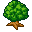
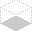
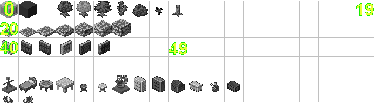

.. _stonesense-art-guide:

Stonesense art creation guide
=============================

Understanding Sprites
---------------------
Understanding how Stonesense deals with sprites is central to anyone who wishes to modify the content.
The scheme is not very complicated, and this guide will give a short introduction to how they work.
The way sprites are loaded is fairly generalized. With the exception of floors, which we will discuss later,
all sprites are 32x32 pixels big and come in groups known as Sprite Sheets. All sprites are loaded and
rendered in 32-bit full-color PNGs.

Here's an example of a typical Stonesense sprite:

Note that, in order not to conflict with neighboring sprites, a sprite must actually be within a smaller
area than its 32x32 block. A template for the area used by most sprites is:

The solid area is the floor space taken up by a sprite, while the dotted box indicates the volume above this
area corresponding to one z-level.

Sprite Sheets
-------------
There can be an arbitrary number of sprite sheets configured for Stonesense, yet some are always present as
they contain default sprites (see further down). Most of the content XML files allow users to specify sprite
sheets, and this is done by adding a file attribute to the content nodes. By convention sprite sheets should
be placed in their appropriate folder, with creature sprite sheets in the creatures folder etc.

Sprite Index
------------
Sprite Index (sometimes referred to as Sheet Index) is a concept for referring to a specific sprite on a sheet.
The index starts with the upper left sprite which has index zero. It then increments to the right. Stonesense
is hardcoded to 20 sprites wide sheets, this means that the last sprite to the right in the first row has Sprite
Index 19. The first sprite on the second row has index 20. This boundary is hardcoded and changing the size of
the sheet will not affect it.

This image shows how sprites are indexed. Note: Grid added for readability.

Specific Sprite Sheets
----------------------
**objects.png** is the default sheet for buildings and vegetation. Also used for all hard-coded content, like default
plants, the cursor, default walls and liquid.

**creatures.png** is the default sprite sheet for creatures. If no file is specified in a creature node, this is the
sheet it will use.

**floors.png** holds all the Stonesense floors. Unlike the other sprite sheet, this sheet is hard-coded with sprite
dimensions of 32x20 pixels.

Stonesense is fully configurable in the way it renders creatures. No information is hardcoded, but rather loaded
from the creature databases found in the creatures directory.
